# Sprawozdanie Lab04
# Szymon Rewilak

## Przebieg ćwiczenia

# Zachowanie stanu

1. Przygotowano wolumin wejściowy i wyjściowy o nazwach volume-out oraz volume-in

```
sudo docker volume create --name volume-out

sudo docker volume create --name volume-in

```

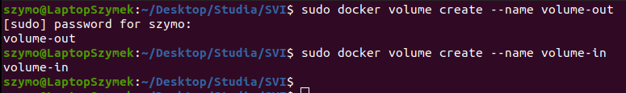

2. Wylistowano woluminy:

```
sudo docker volumes ls
```

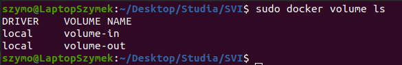

3. Uruchomiono kontener ubuntu:latest z utworzonymi woluminami. Utworzone zostaną katalogi /input oraz /outpu dla woluminu wejściowego i wyjściowego.

```
sudo docker run -it -v dolume-in:/input -v volume-out:/outpu
```

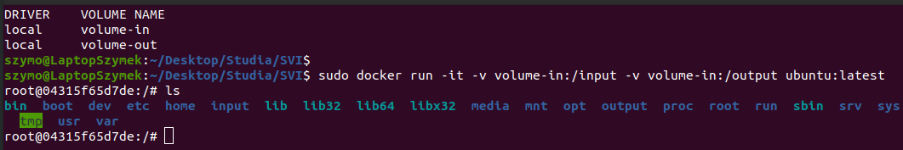

4. Sklonowano repozytowrium na wolumin wejściowy. Wykorzystanym repozytorium jest chibbic, intepreter napisany w języku C.

Aby sklonowac repozytorium bez instalacji gita w kontenerze, zrobiono to z hosta. Wykorzystano polecenie sudo-i by wejść do odpowiedniego katalogu.

```
sudo -i
cd /var/lib/docker/volumes/volume-in/_data
git clone https://github.com/rui314/chibicc.git
```

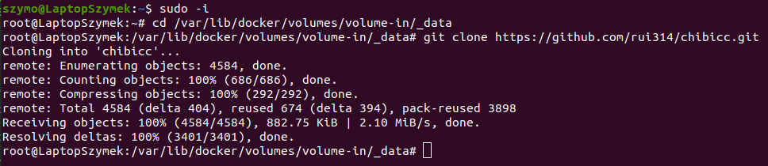

5. W kontenerze zainstalowano konieczne zależności.

```
apt-get update
apt-get install make
apt-get install build-essential
```

Celem zwiększenia przejrzystości sprawozdania, wklejono jedynie początek outputu:

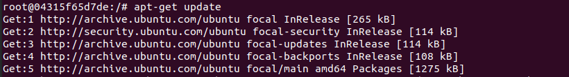

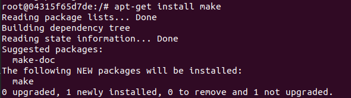

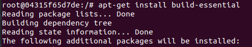


6. Zawartość katalogu ./input w kontenerze:


7. Wewnątrz kontenera uruchomiono builda z uzyciem polecenia make. Katalog, w którym zostaną utworzone pliki wyjściowe został ustawiony flagą DESTDIR:

```
make DESTDIR=/output
```

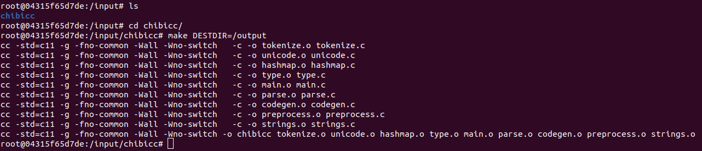

8. W folderze wyjściowym wylistowano zbudowane pliki:

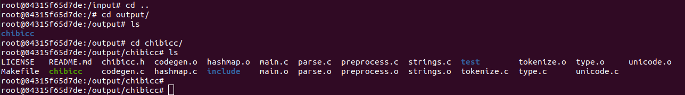

# Eksponowanie portu

9. Wewnątrz kontenera zainstalowano oraz uruchomiono serwer iperf3:

```
apt-get install iperf3
```

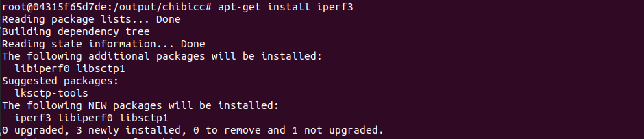

10. Uruchomiono bliźniaczy kontener ubuntu:latest z udostępionym portem 2000:

```
sudo docker run -it -p 2000:2000 ubuntu:latest
```

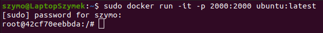

Na bliźniaczym porcie zainstalowano serwer iperf3:

```
apt-get install iperf3
```

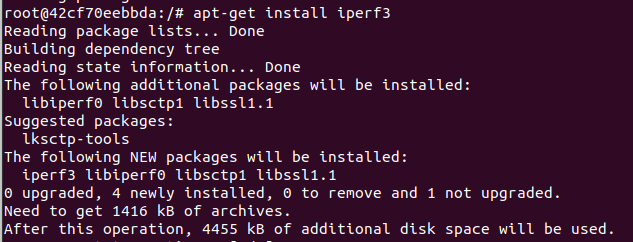

Zainstalowano net-tools celem zbadania adresu IP:

```
apt-get install net-tools
```

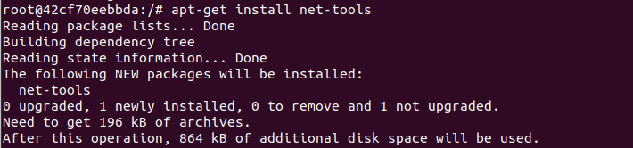

11. Uruchomiono serwer iperf3 na porcie 2000:

```
iperf3 -s -p 2000
```

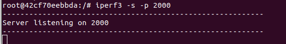

12. Sprawdzono adres ip z użyciem polecenia ifconfig. Wykonano połączenie (w roli klienta) z uruchomionym serwerem z drugiego kontenera.

```
iperf3 -c 172.17.0.3 -p 2000
```

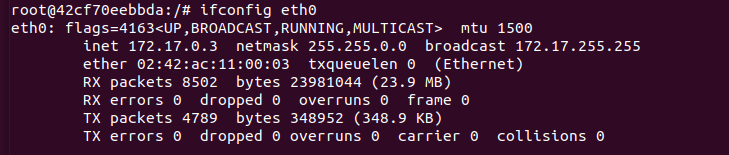

Udane połączenie z serwerem:

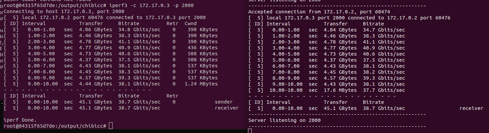

13. Wykonano połączenie z serwerem z poziomu hosta:

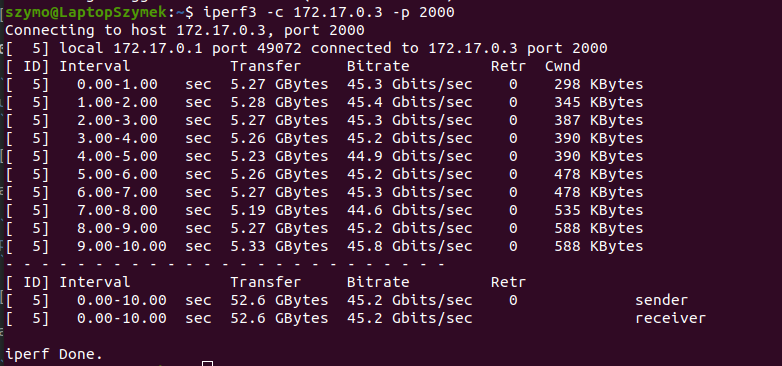


14. Porównano przepustowość komunikacji:

| Połączenie  | Uśredniona przepustowość |
| ----------- | ----------------------   |
| Kontenery   |     45,3   [Gb/s]        |
| Host        |     44,3   [Gb/s]        |

Nieznacznie szybszym połączeniem okazało się połączenie host-kontener.


# Instalacja Jenkins

15. Uruchomiono obraz docker:

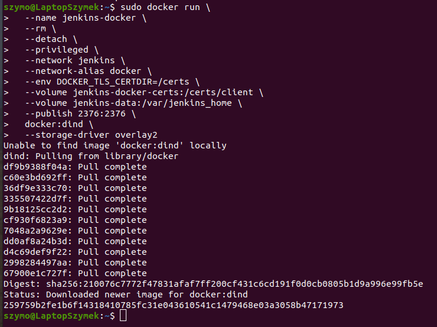

16. Utworzono plik Dockerfile na podstawie dokumentacji. Zbudowano obraz:


```
FROM jenkins/jenkins:2.332.2-jdk11
USER root
RUN apt-get update && apt-get install -y lsb-release
RUN curl -fsSLo /usr/share/keyrings/docker-archive-keyring.asc \
  https://download.docker.com/linux/debian/gpg
RUN echo "deb [arch=$(dpkg --print-architecture) \
  signed-by=/usr/share/keyrings/docker-archive-keyring.asc] \
  https://download.docker.com/linux/debian \
  $(lsb_release -cs) stable" > /etc/apt/sources.list.d/docker.list
RUN apt-get update && apt-get install -y docker-ce-cli
USER jenkins
RUN jenkins-plugin-cli --plugins "blueocean:1.25.3 docker-workflow:1.28"
```

Budowanie obrazu z Dockerfile:

```
sudo docker build -t myjenkins-blueocean:2.332.2-1 .
```
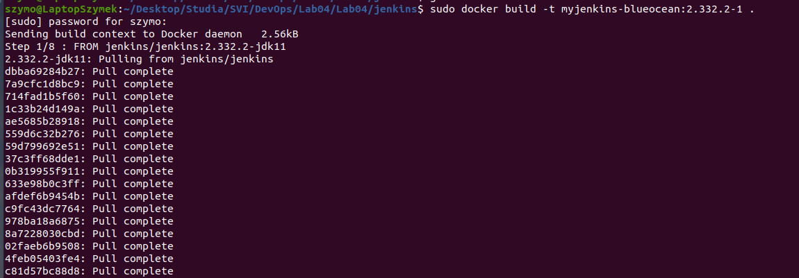

17. Zgodnie z dokumentacją, uruchomiono utworzony obraz:


18. Dalej, postępując zgodnie z dokumentacją pobrano hasło początkowe do Jenkinsa i pomyślnie się zalogowano:

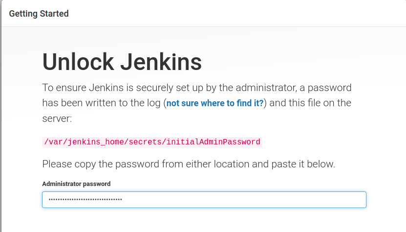

19. Uruchomiony jenkins:

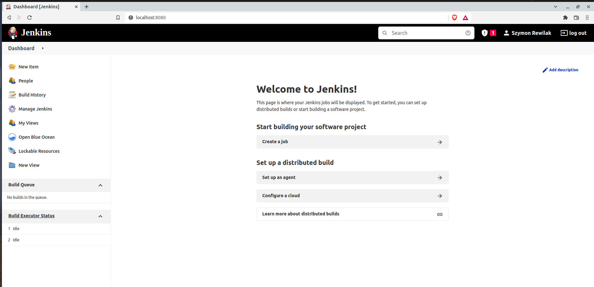
