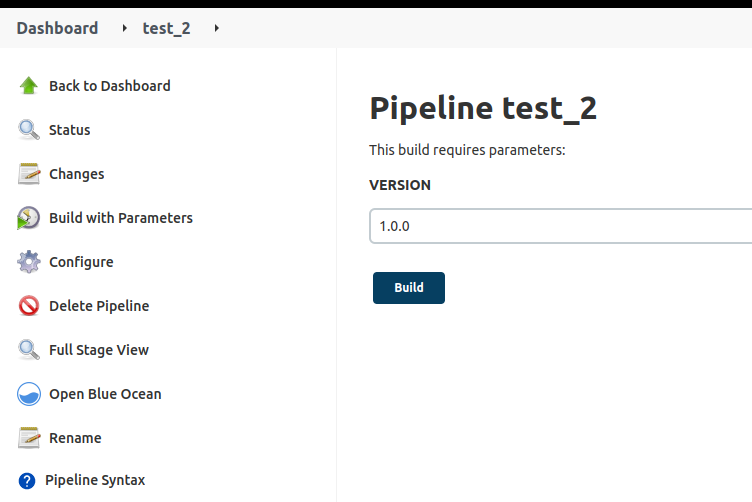
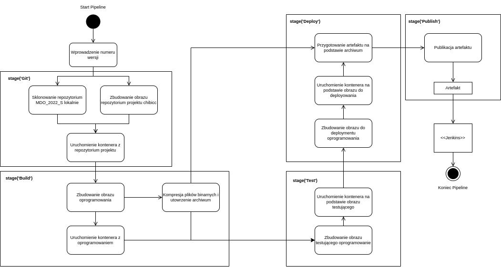
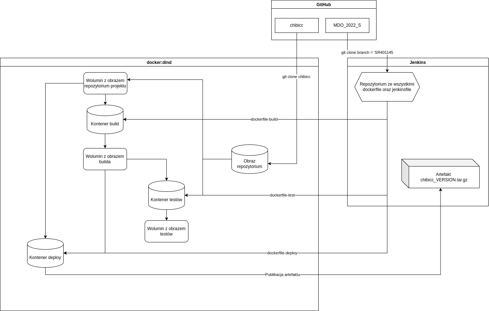

# Sprawozdanie - projekt DevOps Jenkins

## Szymon Rewilak, grupa lab07

---


## Cel projektu
Celem projektu było przygotowanie pipeline służącego do zbudowania i opublikowania oprogramowania.  
Projektem wykorzystanym w pipeline był [chibicc](https://github.com/rui314/chibicc) - **szybki kompilator języka C**

## Wykonanie projektu
Celem wdrożenia projektu przygotowano pipeline, składajacego się z niżej opisanych etapów (stage'ów):

## 1. Git
Celem etapu jest sklonowanie repozytoriów;  
- repozytorium [*MDO2022_S*](https://github.com/InzynieriaOprogramowaniaAGH/MDO2022_S) na branchu SR401145  
- repozytorium projektu [*chibicc*](https://github.com/rui314/chibicc)

Następnie utworzono woluminy *volume-build*, *volume-repo* oraz *volume-test*, na które zostaną skopiowane pliki
(odpowiednio) z kontenera repozytorium [chibicc](https://github.com/rui314/chibicc), ze zbudowanego projektu oraz pliki z kontenera do testowania.  
Obraz repozytorium został zbudowany z użyciem pliku *dockerfile-clone*:
```
FROM ubuntu:latest
RUN apt-get update
RUN apt-get -y install git
CMD git clone https://github.com/rui314/chibicc.git
```  
Następnie, na podstawie zbudowanego obrazu, kontener został uruchomiony na woluminie volume-repo.    
**Etap *git* w pipeline:**
```
 stage('Git'){       
            steps{
                git branch: 'SR401145', url: 'https://github.com/InzynieriaOprogramowaniaAGH/MDO2022_S.git'
                sh 'docker volume create --name volume-build'
                sh 'docker volume create --name volume-test'
                sh 'docker volume create --name volume-repo'
                sh 'docker build -t chibiccclone . -f "ITE/GCL07/SR401145/Lab05/dockerfile-clone"'
                sh 'docker run -v volume-repo:/chibicc chibiccclone'
            }
        }
```

## 2. Build
Celem etapu jest zbudowanie oraz uruchomienie obrazu projektu.  
W tym celu wykorzystano plik *dockerfile-build*. W tym pliku pliki binarne zostają zbudowane komendą *make* oraz spakowane do archiwum
w nowym folderze na woluminie:  
```
FROM ubuntu:latest

RUN apt-get update
RUN apt-get -y install make
RUN apt-get -y install build-essential
WORKDIR chibicc
RUN mkdir build_dir
CMD sh -c "make prefix= DESTDIR=/build_dir && touch chibicc.tar.gz && tar -czf chibicc.tar.gz /chibicc && cp chibicc.tar.gz /build_dir && cp chibicc.tar.gz /build"

```  
Następnie obraz zostaje uruchomiony z wykorzystaniem woluminu *volume-build*. Podpięty został również wolumin *volume-repo* celem dostępu do plików projektu: 
```
 stage('Build'){
            steps{
                sh 'docker build -t build . -f ITE/GCL07/SR401145/Lab05/dockerfile-build'
                sh 'docker run -v volume-repo:/chibicc -v volume-build:/build build'
            }
        }
```

## 3. Test
Celem etapu jest przetestowanie zbudowanego projektu z wykorzystaniem testów wcześniej przygotowanych w projekcie.  
Wykorzystano w tym celu plik *dockerfile-test*  
```
FROM build:latest
RUN apt-get -y install file
CMD make test
```
Obraz został zbudowany i uruchomiony na woluminie *volume-test*, analogicznie do etapu *build*:
```
stage('Test'){
            steps{
                sh 'docker build -t test . -f ITE/GCL07/SR401145/Lab05/dockerfile-test'
                sh 'docker run -v volume-repo:/chibicc -v volume-test:/test test'
            }
        }
```

## 4. Deploy
Celem etapu jest przygotowanie artefaktu, który zostanie opublikowany w etapie *publish*.  
Wykorzystano w tym celu plik *dockerfile-deploy*, w którym pliki binarne projektu znajdujące się w archiwum w woluminie volume-buid:/build zostają wyodrębnione:  
```
from ubuntu:latest
CMD sh -c "tar -xzf build/chibicc.tar.gz"
```

Obraz zostaje zbudowany i uruchomiony, ponownie z podpiętym woluminem *volume-build*, w którym zapisane jest wcześniej utworzone archiwum *chibicc.tar.gz*:

```
stage('Deploy'){
            steps{
                sh 'docker build -t deploy . -f ITE/GCL07/SR401145/Lab05/dockerfile-deploy'
                sh 'docker run -v volume-build:/build deploy'
            }
        }
```

## 5. Publish 
Celem etapu jest publikacja artekfaktu przygotowanego w poprzednich etapach. Wykorzystane zostaje polecenie *archiveArtifacts*.  
Wykorzystany zostaje parametr *VERSION*, aby otagować przygotowany artefat numerem wersji oprogramowania:
```
stage('Publish'){
            steps{
                sh 'mv chibicc.tar.gz chibicc_${VERSION}.tar.gz'
                archiveArtifacts "chibicc_${VERSION}.tar.gz"
            }
        }
```

# Działanie Pipeline

## Poprawny build: 
  
*Zrzut ekranu ukazuje uzyskany artefakt bez uwzględnienia wersji 1.0.0  
Błąd został spowodowany najprawdopodobniej niepoprawnym skopiowaniem nazwy pliku w etapie publish, dlatego w zaprezentowanym buildzie polecenie to zostało pominięte*

## Parametryzacja builda
Przy uruchamianiu pipeline zostaje wprowadzony parametr odpowiadający za nazwanie wersji artefaktu:


# Diagramy
Poniżej zaprezezentowano diagramy UML - diagram aktywności w pipeline oraz diagram wdrożenia.  
Diagramy zostały utworzone z użyciem programu [draw.io](https://github.com/jgraph/drawio)

## Diagram aktywności


## Diagram wdrożenia

