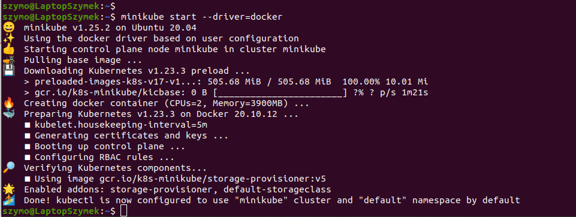
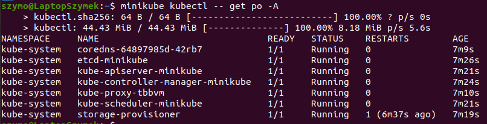
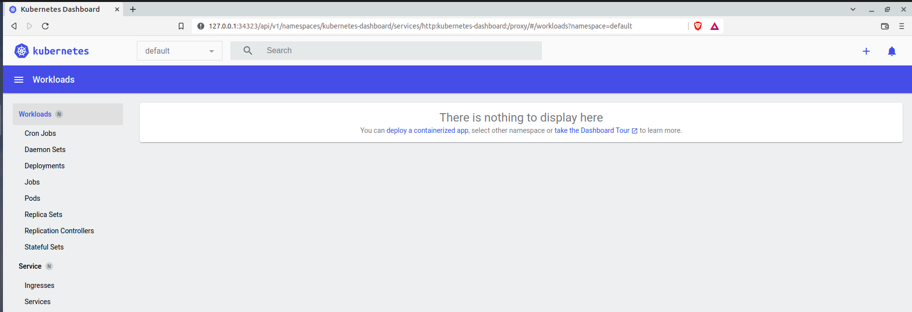
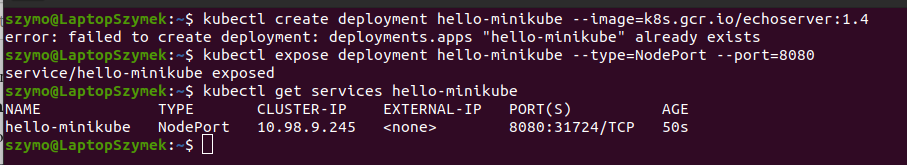
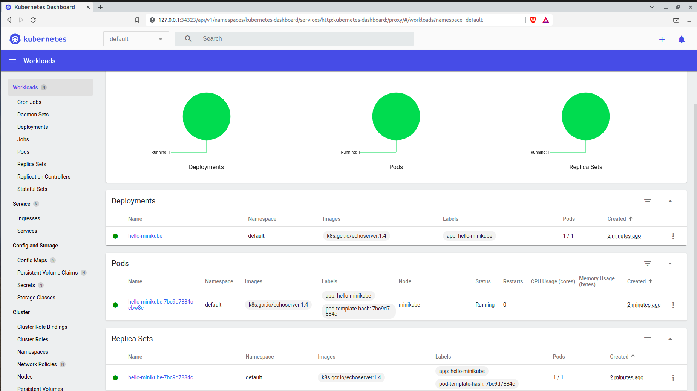

# Instalacja Kubernetes

1. Zainstalowano minikube:

```
minikube start --driver=docker
```


2. Pobrano kubectl:

```
minikube kubectl -- get po -A
```


3. Uruchomiono dashboard:

```
minikube dashboard
```


4. Sprawdzono łączność w przeglądarce:




## Deploy przykładowej aplikacji

1. Utworzono prosty deployment i wyeksponowano na port 8080:

```
kubectl create deployment hello-minikube --image=k8s.gcr.io/echoserver:1.4
kubectl expose deployment hello-minikube --type=NodePort --port=8080
```


2. Dashboard po deploymencie:


