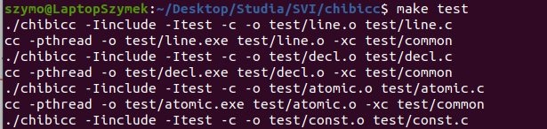
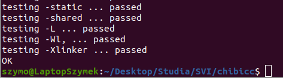
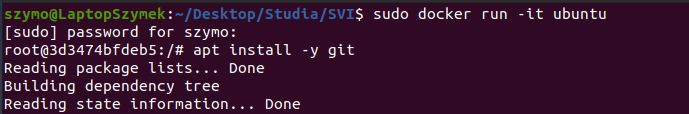
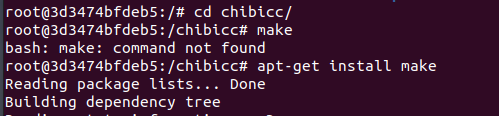
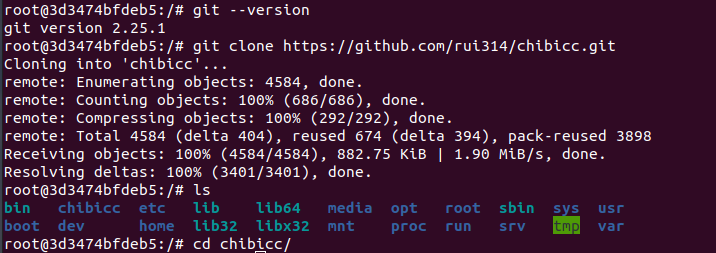
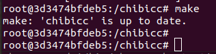
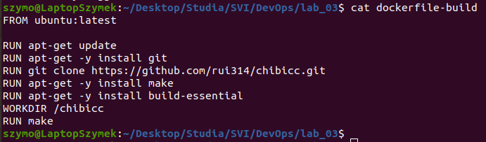
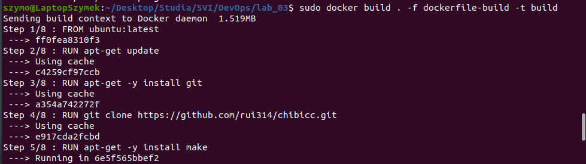
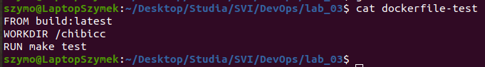
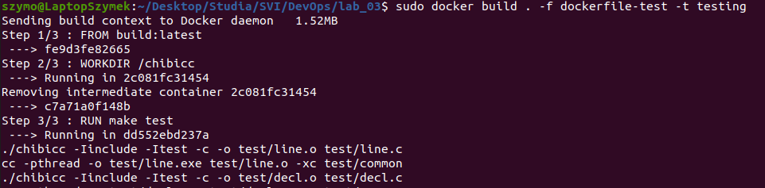

# Sprawozdanie Lab03
# Szymon Rewilak

## Przebieg ćwiczenia

# Przeprowadzenie buildu

1. Sklonowano repozytorium spełniające wymagania laboratorium. Klonowanym projektem jest kompilator C o nazwie chibicc. Projekt został napisany w języku C.


2. Przeprowadzono build programu z wykorzystaniem pliku Makefile:


3. Uruchomiono testy dołączone do projektu. Ze względu na długi wydruk, w sprawozdaniu umieszczono jedynie początek i koniec wyjścia konsoli:





# Przeprowadzenie buildu w kontenerze

1. Uruchomiono kontener ubuntu, by uruchomić aplikację C:
```
sudo docker run -it ubuntu
```


2. Do sklonowania repozytorium i przeprowadzenia builda konieczne było zainstalowanie zależności; git, make oraz build-essential:

```
apt-get git
apt-get make
apt-get build-essential

```





3. Sklonowano repozytorium do obrazu:

```
git clone https://github.com/rui314/chibicc.git
```



4.Pomyślnie uruchomiono program poleceniem make:




5. Pomyślnie uruchomiono test poleceniem make test:


# Przeprowadzenie buildu z wykorzystaniem Dockerfile

1. Utworzono dockerfile, z użyciem którego można przeprowadzić builda projektu:
Flaga -y została użyta, by każde zapytanie Y/n zostało automatycznie zaznaczone.

Plik dockerfile-build:

```
FROM ubuntu:latest

RUN apt-get update
RUN apt-get -y install git
RUN git clone https://github.com/rui314/chibicc.git
RUN apt-get -y install make
RUN apt-get -y install build-essential
WORKDIR /chibicc
RUN make
```



2. Stworzono obraz o nazwie build z wykorzystaniem Dockerfile o nazwie dockerfile-build:

```
sudo docker build . -f dockerfile-build -t build
```

Celem zwiększenia przejrzystości sprawozdania zrzut ekranu został przycięty.


Poprawne budowanie projektu:


3. Uruchomiony kontener:


3. Przeprowadzono testy z wykorzystaniem dockerfile, na podstawie wcześniej uruchomionego kontenera:

Plik dockerfile-test:

```
FROM build:latest
WORKDIR /chibicc
RUN make test
```



4. Uruchomiono testy z wykorzystaniem dockerfile:

```
sudo docker build . -f dockerfile-test -t testinf 
```



5. Poprawne przechodzenie testów:


