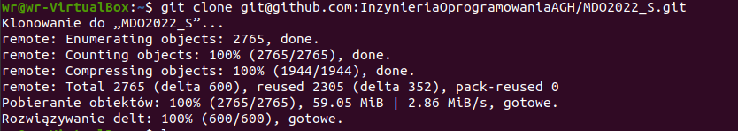
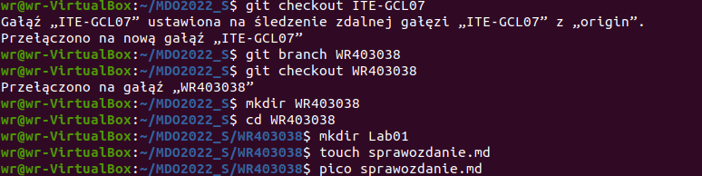
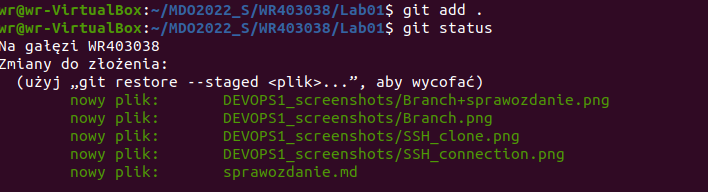
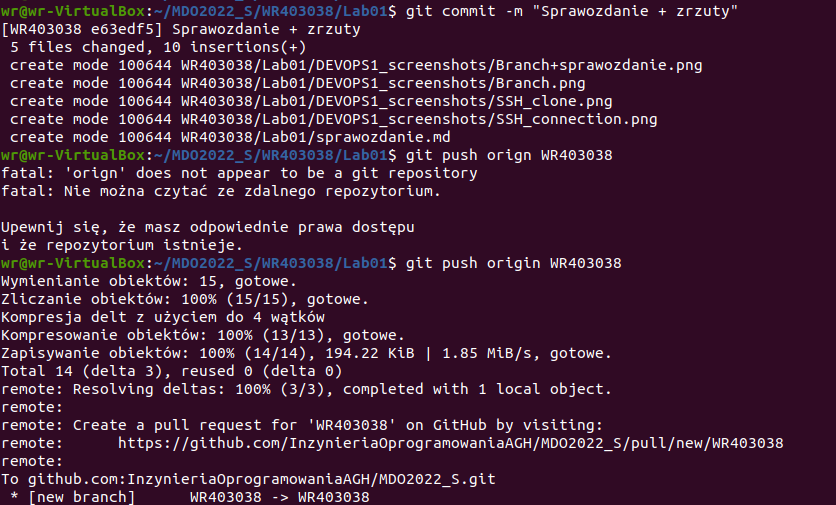

Sprawozdanie LAB01 Weronika Rusinek 403038

1. Instalacja Git i obsługa SSH: sudo apt install git

2. Klonowanie SSH: git clone git@github.com:InzynieriaOprogramowaniaAGH/MDO2022_S.git

3. Przełączanie między gałęziami: git checkout main, git checkout ITE-GCL07
4. Tworzenie nowej gałęzi: git branch WR40303

5. 
  - tworzenie nowego katalogu: mkdir
  - dodawanie sprawozdania: touch
  - Sprawdzenie statusu, śledzenie plików: git status, git add . 
  - Tworzenie commita: git commit -m "nazwa commita"
  -  Wyciąganie brancha: gitt push orign WR403038

6. Pull Request

