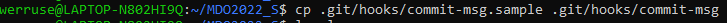
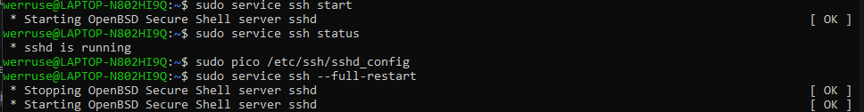
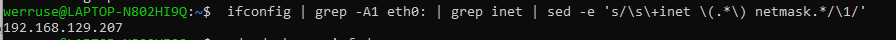
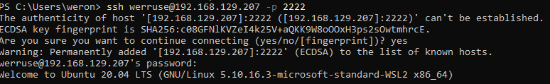
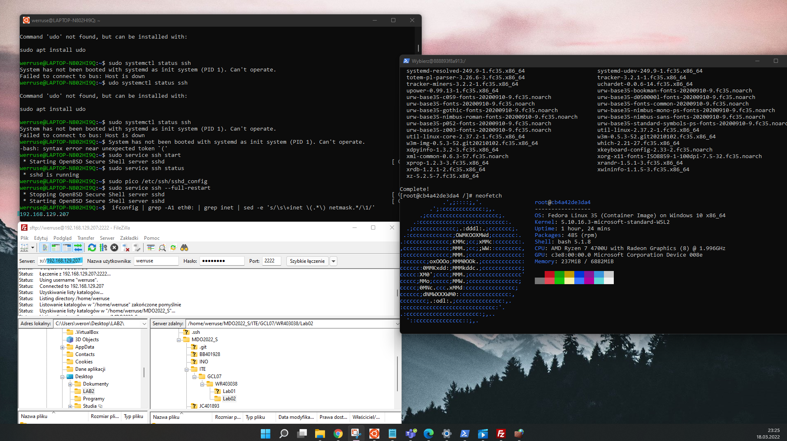
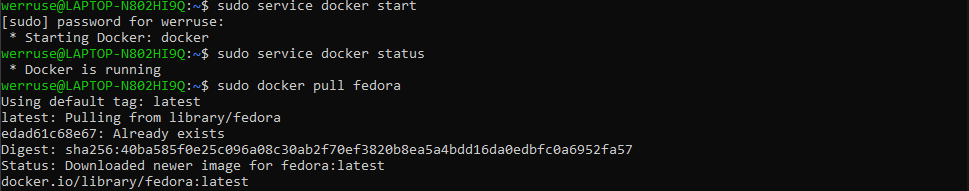
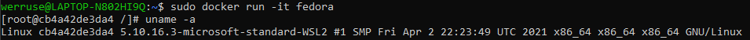
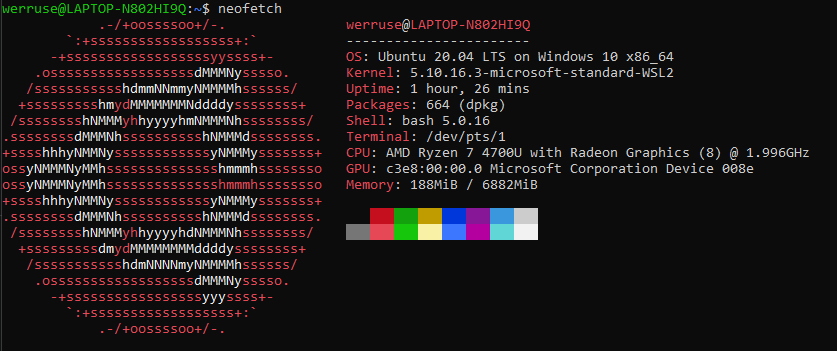
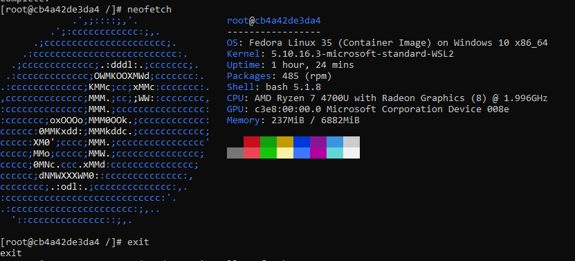
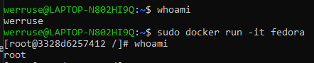

Sprawozdanie LAB02 Weronika Rusinek 403038

1. Przygotowanie git hooka do sprawdzania tytułu commita: WR403038 i laboratorium:

2. Hook: 

	#!/usr/bin/python3 
	import sys                                                                                                              
	commit=sys.argv[1]
	fileName=open(commit,'r')  
	check=fileName.read() 

	c1=check.split('\n')[0]
	c2=check.split('\n')[2]      
	if c1 != "WR403038": 
			print("Are you sure that your commit message contains your details?")                                                 
 	 exit(1)                                                                                                            
	 if not (c2.find("02") != -1):                                                                                                
	print("Check your current catalog!")                                                                                    
  
                                                                                                                                                                                                                                  
exit(0)   
:::

3. Przygotowanie środowiska dockerowego:

	- Dostęp do Ubuntu WSL poprzez ssh: 

W Windows Terminal połączono się poprzez SSH: 

Połączenie wykonano także w programie FileZilla: 

	- docker:
Sprawdzenie statusu i praktyczne wykorzystanie dockera: pobranie i uruchomienie fedory

Wersje: 

a) ubuntu stosowane na WSL: 

b) środowisko dockerowe - fedora:

4. Założenie konta na DockerHub

![plot][./dockerhub.png]

