## **LAB3 - Weronika Rusinek - ITE  403038 gr lab 7**

# Punkt 1: Wykonaj kroki build i test wewnątrz wybranego kontenera bazowego.
Wybrano projekt strony nodejs.org: ([https://github.com/nodejs/nodejs.org](https://github.com/nodejs/nodejs.org) - otwarta licencja

Wybrany projekt spełnia wszystkie wymagania postawione w zadaniu: licencja, narzędzia Makefile, testy możliwe do uruchomienia.

- Sklonowanie repozytorium:  `git clone`

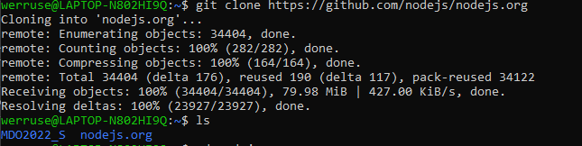

- Zainstalowanie zależności z wcześniejszym doinstalowaniem pakietów 

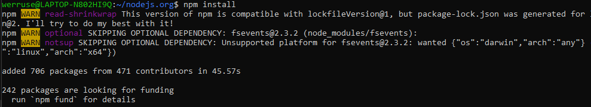
- Zbudowanie projektu: `npm run build`

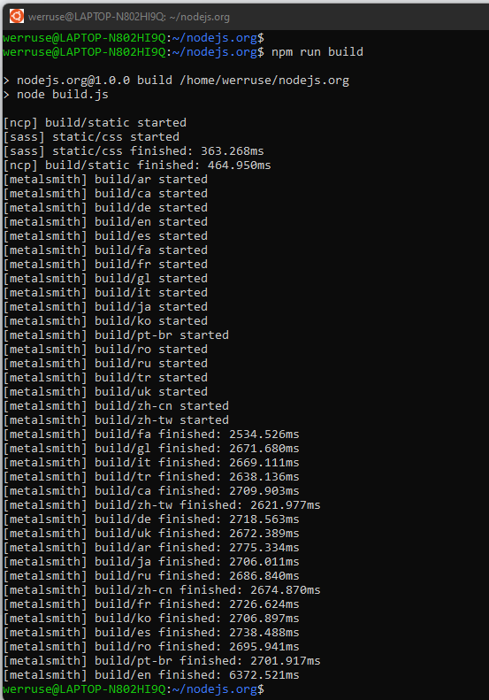
- Uruchomienie testów:  `npm test`

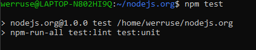

**Bulid w kontenerze:**
- Uruchamianie: 

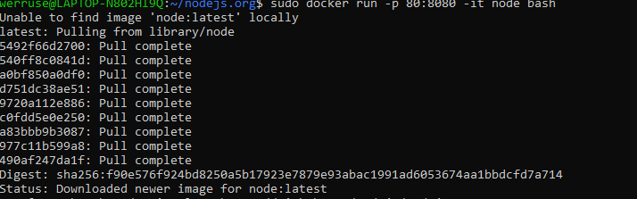
- Klonowanie:

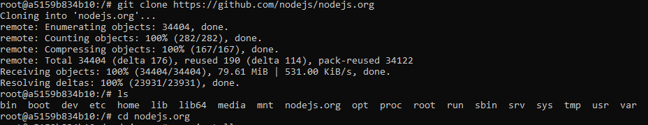
- Uruchamianie: 

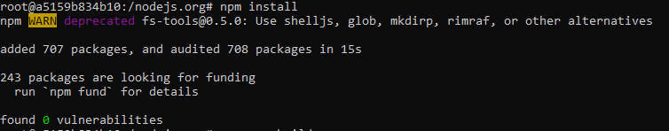

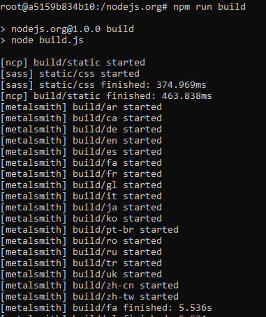
- Testy: 

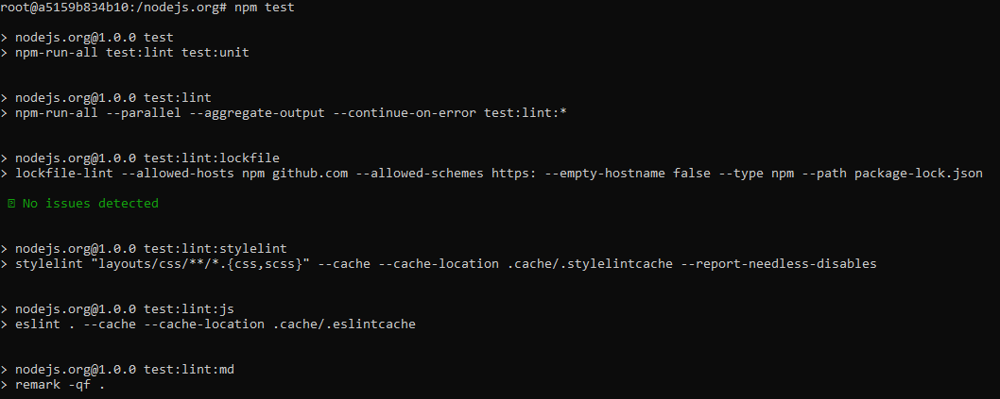

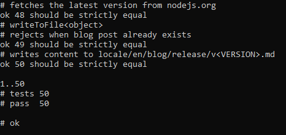

# Punkt 2: Stwórz dwa pliki Dockerfile automatyzujące kroki powyżej

**- Kontener pierwszy ma przeprowadzać wszystkie kroki aż do bulida:**

`RUN git clone  https://github.com/nodejs/nodejs.org`

`WORKDIR /nodejs.org/`

`RUN npm install`

`RUN npm build`

`#EXPOSE 8080`

**- Kontener drugi bazuje na pierwszym i wykonuje testy:**

`FROM nbuild:latest`

`WORKDIR /nodejs.org/`

`RUN npm run build`

# Punkt 3: Wykaż, że kontener wdraża się i pracuje poprawnie

Na poniższym zrzucie przez `-f` możliwość wyboru dockerfile. `-t`wybranie nazwy końcowej obrazu. 
Przedstawiam kolejno wykonane kroki wykazujące działanie dockerfile oraz poprawne wykonanie testów. 

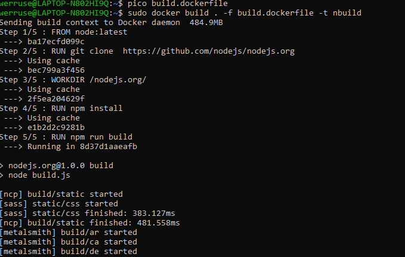

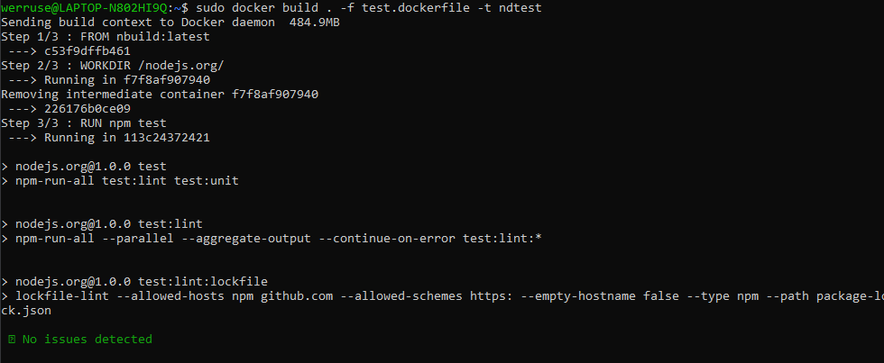

Powstałe obrazy: 

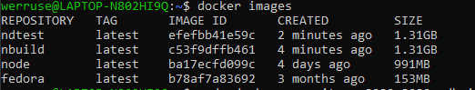

Uruchomienie obrazu: 

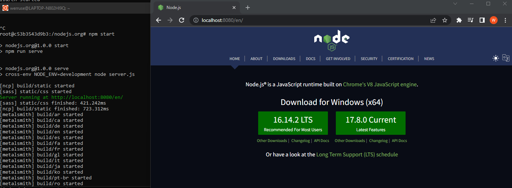

