## **LAB4 - Weronika Rusinek - ITE  403038 gr lab 7**

**Na wstępie chciałabym zaznaczyć, że podejmowałam kilka prób wykonania tego ćwiczenia dlatego w przypadku niektórych listowań mogą pojawiać się elementy o podobnych nazwach/potrzebne w kolejnych krokach.**

# Punkt 1: Zachowywanie stanu 

Rozpoczynam od stworzenia dwóch woluminów wejściowego oraz wyjściowego o nazwach odpowiednio `volin` oraz `volout`. Używam do tego polecenia `docker volume create`. Przełącznik `--name` użyty w celu nadania nazwy.

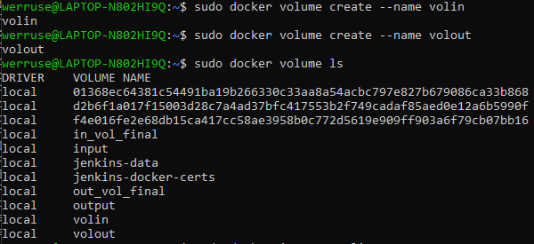

Następnie potrzebuję informacji o woluminie. Używam w tym celu polecenia `docker volume inspect`, który pozwala na wyświetlenie szczegółowych informacji o woluminie takich jak punkt montowania, który będzie potrzebny w kolejnych krokach pracy z woluminiem.

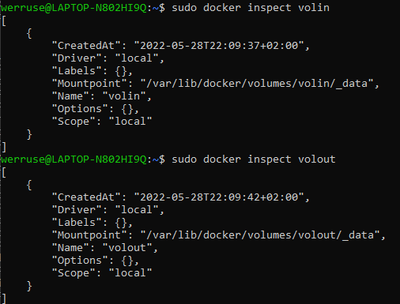

Biorąc pod uwagę zalecenie braku gita zmieniam swój kontener bazowy z node:latest na node:slim, który ma mniejszy rozmiar, nie zawiera gita i można powiedzieć, że jest "odchudzoną" wersją poprzednika. 

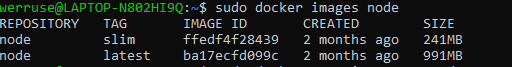
// tutaj dokładnie widać to o czym wspominałam na początku - obraz node utworzony 2 miesiące temu 

Kolejnym krokiem będzie uruchomienie kontenera bazowego za pomocą komendy: 
`sudo docker run -it --name nodev -v volin:/vin -v volout:/vout node:latest bash`
gdzie:
w celu zamontowania volume używam przełącznka `-v` w formacie `[nazwa volume]`:/`[punkt montowania w kontenerze]`
`-it` uzyte w celu interaktywnego terminalu
Nazwa nadana poprzez `--name` 
`bash` w celu terminala bashowego a nie node

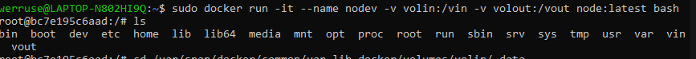

**Klonowanie repo na wolumin wejściowy**

Aby klonowanie było bezpośrednie polecenie `git clone` wykonuje w sprawdzonym wcześniej punktu montowania woluminu. 

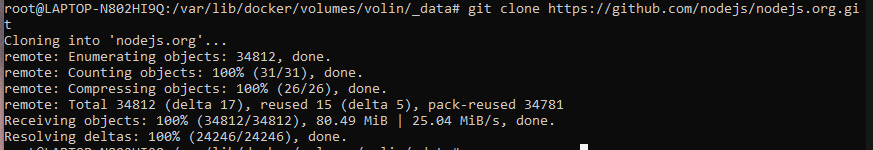

poziom konteneru:

**Uruchamiania bulidu w kontenerze:**
Rozpoczynam od skopiowania katalogu bezpośrednio na kontener, następnie instaluje na nim npm, a później za pomocą `npm ci` instaluje dependencje (clean-install). 

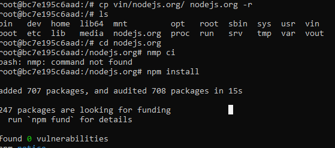

uruchomienie builda: `npm run build`

**Zapis plików na woluminie wyjściowym**

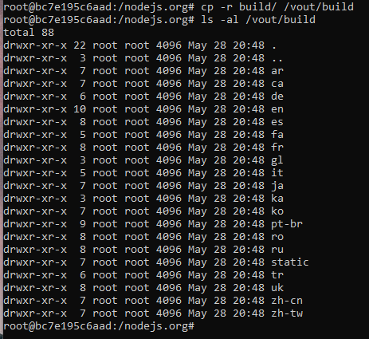

# Punkt 2: Eksponowanie portu 

Obraz dockerowy z iperfem: alternatywa dla clearlinux, która wybrałam ze względu na kompatybilność z arm64 jest oparta na alpine od taoyou. 

Uruchamiam serwer poprzez docker run 
`-p`- publish ( publikowanie portu)
`-it` interaktywny terminal
`-rm` usunięcie obrazu po zamknięciu 

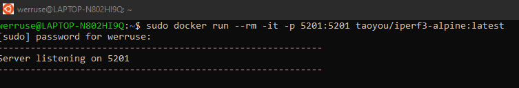

Aby połączyć się z drugiego kontenera uruchamiam go, `-c` umożliwia działanie jako klient, a `--time` czas.
Połączenie udało się nawiązać.

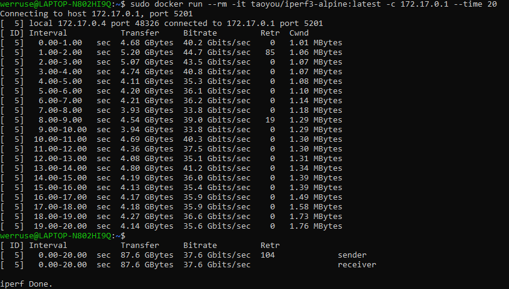

Logi z kontenera: 

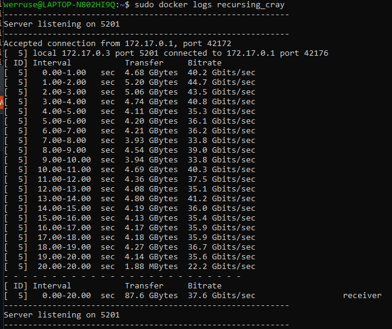

# Punkt 3: Instalacja Jenkins 

Wykonane przeze mnie kroki bazują na: https://www.jenkins.io/doc/book/installing/docker/
Rozpoczęłam od stworzenia nowej sieci dockerowej `sudo docker network create jenkins`, wykonałam to wcześniej dlatego niżej przedstawiam wylistowane sieci: 

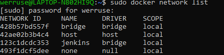

Kolejno, zgodnie z instrukcją pobieram i uruchamiam obraz DIND kontenera.
`--detach` - uruchomienie kontenera jako daemona
`--privileged`- użycie wszystkich uprawnień
`--network`- nazwa sieci, która będzie używana w kontenerach
`--network-alias` - alias sieci, który będzie używany  w kontenerach
`--env` - zmienne środowiskowe 
`---storage-driver`- właściwy mechanizm zapisu danych

Tworzę Dockerfile: używam znacznika `FROM` do wskazania, ze kontener będzie dziedziczył z obrazu `jenkins/jenkins:2.33.1-jdk11`. Poprzez USER określam użytkownika - roota. Używam znacznika `RUN` do wykonania polecenia w kontenerze
Na końcu uruchamiam builda. Poprzez `-t` podaję nazwę obrazu, który będzie stworzony.

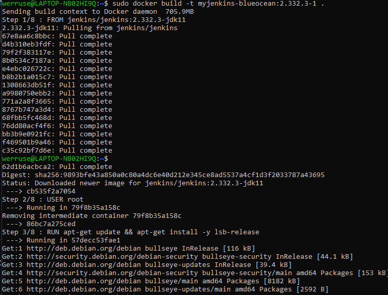
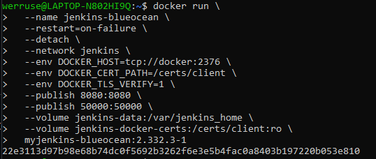

Odnalezienie hasła i instalacja wtyczek: 

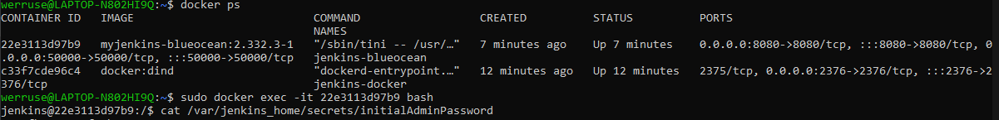
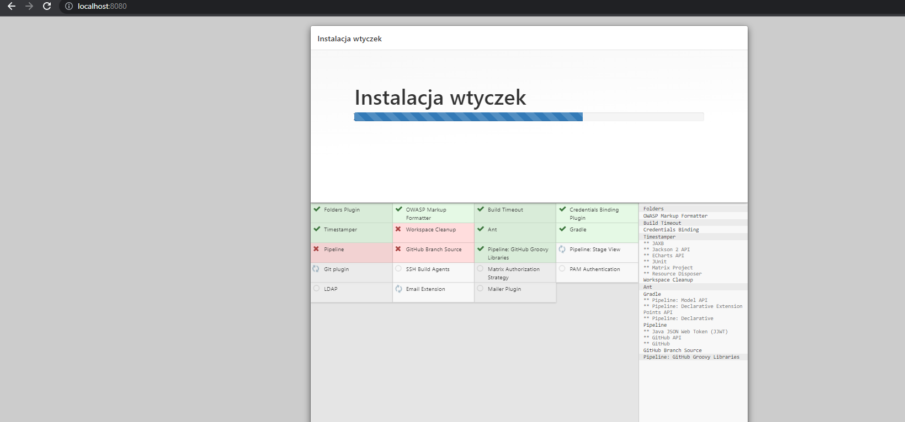

Ekran logowania:

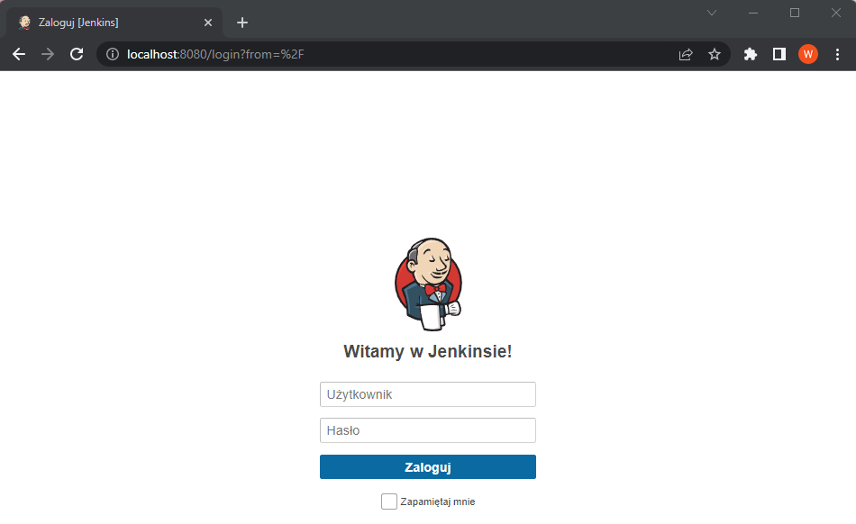

