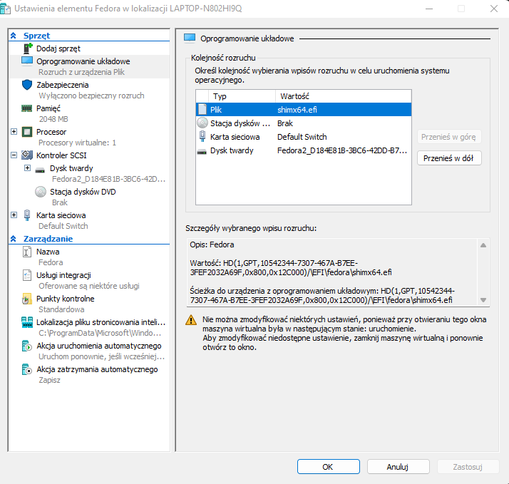
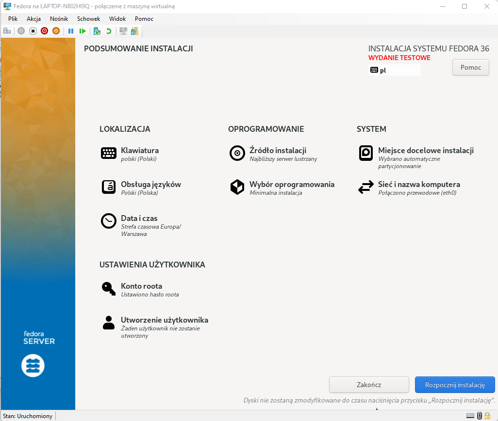
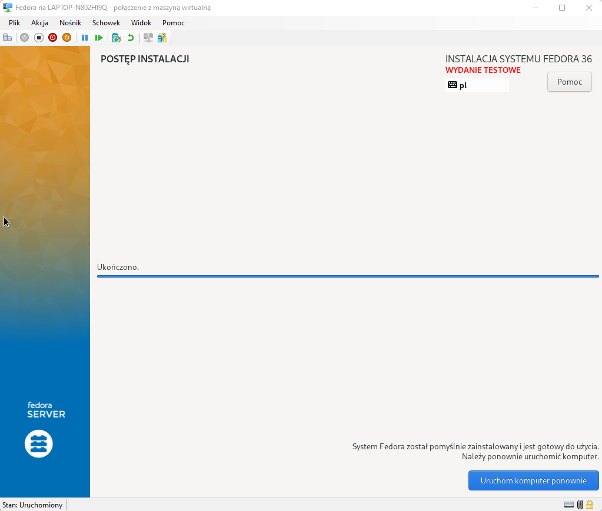
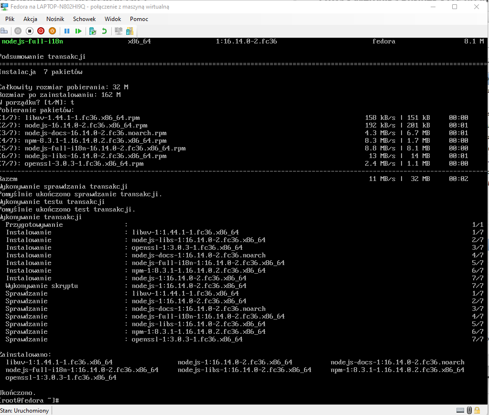
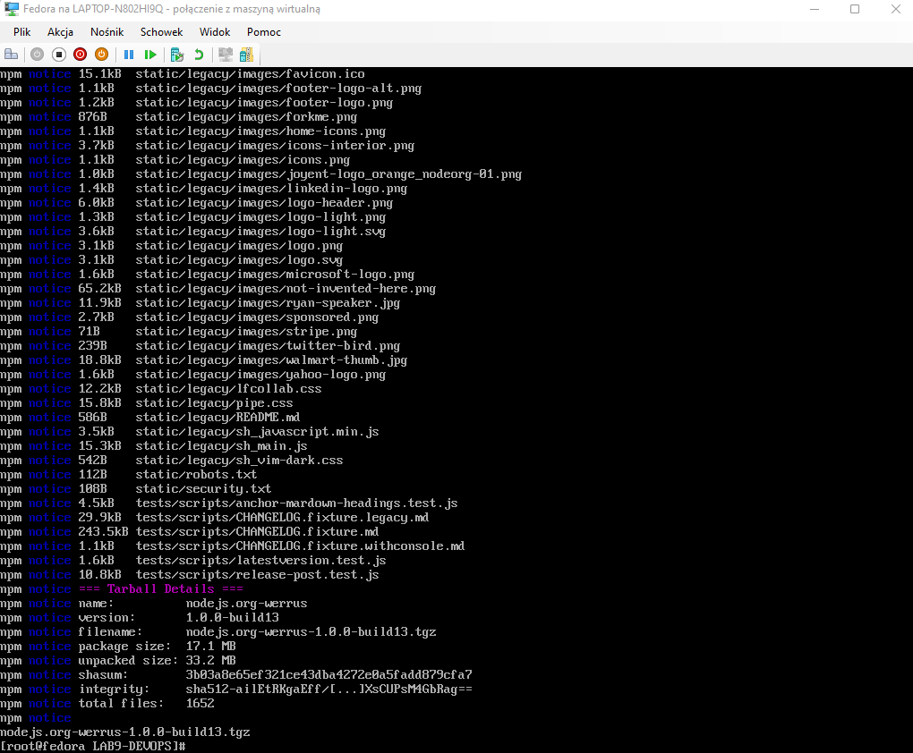
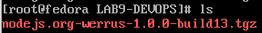
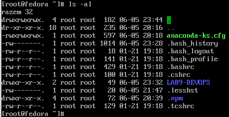
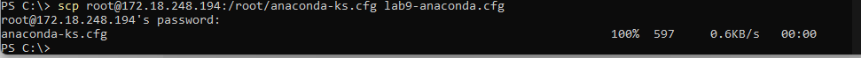

## **LAB9 - Weronika Rusinek - ITE  403038 gr lab 7**


#  Przygotowywanie systemu pod uruchomienie 

Rozpoczynam od pobrania pliku .iso z systemem Fedora. Wersja która została przeze mnie wybrana to: **Fedora 36 Beta 1.4**  Przy użyciu Hyper-V dokonuje instalacji. Podczas procesu definiuje ustawienia wymagane w instrukcji. 
Hyper-V:


Instalacja:



Po procesie instalacji rebootuje system i loguje się jako root ustawionym wcześniej hasłem. 

**Druga instalacja Fedora w VM**

Jeśli chodzi o ten punkt to został on przeze mnie pominięty. W projekcie Pipeline znajduje się pakiet npm registry, który można uznać za 'serwer HTTP' jeśli rozważamy to pod kątem działania. 

**Artefakty na serwerze HTTP**

Umieszczanie artefaktów znajduje się w kroku Publish w Pipeline. 

**Wykonanie zbioru poleceń umożliwiających pobranie artefaktu**

1. Należy rozpocząć od instalacji npm na Fedorze.
	`yum install npm`
	
	
2. Pobranie artefaktu: `npm pack "nazwa_pakietu"` -  w moim przypadku npm pack nodejs.org-werrus (opublikowane w ramach projektu)
	
	


# Zakres rozszerzony

**Automatyzacja uploadu na serwer HTTP - skonfiguruj pipeline**

W moim projekcie publikuje artefakt w npm registry, więc ten krok jest już wykonany. Upload dokonuję przed `npm publish` w stage Publish mojego pipeline. Jest to możliwe przez token wygenerowany na npm i dodany w zmiennych na Jenkinsie. 

```
stage('Publish') {
            agent {
                docker {
                    image 'node'
                    args '-v vol-in:/vi -v vol-out:/vo'
                }
            }
            when { branch "CI" }
            steps {
                dir('pckg/$BUILD_NUMBER') {
                        script{
                            env.VERSION = sh( script: "npm view . version",returnStdout: true).trim()
                            echo "VERSION: ${env.VERSION}"
                        }
                        sh 'ls . -al'                    
                        withEnv(["TOKEN=${NPMJS_TOKEN}"]) {
                            sh 'echo "//registry.npmjs.org/:_authToken=${TOKEN}" >> ~/.npmrc'
                        }
                        sh 'git config --global user.email "werruse@gmail.com"'
                        sh 'git config --global user.name "weronika_rusinek"'
                        withEnv(["TOKEN=${GH_TOKEN}"]) {
                            sh 'git config remote.origin.url "https://${TOKEN}@github.com/werruse/nodejs.org.git"'
                        }
                        withEnv(["VER=${VERSION}"]){
                            sh 'npm version ${VER}-build$BUILD_NUMBER'
                            sh 'git tag -a "${VER}-build$BUILD_NUMBER" -m "${VER}-build$BUILD_NUMBER"'
                        }
                        sh 'npm publish'
                        sh 'git push --tags'
                }
                sh 'ls'
            }
        }
```

 ***Jeżeli artefaktem jest plik RPM, serwer HTTP powinien serwować repozytorium (createrepo)***

W moim przypadku artefaktem jest plik tgz.

**Instalacja nienadzorowana**

1. Lokalizacja pliku odpowiedzi z instalacji.

Plik został zlokalizowany na Fedorze:



Następnie poprzez scp, który zapewnia transfer plików przerzucam go na Windowsa. 
Należało do tego sprawdzić adres IP Fedory i podłączyć się bezpośrednio do roota, ponieważ defaulotwo otrzymywałam połączenie weron@adres_ip, gdzie weron - user Windowsa (nie ma takiego profilu na Fedorze). 



**Dodanie elementów odpowiedzialnych za wszystkie potrzebne dependencje**

Kluczowe jest tutaj dodanie npm. Wszystkie elementy związane z jego instalacją są wykonywane przez pobranie pakietu instalacyjnego z repo. Instalacja dependencji i pobranie dokonuje się w procedusze post. 


```
%packages
@^minimal-environment
npm*

%end

%post

npm i nodejs.org-werrus
npm pack nodejs.org-werrus

%end
```
