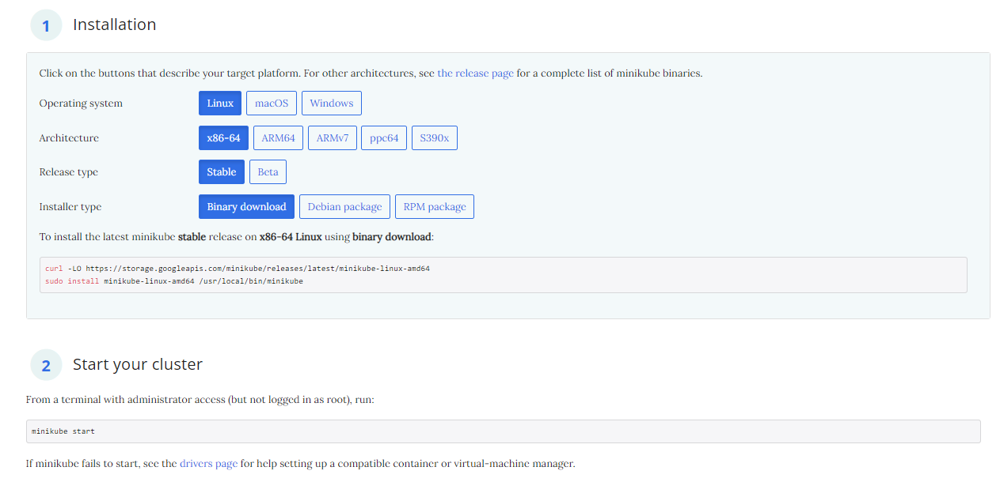
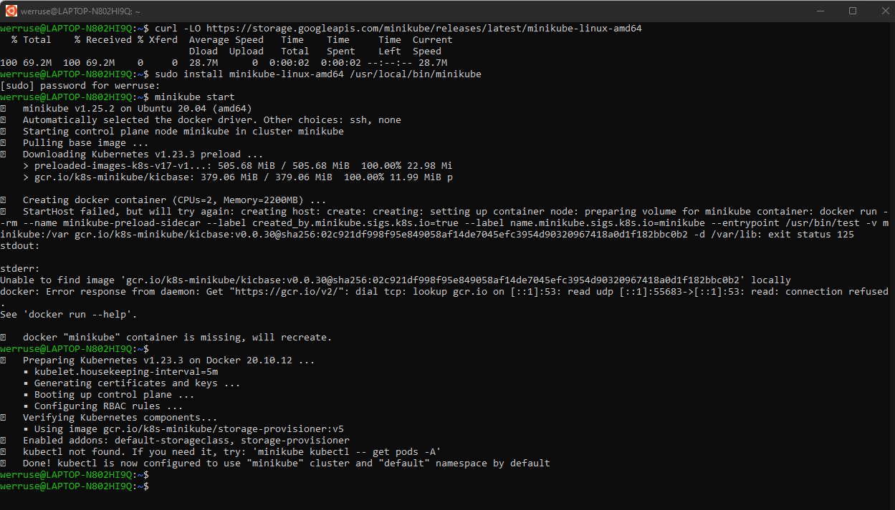
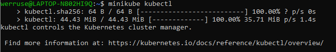
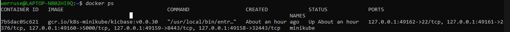
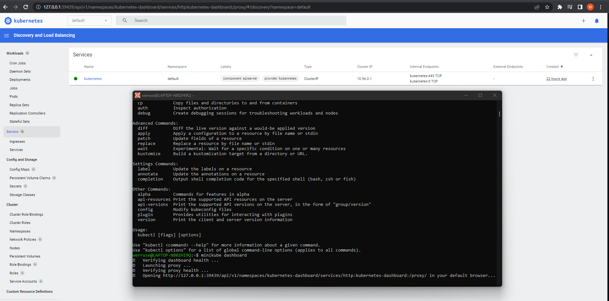
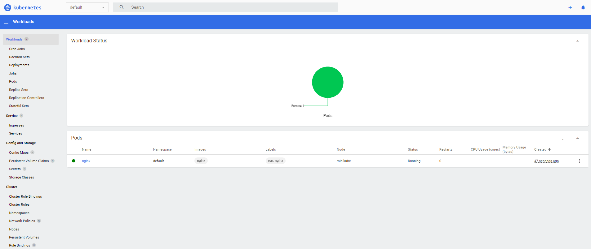
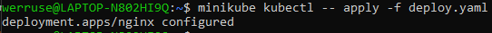
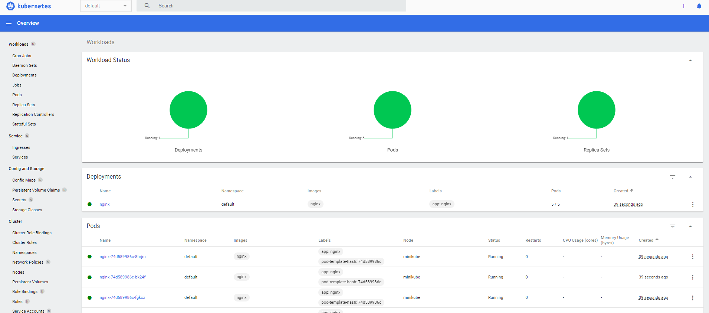

## **LAB11 - Weronika Rusinek - ITE  403038 gr lab 7**


#   Instalacja klastra Kubernetess

1. Z oficjalnej strony producenta przeprowadzam instalację klastra Kubernetess dla Ubuntu na WSL2.





2. Zaopatruje się w polecenie *kubectl*


3. Uruchamiam Kuberneres, działający kontener:


4. Uruchamiam dashboard:




# Analiza posiadanego kontenera i uruchamianie oprogramowania

Korzystam z obrazu-gotowca, aplikacja pracuje jako kontener. 

Uruchomienie: `minikube kubectl run -- nginx --image=nginx`
Wyprowadzenie portu na 5000: `minikube kubectl port-forward nginx 5000:80`


Utworzony pod: 


# Wdrożenie manualne -> plik wdrożenia  

Plik YAML dla wdrożenia 5 podów nginxa:

```
apiVersion: apps/v1
kind: Deployment
metadata:
  name: nginx
  labels:
    app: nginx
spec:
  replicas: 5
  selector:
    matchLabels:
      app: nginx
  template:
    metadata:
      labels:
        app: nginx
    spec:
      containers:
      - name: nginx
        image: nginx
        ports:
        - containerPort: 80
```



Wcześniej usunięte poda utworzonego na początku więc na poniższym zrzucie widzimy pełne wdrożenie yamla: 


