| Imię i nazwisko | Grupa dziekańska | Termin zajęć | Grupa zajęciowa |
| ----------- | ----------- | ----------- | ----------- |
| Adam Głąb | 03 | 09.03.2022r | 08 |

# Sprawozdanie z ćwiczenia laboratoryjnego nr 1

## Zadanie 1

Podczas wykonywania ćwiczenia wykorzystano WSL z zainstalowanym Ubuntu 20.04. System posiadał uprzednio zainstalowany Git oraz obsługę SSH.

Wykorzystując komendę `ssh-keygen -y -f ~/.ssh/klucz` wygenerowano klucz prywatny i publiczny. W celu zachowania zgodności nazw, nazwy kluczy zmieniono odpowiednio na **id_rsa**. 

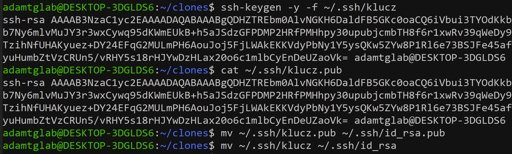

Klucz publiczny został skopiowany i umieszczony w odpowiedniej sekcji w ustawieniach profilu GitHub.

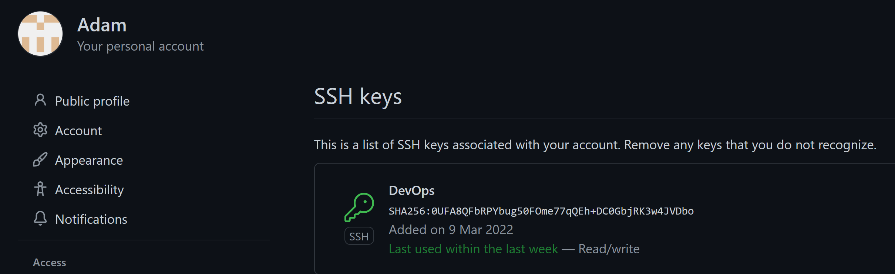

## Zadanie 2

Utworzono pomocniczy folder **temp/** do którego sklonowano repozytorium poprzez https poleceniem `git clone https://github.com/InzynieriaOprogramowaniaAGH/MDO2022_S.git`.

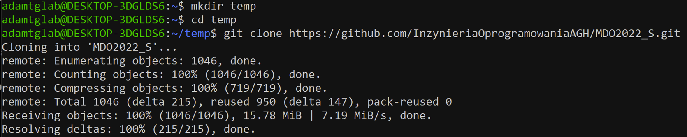

## Zadanie 3

Utworzono folder **clones/** do którego następnie sklonowano repozytorium z wykorzystaniem polecenia `git clone git@github.com:InzynieriaOprogramowaniaAGH/MDO2022_S.git`. Wykorzystanie tego typu klonowania było możliwe dzięki wykorzystaniu klucza publicznego SSH wygenerowanego w pierwszym punkcie.

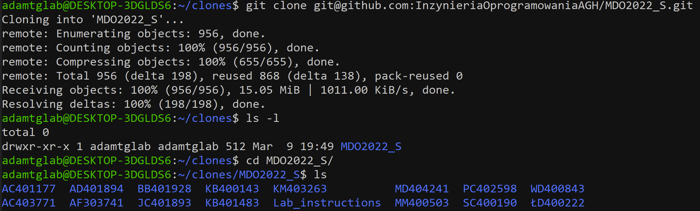

## Zadanie 4

Przełączono się na gałąź main -> gałąź grupy (w tym przypadku GCL08) kolejno komendami:

> `git checkout main`

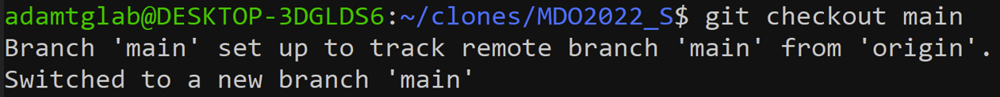

> `git checkout ITE-GCL08`

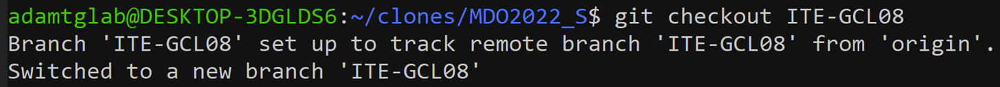

## Zadanie 5

Utworzono nową gałąź wykorzystując polecenie `git checkout -b AG400408`.

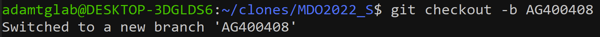

## Zadanie 6

Rozpoczęto pracę na gałęzi:

- przeniesiono się do folderu głównego gałęzi i utworzono w nim folder o takiej samej nazwie jak gałąź (**AG400408**),

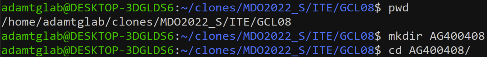

- w nazwanym folderze utworzono nowy folder Lab01,

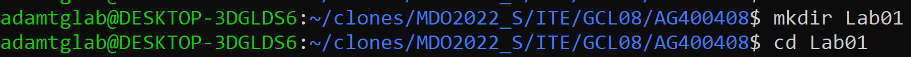

- w folderze Lab01 umieszczono plik ze sprawozdaniem i zrzuty,

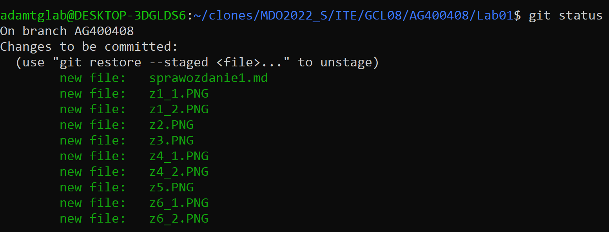

- wysłano zmiany do zdalnego źródła,

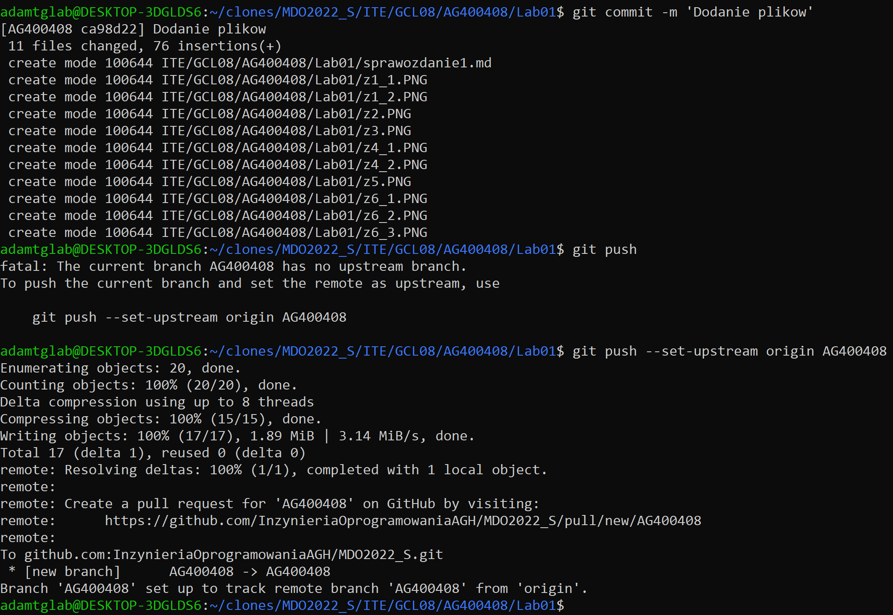

- podjęto próbę wciągnięcia gałęzi do gałęzi grupowej

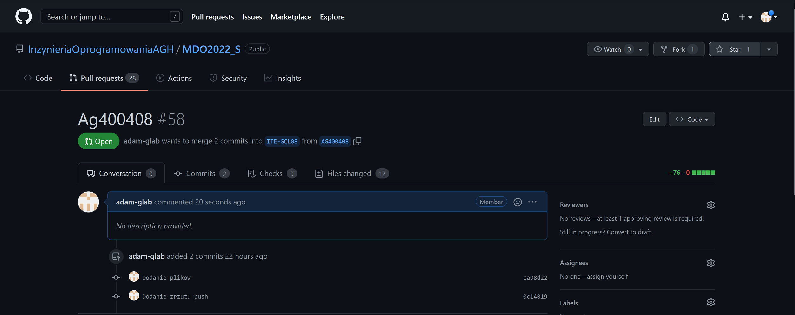

## Zadanie 7

Wystawiono pull request do gałęzi grupowej (widoczne na ostatnim zrzucie).
