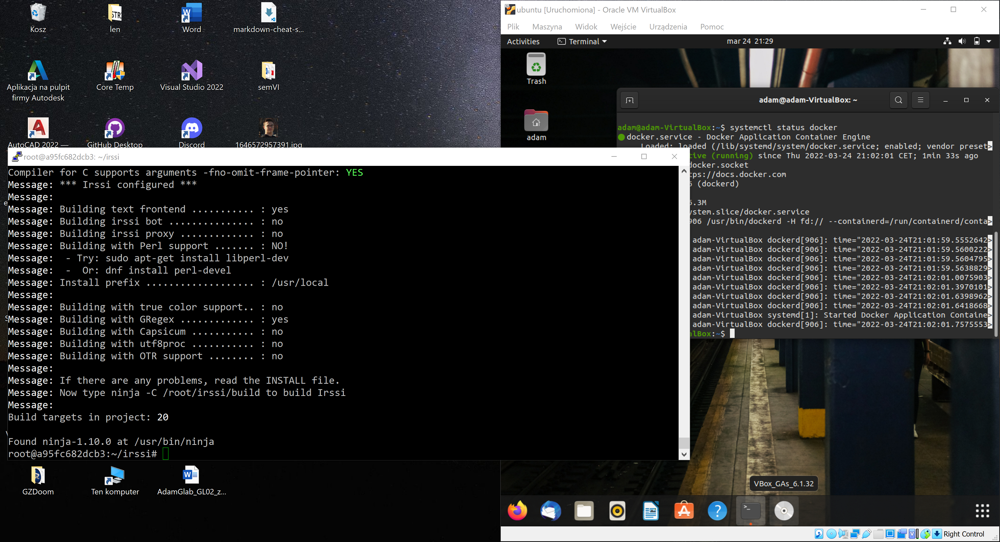
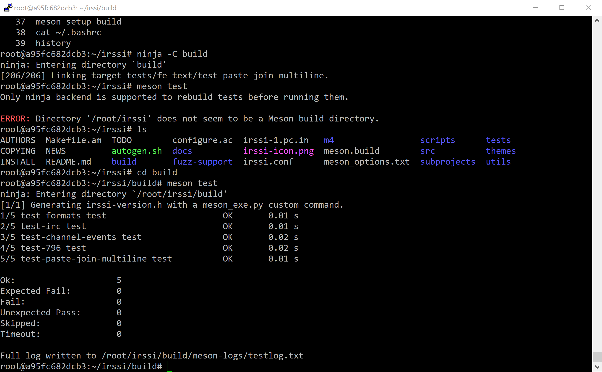
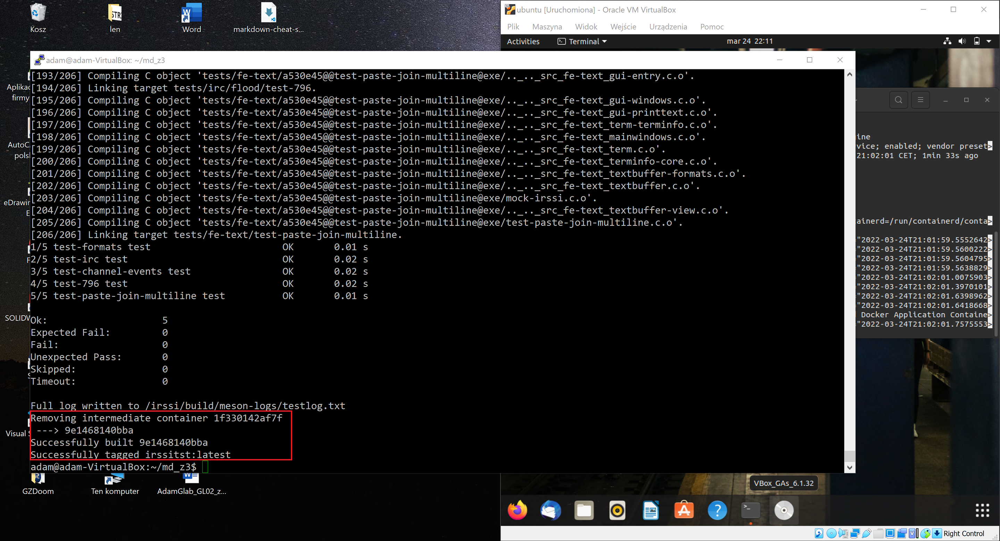
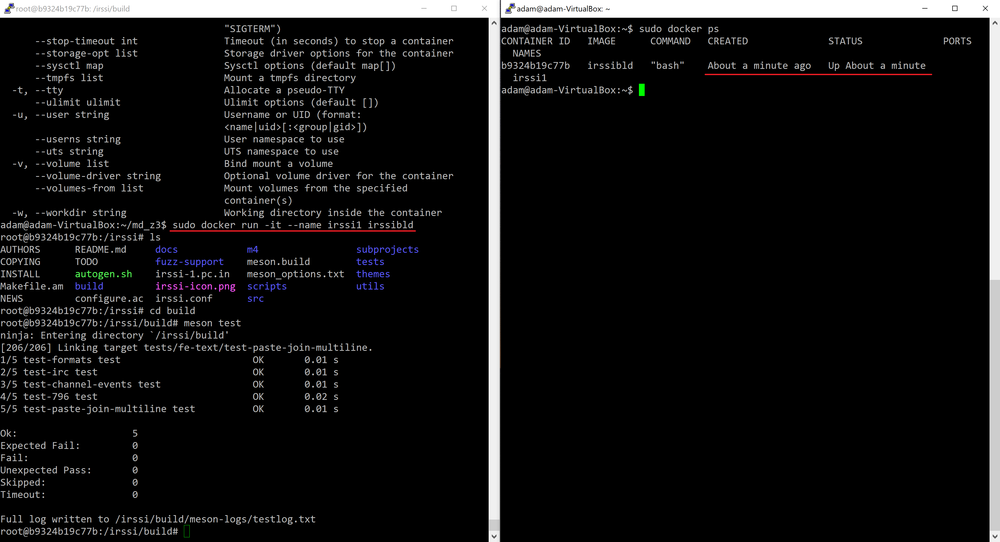

| Imię i nazwisko | Grupa dziekańska | Termin zajęć | Grupa zajęciowa |
| ----------- | ----------- | ----------- | ----------- |
| Adam Głąb | 03 | 23.03.2022r | 08 |

# Sprawozdanie z ćwiczenia laboratoryjnego nr 3


## Zadanie 1

W ramach ćwiczenia wybrano repozytorium [https://github.com/irssi/irssi](https://github.com/irssi/irssi).

Kierując się krokami z poprzedniego ćwiczenia koniecznymi do utworzenia tunelu do maszyny wirtualnej nawiązano połączenie. I podjęto kolejne kroki:

- ściągnięto obraz Ubuntu `sudo docker pull ubuntu`,
- rozpoczęto pracę na obrazie `sudo docker run --name irssi1 -it ubuntu`,
- zaktualizowano apt `apt update`,
- zaopatrzono kontener w najpotrzebniejsze biblioteki i paczki `apt install meson gcc make automake git`,
- sklonowano repozytorium `git clone https://github.com/irssi/irssi.git`,
- w folderze *irssi/* podjęto próbę zbudowania `meson setup build`:
    - pobrano kolejno brakujące komponenty: 
        - `apt-get install libglib2.0-dev`,
        - `apt-get install libssl-dev`,
        - `apt-get install libghc-terminfo-dev`,
    - ponownie podjęto próbę zbudowania, tym razem udaną:

    
- w folderze *build/* przeprowadzono testy komendą `meson test`:


## Zadanie 2

Utworzono dwa pliki Dockerfile odpowiadające za zautomatyzowanie kroków podjętych w poprzednim zadaniu:

- najpierw stworzono plik **Docker-Build**, który odpowiadał za przeprowadzenie wszystkich kroków aż do buildowania:

```Dockerfile
FROM ubuntu:latest

ENV DEBIAN_FRONTEND=noninteractive

RUN apt update
RUN apt-get -y install git gcc make automake meson libglib2.0-dev libssl-dev libghc-terminfo-dev

RUN git clone https://github.com/irssi/irssi.git

WORKDIR irssi

RUN meson setup build
```

*Wyjaśnienie:* Na drodze realizacji zadania napotkano problem w postaci wymuszenia od użytkownika wprowadzenia strefy czasowej przy pobieraniu paczki **terminfo**. Zatrzymywało to proces buildowania. W ramach naprawienia problemu wprowadzono do treści pliku *ENV DEBIAN_FRONTEND=noninteractive*, który pozbywa się niechcianej interakcji.

- zbudowano pierwszy kontener `sudo docker build -t irssibld:latest . -f ./Docker-Build`:


- stworzono plik **Docker-Test**, który odpowiadał za wykonanie testów:

```Dockerfile
FROM irssibld

WORKDIR build

RUN meson test
```
- zbudowano drugi kontener `sudo docker build -t irssitst:latest . -f ./Docker-Test`:



## Zadanie 3

*Kontener* powstaje na bazie *obrazu*, który zawiera elementy potrzebne do uruchomienia aplikacji (biblioteki, środowisko, narzędzia). 

Kontener tworzy wyizolowane środowisko, w którym pracuje obraz.

Działanie kontenera:



Po uruchomieniu kontenera `sudo docker run -it --name irssi1 irssibld `, kontener rozpoczyna działanie (podgląd w terminalu po prawej).