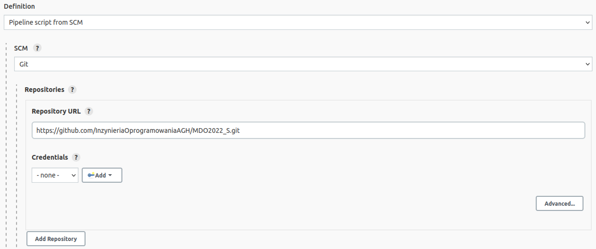
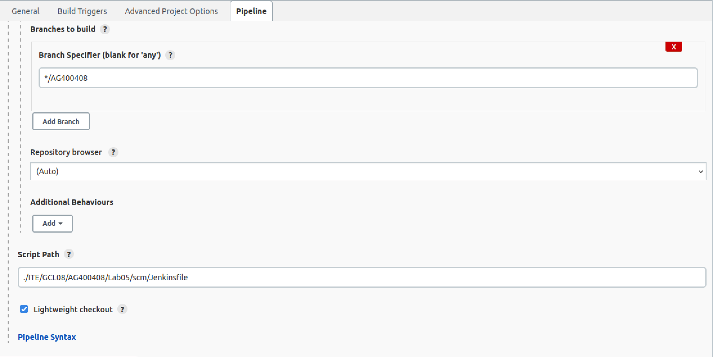
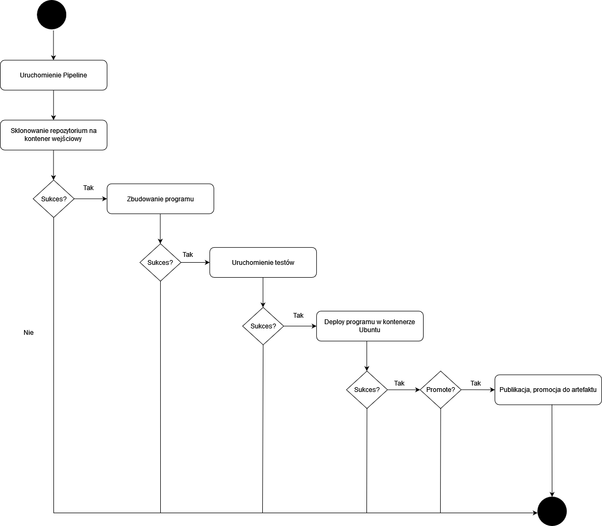

| Imię i nazwisko | Grupa dziekańska | Data wykonania | Grupa zajęciowa |
| ----------- | ----------- | ----------- | ----------- |
| Adam Głąb | 03 | 11.05.2022r | 08 |

# Pipeline - projekt

## Wstęp

W ramach projektu wybrano repozytorium [irssi](https://github.com/irssi/irssi). Celem projektu jest przeprowadzenie buildu i testów repozytorium poprzez zautomatyzowany pipeline Jenkins. 

## Przygotowanie Pipeline

Podstawą wykonania projektu jest konfiguracja Jenkinsa według [poradnika](https://www.jenkins.io/doc/book/installing/docker/) udostępnionego w oficjalnej dokumentacji.

Aby utworzyć projekt należy wybrać opcję `New Project` i następnie określić nazwę projektu oraz wybrać z listy `Pipeline`.

Definiując nowy pipeline należy przejść do sekcji `Definition` i wybrać opcję `Pipeline script from SCM`, w celu poprawnego podpięcia repozytorium z potrzebnymi Dockerfile i Jenkinsfile.

* W `Repository URL` należy podać adres repozytorium [przedmiotu](https://github.com/InzynieriaOprogramowaniaAGH/MDO2022_S) (Credentials nie są wymagane),
* W `Branch Specifier` należy wybrać [gałąź](https://github.com/InzynieriaOprogramowaniaAGH/MDO2022_S/tree/AG400408) osoby odpowiedzialnej za projekt `*/AG400408`,
* W `Script Path` należy podać dokładną [ścieżkę](https://github.com/InzynieriaOprogramowaniaAGH/MDO2022_S/blob/AG400408/ITE/GCL08/AG400408/Lab05/scm/Jenkinsfile) `./ITE/GCL08/AG400408/Lab05/scm/Jenkinsfile` do `Jenkinsfile`.

Konćowy efekt powinien wyglądać następująco:

Aby uruchomić pipeline należy wcisnąć `Build` w menu głównym projektu. Zbudowanie pipeline wymaga od użytkownika wprowadzenia numeru wersji oraz zaznaczenia parametru `PROMOTE`, który określa, czy ma wykonać się ostatni etap (`Publish`).

## Budowa Pipeline

Pipeline został podzielony na następujące etapy:

### Clone
  - Cel: 
    - sklonowanie irssi i umieszczenie plików w woluminie,
  - W jaki sposób: 
    - tworzony jest pomocniczy kontener `buffer`, do którego montowany jest wolumin wejściowy `volin`,
    - repozytorium zostaje skopiowane do folderu z danymi woluminu komendą `docker cp`,
    - dane zostają w woluminie po usunięciu kontenera.
  - Uwagi:
    - -,
  - Znane błędy:
    - -.
###  Build
  - Cel:
    - zbudowanie irssi, umieszczenie rezultatu buildu na kontenerze wyjściowym.
  - W jaki sposób:
    - budowany jest obraz na podstawie buildowego Dockerfile (wymaga podania dokładnej ścieżki),
    - uruchomiany jest kontener z zamontowanym woluminem wejściowym `volin` i wyjściowym `volout`,
    - uruchomienie kontenera wykonuje również komendy odpowiedzialne za zbudowanie irssi (po `bash -c`),
    - po zbudowaniu, pliki repozytorium kopiowane są do katalogu `result`, który wykorzystywany jest przez wolumin wyjściowy.
  - Uwagi:
    - -,
  - Znane błędy:
    - niestabilne połączenie może zakłócić proces aktualizowania `apt-get`, przez co build nie wykona się,
    - wówczas `apt-get clean` i `docker system prune -f` zabezpieczają przed ciągłym pobieraniem plików z niepełnego cache przy kolejnych próbach wykonania etapu.
###  Test
  - Cel:
    - uruchomienie wbudowanych w repozytorium testów.
  - W jaki sposób:
    - budowany jest obraz na podstawie testowego Dockerfile (wymaga podania dokładnej ścieżki),
    - kontener powstaje na bazie obrazu irssi utworzonego w poprzednim etapie, z zamontowanym woluminem wejściowym,
    - uruchomienie kontenera skutkuje przejściem do odpowiedniego katalogu i uruchomieniem testów komendą `meson test`.
  - Uwagi:
    - -,
  - Znane błędy:
    - -.
###  Deploy
  - Cel:
    - uruchomienie aplikacji w celu sprawdzenia jej działania przed publikacją.
  - W jaki sposób:
    - tworzony jest pomocniczy kontener na bazie Ubuntu,
    - do kontenera zamontowany jest wolumin wyjściowy `volout`, zawierający zbudowaną aplikację,
    - wewnątrz kontenera pobierane są zależności niezbędne do uruchomienia irssi,
    - irssi zostaje uruchomione, a kontener dobity i usunięty.
  - Uwagi:
    - -,
  - Znane błędy:
    - -,
###  Publish
  - Cel:
    - wypromowanie pliku do artefaktu; publikacja.
  - W jaki sposób:
    - utworzony zostaje katalog w przestrzeni roboczej Jenkinsa, który ma na celu przechowywać artefakty,
    - kontener ma zamontowany wolumin wyjściowy `volout`, oraz posiada zbindowanie do katalogu z artefaktami,
    - w pomocniczym kontenerze na bazie Ubuntu dochodzi do przekopiowania plików do zbindowanego folderu,
    - wszystkie konieczne pliki (zbudowane repozytorium), zostają umieszczone w archiwum,
    - następuje promocja pliku archiwum do artefaktu,
    - jeśli etap zakończy się sukcesem, artefakt będzie gotowy do pobrania.
  - Uwagi:
    - należy wykorzystać parametry `VERSION` (string) do słownego nazwania wersji i `PROMOTE` (boolean) do określenia, czy etap w ogóle się wykona,
    - efekt końcowy jest plikiem binarnym, stąd potrzeba umieszczenia plików w archiwum,
  - Błędy:
    - proces archiwizacji może zakończyć się niepowodzeniem, gdy losowe pliki z repozytorium ulegną korupcji, wówczas etap nie wykona się,
    - reset maszyny rozwiązuje problem.

## Diagram aktywności

