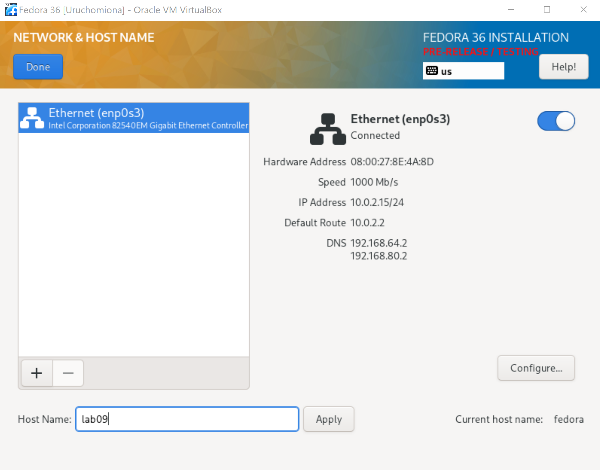
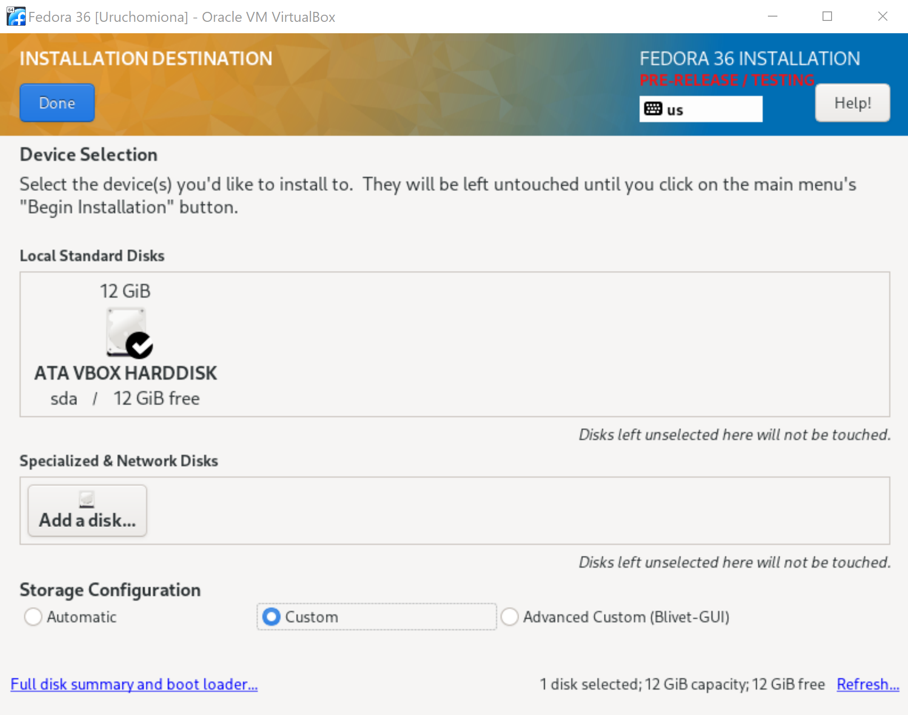
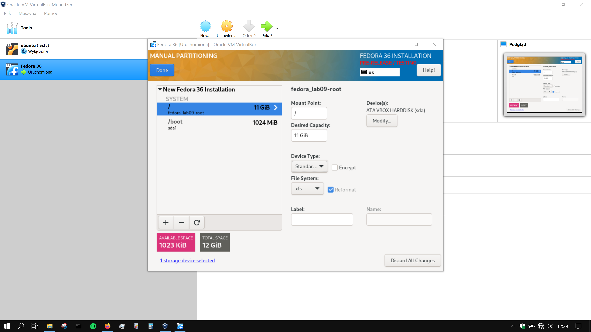
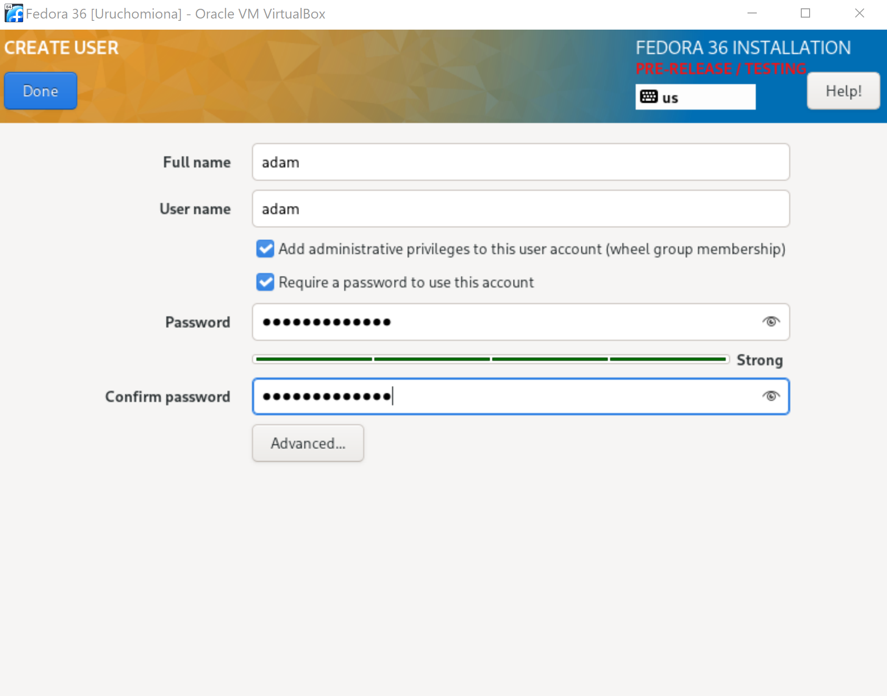
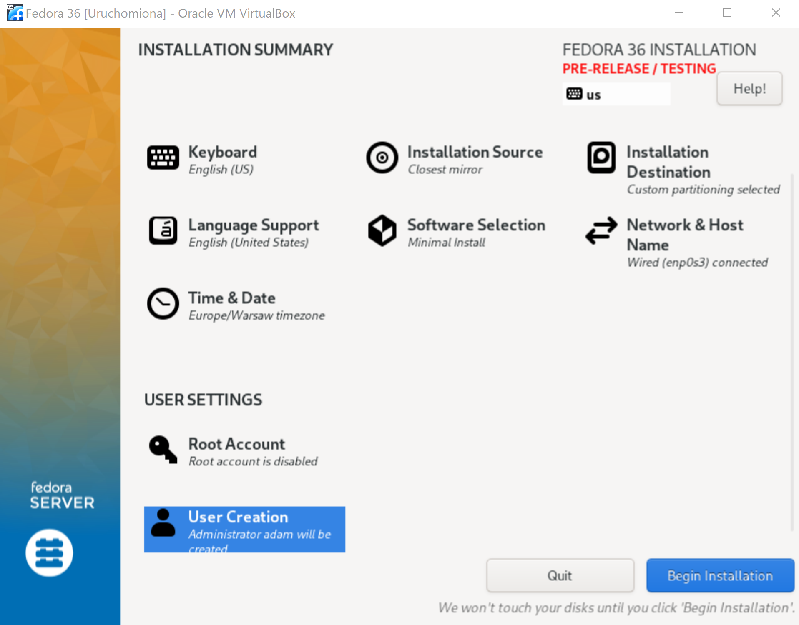
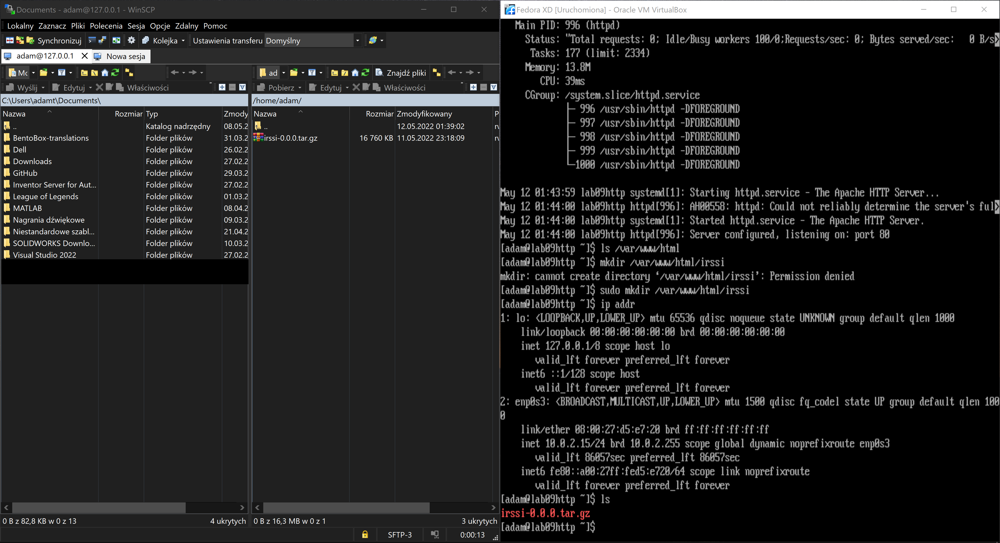
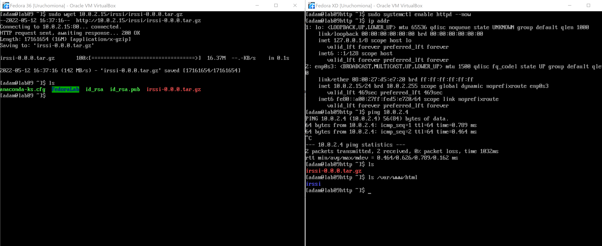
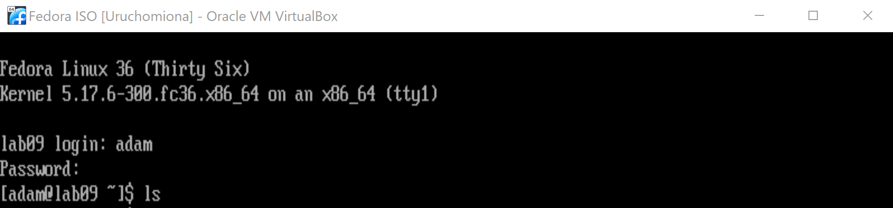

| Imię i nazwisko | Grupa dziekańska | Data wykonania | Grupa zajęciowa |
| ----------- | ----------- | ----------- | ----------- |
| Adam Głąb | 03 | 12.05.2022r | 08 |

# Laboratorium nr 9

## 1 - Przygotowanie systemu








Po postawieniu Fedory, znaleziono plik `anaconda-ks.cfg` w katalogu `/root`.

Plik został wyciągnięty z maszyny wirtualnej za pomocą programu `WinSCP`. W dalszej części wykonywania zadania ulegnie on modyfikacjom.

Po wstępnym skonfigurowaniu systemu postawiono drugą maszyne wirtualną Fedory o identycznych parametrach. Ta maszyna posłużyła za serwer, w którym umieszczono artefakt powstały w ramach projektu Pipeline (plik `.tar` zawierający [irssi](https://github.com/irssi/irssi)).

Na Fedorze "serwerowej" pobrano `httpd` poprzez `dnf -y install httpd` i uruchomiono serwis `systemctl enable httpd --now`.

Ponadto, dokonano pewnych operacji w celu wyłączenia firewalla:
* firewall-cmd --permanent --zone=public --add=http
* firewall-cmd --permanent --zone=public --add=https
* firewall-cmd --reload

Podobnie jak w przypadku pierwszej maszyny, na Fedorę "serwerową" załadowano plik `.tar` poprzez WinSCP.

Plik następnie umieszczono w `/var/www/html/irssi`.



W ramach nawiązania połączenia między maszynami utworzono wewnętrzną sieć NAT i zmieniono rodzaj połączenia w obu maszynach tak, aby obie były podłączone do nowej sieci.

Na Fedorze "bazowej" pobrano `wget` poprzez `dnf -y install wget` i następnie ściągnięto z Fedory "serwerowej" plik `.tar` komendą `wget 10.0.2.15/irssi/irssi-0.0.0.tar.gz`.



## 2 - Instalacja nienadzorowana

Wyciągnięty wcześniej plik `anaconda-ks.cfg` zmodyfikowano tak, aby uwzględniał istotne pakiety i ściąganie artefaktu z serwera. Ponadto, dodano linki do repozytorium Fedory oraz włączono tryb tekstowy, zastępując `graphical` -> `text`.

Link do pliku [anaconda-ks.cfg](https://github.com/InzynieriaOprogramowaniaAGH/MDO2022_S/blob/AG400408/ITE/GCL08/AG400408/Lab09/anaconda-ks.cfg)

```
# Repo
url --mirrorlist=http://mirrors.fedoraproject.org/mirrorlist?repo=fedora-$releasever&arch=x86_64
repo --name=updates --mirrorlist=http://mirrors.fedoraproject.org/mirrorlist?repo=updates-released-f$releasever&arch=x86_64
```
```
%packages
@^minimal-environment
wget
utf8proc
ncurses

%end
```
```
%post
wget --user-agent="Mozilla" http://10.0.2.15/irssi/irssi-0.0.0.tar.gz

%end
```
## 3 - Infrastructure as Code

Postawiono nową maszynę z Fedorą ("Fedora ISO"), podpiętą do wewnętrznej sieci NAT (aby mogła pobrać dane z Fedory "serwerowej").

Zamiast wykonywać standardowy proces instalacji, w konsoli na ekranie powitalnym wpisano:

```
vmlinuz initrd=initrd.img inst.stage2=hd:LABEL=Fedora-S-dvd-x86_64-36 rd.live.check quiet inst.ks=https://raw.githubusercontent.com/InzynieriaOprogramowaniaAGH/MDO2022_S/AG400408/ITE/GCL08/AG400408/Lab09/anaconda-ks.cfg
```

(podczas instalacji włączono tryb graficzny w celu "prostszego" debugowania)


Zainstalowano pomyślnie. Maszyna została wyłączona i następnie wyjęto plik `.iso` w konfiguracji maszyny wirtualnej i uruchomiono ją ponownie.



Użytkownik, pakiety i pliki uwzględnione w pliku `anaconda-ks.cfg` zostały pomyślnie skonfigurowane i zainstalowane w maszynie.
