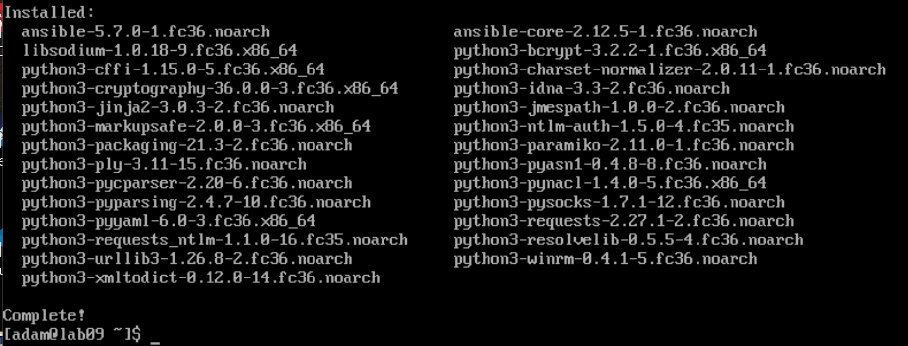
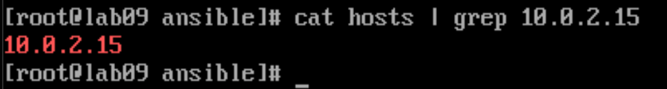
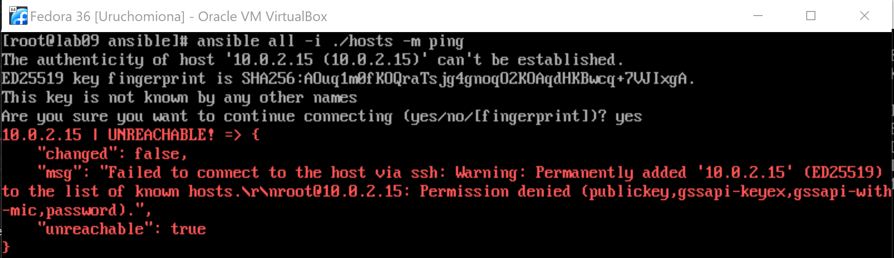
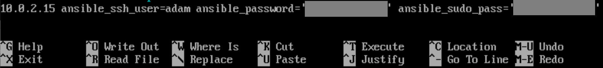
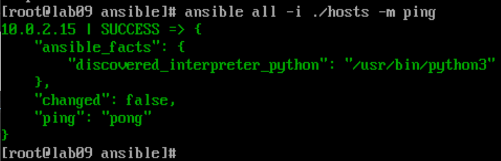
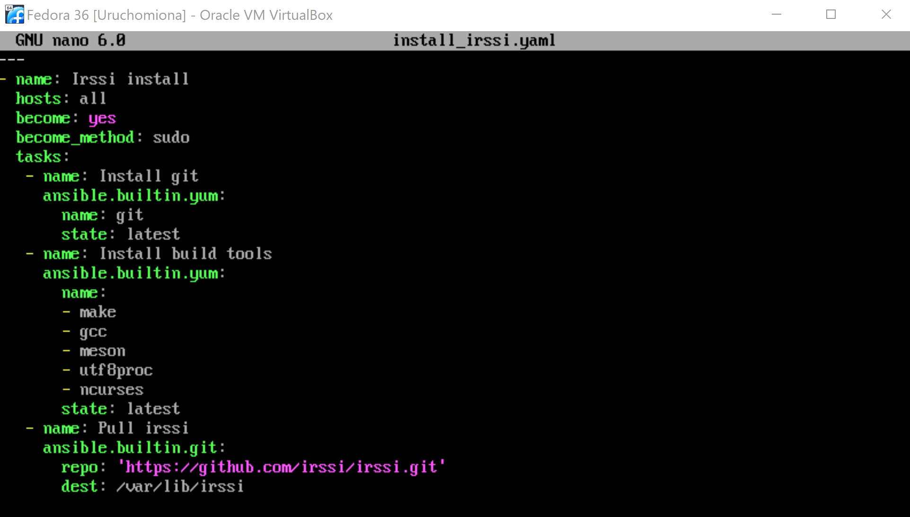
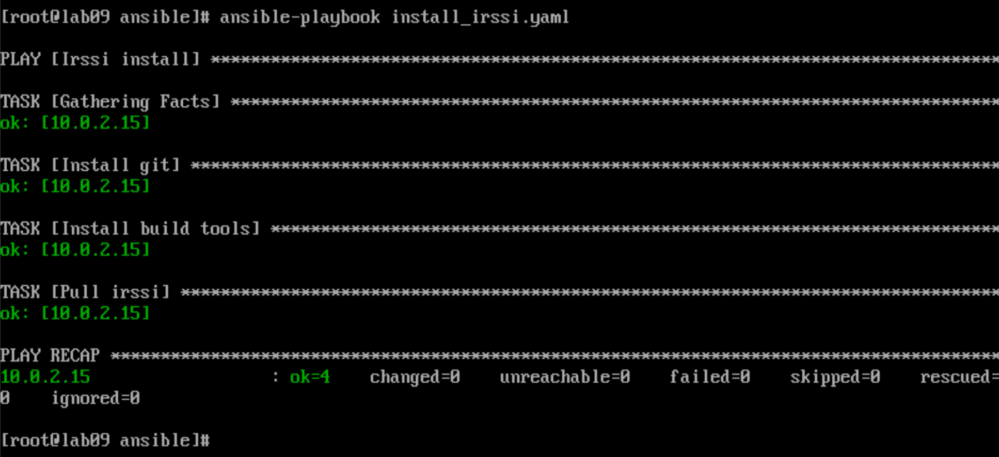

| Imię i nazwisko | Grupa dziekańska | Termin zajęć | Grupa zajęciowa |
| ----------- | ----------- | ----------- | ----------- |
| Adam Głąb | 03 | 23.03.2022r | 08 |

# Sprawozdanie z ćwiczenia laboratoryjnego nr 10

## Zadanie 1

W ramach ćwiczenia wybrano repozytorium [https://github.com/irssi/irssi](https://github.com/irssi/irssi).

Zainstalowano dwie maszyny wirtualne Fedora połaczone ze sobą siecią NAT.

Na jednej z maszyn zainstalowano ansible poprzez `dnf --assumeyes install ansible`.

Uruchomiono powłokę `sudo -i`.

Stworzono (zmodyfikowano) plik inwentaryzacji `/etc/ansible/hosts` poprzez dodanie adresu drugiej maszyny.

Podjęto próbę spingowania maszyny poleceniem `ansible all -i ./hosts -m ping`.

Po sprawdzeniu pliku `/etc/shadow` w drugiej maszynie, do pliku `hosts` dopisano nowe parametry.

Pobrano paczkę `sshpass` w celu uniknięcia błędów przy próbie połaczenia (`dnf --assumeyes install sshpass`). Podjęto kolejną próbę spingowania.

Proces zakończył się pomyślnie.

## Zadanie 2

Utworzono plik playbooka (`install_irssi.yaml`) klonującego `irssi` i pobierającego zależności.

Uruchomiono playbooka komendą `ansible-playbook install_irssi.yaml`.

Proces zakończył się pomyślnie.