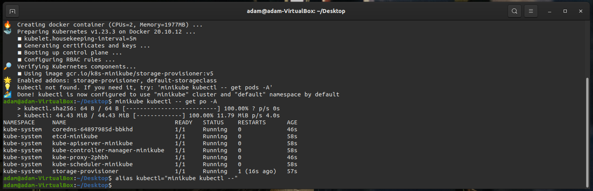
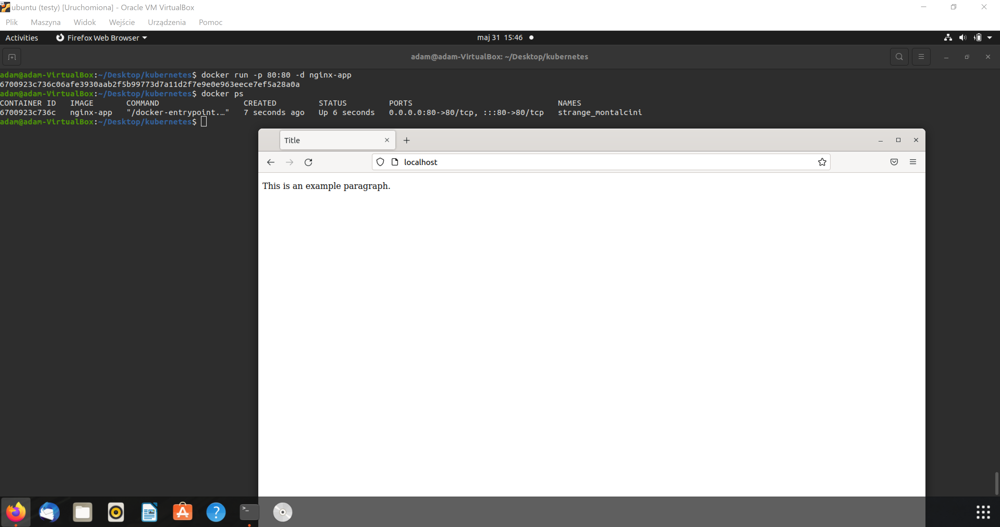
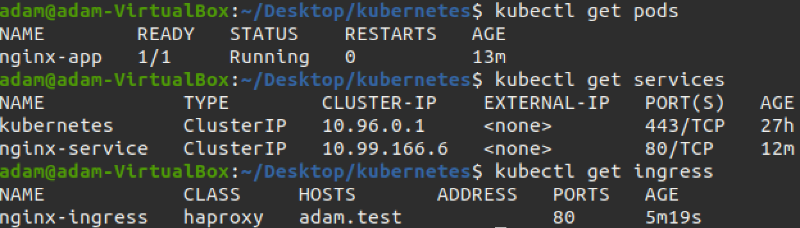
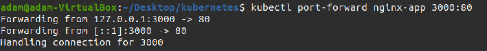
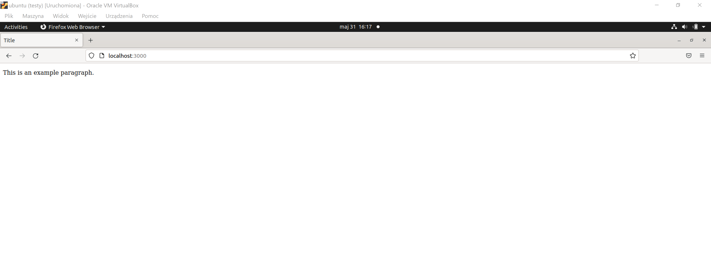
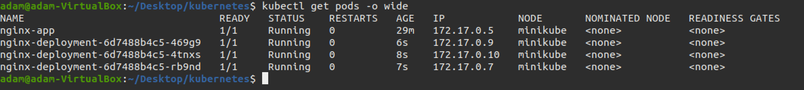
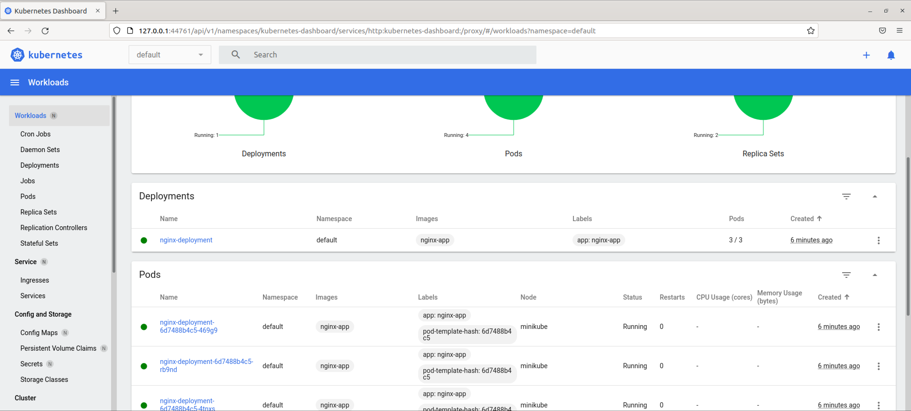

| Imię i nazwisko | Grupa dziekańska | Termin zajęć | Grupa zajęciowa |
| ----------- | ----------- | ----------- | ----------- |
| Adam Głąb | 03 | 26.05.2022r | 08 |

# Sprawozdanie z ćwiczenia laboratoryjnego nr 11

## Zadanie 1

Pomyślnie zainstalowano i skonfigurowano `minikube` na maszynie wirtualnej. Zaopatrzono się w polecenie `kubectl` poprzez wykorzystanie polecenia `alias`.

Działający dashboard (`minikube start` --> `minikube dashboard`).

## Zadanie 2

Porzucono używany do tej pory `irssi`, użyto obrazu `nginx`.

Utworzono stosowny [Dockerfile](./Dockerfile).

Zbudowano obraz `docker build -t nginx-app .` i przetestowano jego działanie `docker run -p 80:80 -d nginx-app`.

## Zadanie 3

Napisano [poda](./yaml/pod.yaml), [service](./yaml/service.yaml) oraz [ingress](./yaml/ingress.yaml).

Utworzono je za pomocą komendy `kubectl apply -f <nazwa pliku>`.

Wyprowadzono port `kubectl port-forward nginx-app 3000:80` i przetestowano działanie aplikacji.

## Zadanie 4

Napisano [deployment](./yaml/deploy.yaml).

Utworzono je za pomocą komendy `kubectl apply -f deploy.yaml`.

Status działania podów:

