| Imię i nazwisko | Grupa dziekańska | Termin zajęć | Grupa zajęciowa |
| ----------- | ----------- | ----------- | ----------- |
| Adam Głąb | 03 | 02.06.2022r | 08 |

# Sprawozdanie z ćwiczenia laboratoryjnego nr 12

## Zadanie 1

Wdrożenie z poprzednich zajęć: [deploy.yaml](./yaml/deploy.yaml)

Wzbogacenie o 4 repliki.

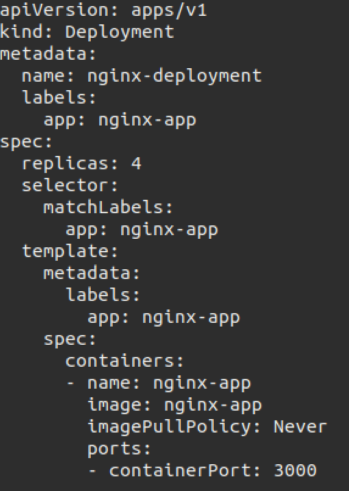

Zbadanie stanu.

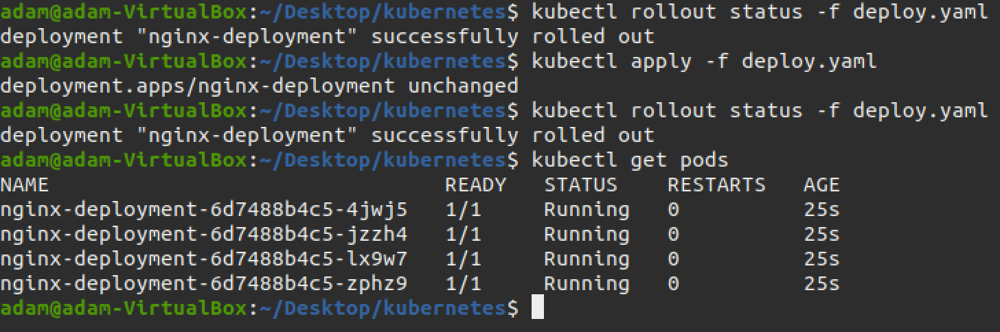

## Zadanie 2

Rejestracja nowego obrazu (dodanie zmiennej środowiskowej do Dockerfile):

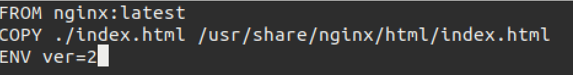

Rejestracja obrazu kończącego się błędem (polecenie wyjścia ze statusem `1`):

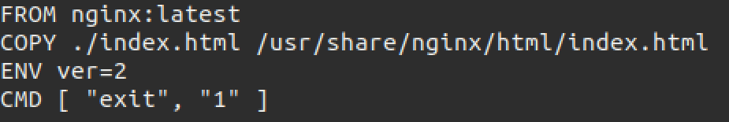

Upewnienie się, czy obrazy zostały dobrze zbudowane:

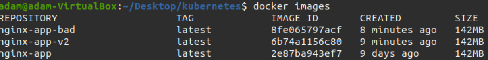

## Zadanie 3

1. Podwojenie ilości replik

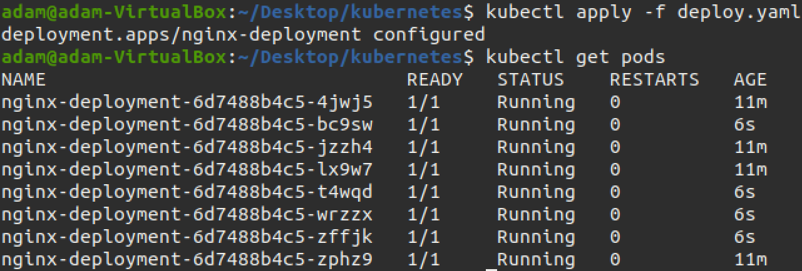

2. Zmniejszenie replik do 1

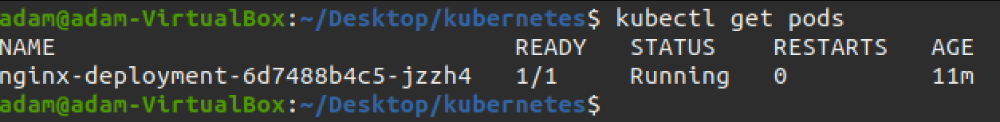

3. Zmniejeszenie replik do 0

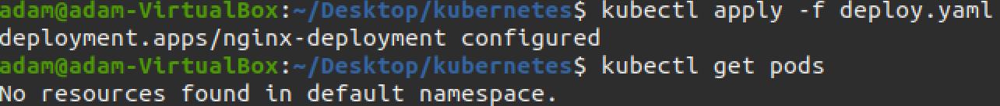

4. Zastosowanie nowej wersji (sprawdzenie poda komendą `kubectl describe pods <identyfikator>`)

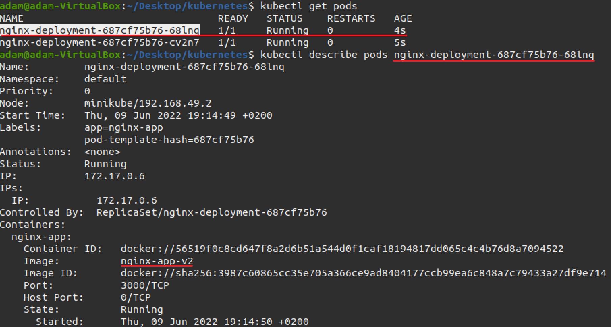

5. Zastosowanie wersji z błędem

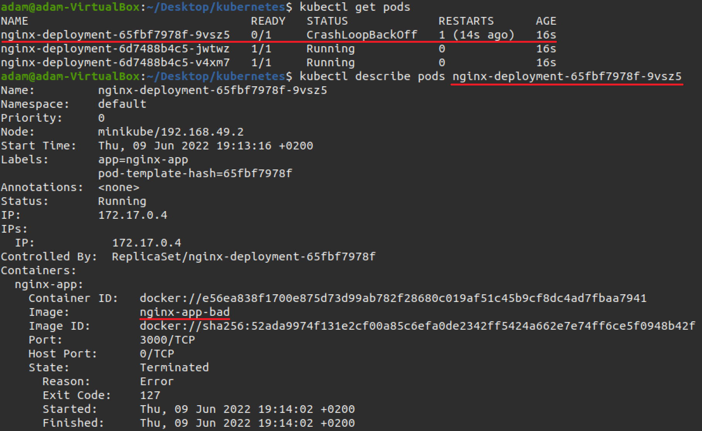

6. Przywrócenie poprzednich wersji

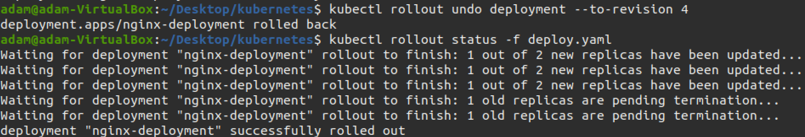

