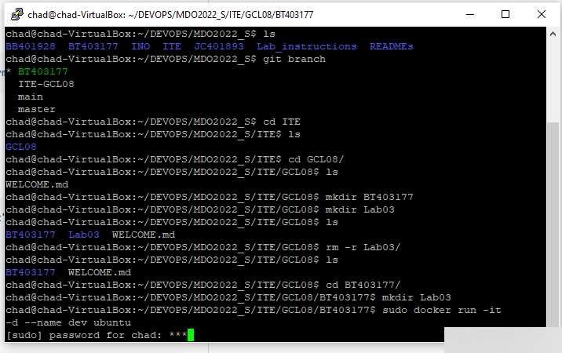
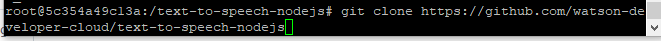
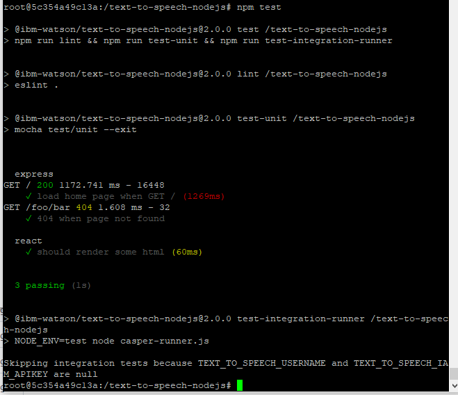
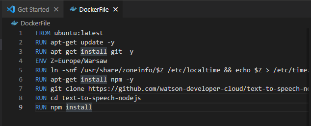
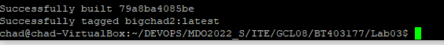
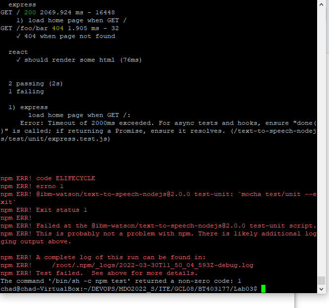

# Lab03
### uruchomienie kontenera



### podłączenie się do kontenera


### pobranie na kontener git'a z wczesniejszym updatem managera pakietów


### instalacja npm oraz innych wymaganych pakietów

Do tego podpunktu brakuje screenshotów, przez długi output konsoli
```console
apt-get install npm
```

### pobranie repozytorium



Link do Repozytorium
```
https://github.com/watson-developer-cloud/text-to-speech-nodejs
```

przejscie do katalogu repozytorium i uruchomienie w nim komendy

```console
npm install
```

### uruchomienie testów

```console
npm test
```


### napisanie pliku DockerFile

```DockerFile
FROM ubuntu:latest
RUN apt-get update -y
RUN apt-get install git -y
ENV Z=Europe/Warsaw
RUN ln -snf /usr/share/zoneinfo/$Z /etc/localtime && echo $Z > /etc/timezone
RUN apt-get install npm -y
RUN git clone https://github.com/watson-developer-cloud/text-to-speech-nodejs
WORKDIR "./text-to-speech-nodejs"
RUN npm install
```





### stworzenie dockerFile bazujacego na wczesniej stworzonym obrazie uruchamiającego same testy

```DockerFile
FROM bigchad:latest
WORKDIR "./text-to-speech-nodejs"
RUN npm test
```



Testy uruchamiają się jednak nie przechodzą przez brak połączenia z serwerami. Występuje nie tylko w dockerze.
