# Sprawozdanie Lab04
## Zachowanie stanu na volumenie

### 1. utworzenie wolumenów

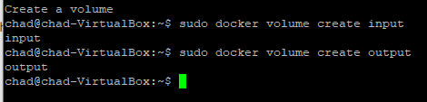

```bash
sudo docker volume create input
sudo docker volume create output
```

### 2. Uruchomienie kontenera z podpiętymi wolumenami

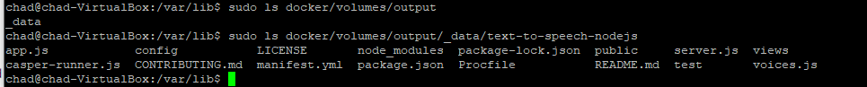

```bash
sudo docker run --name lab4_2 --mount 'type=volume,src=input,dst=\input' \
    --mount 'type=volume,src=output,dst=\output' -it ubuntu
```

### 3. Sklonowanie repozytorium git na wolumen wejściowy

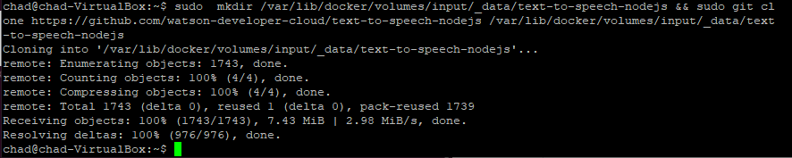

Z poziomu hosta dockera uruchomienie komendy
```bash
sudo mkdir /var/lib/docker/volumes/input/_data/text-to-speech-nodejs && sudo git clone 
```

### 4. plik repozytorium znajduje sie na wolumenie

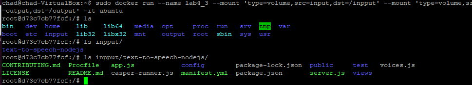

### 5. Kopiowanie plikow repozytorium na wolumin wyjsciowy oraz zbudowanie projektu

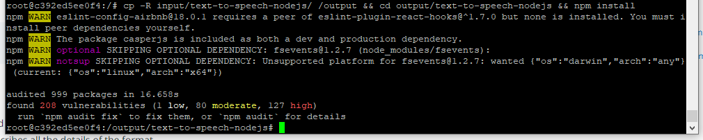

### 6. Potwierdzenie istenienia projektu w volume output


## Połączenie z kontenerem

### 1. Pobranie iperf3 oraz net-tools


### 2. Uruchomienie servera iperf3  na porcie 2000

```bash
sudo iperf3 -s -p 2000
```

### 3. Uruchomienie testu połączenia kontener - kontener

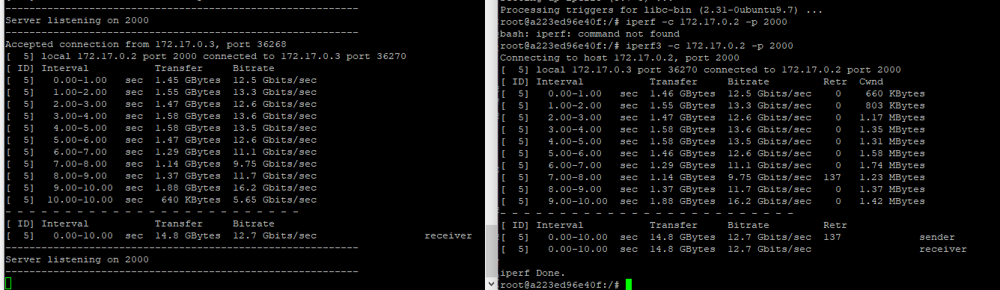

### 4. Uruchomienie testu połączenia host - kontener

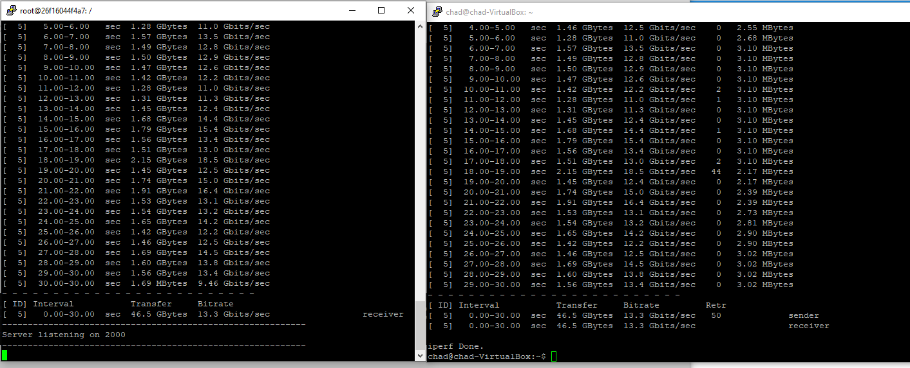

### 5. Uruchomienie testu win - kontener

Pierwsze podejscie wyswietla błąd:

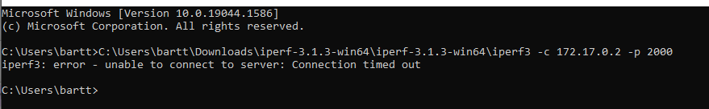

Należy najpierw opublikować porty kontenera:

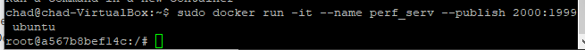

odbywa się to z pomocą flagi <code> --publish port:port </code>

Sprawdzenie nasłuchujących usług na hoscie dockera (VM)

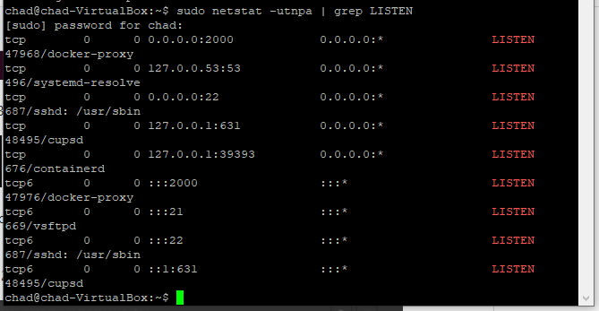

Nastepna próba połączenia z kontenerem:

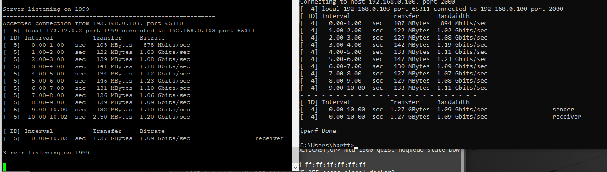

## Instalacja instancji Jenkins

### 1. Stworzenie sieci na hoscie

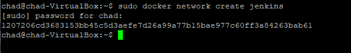

### 2. Uruchomienie docker run

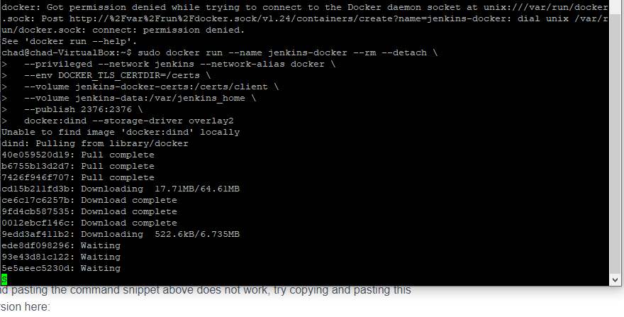

### 3. Stworzenie dockerfile

```Dockerfile
FROM jenkins/jenkins:2.332.1-jdk11
USER root
RUN apt-get update && apt-get install -y lsb-release
RUN curl -fsSLo /usr/share/keyrings/docker-archive-keyring.asc \
  https://download.docker.com/linux/debian/gpg
RUN echo "deb [arch=$(dpkg --print-architecture) \
  signed-by=/usr/share/keyrings/docker-archive-keyring.asc] \
  https://download.docker.com/linux/debian \
  $(lsb_release -cs) stable" > /etc/apt/sources.list.d/docker.list
RUN apt-get update && apt-get install -y docker-ce-cli
USER jenkins
RUN jenkins-plugin-cli --plugins "blueocean:1.25.3 docker-workflow:1.28"
```

### 4. Docker build jenkins

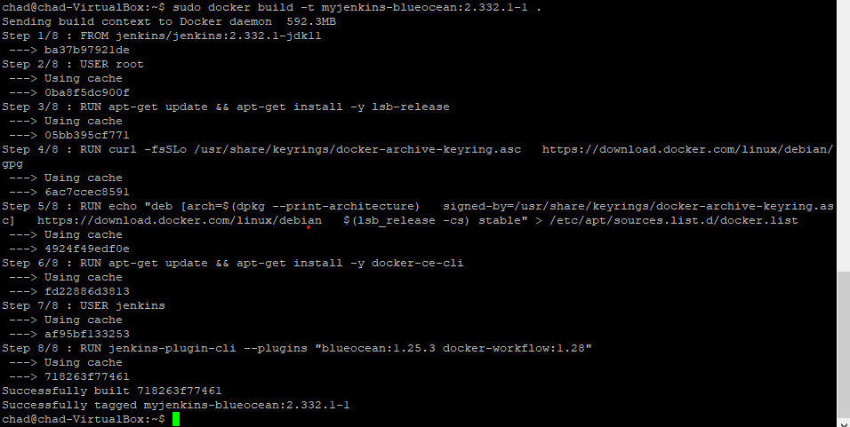

### 5. Wywolanie docker run Jenkins jako dzialająca usługa z udostępnionymi portami

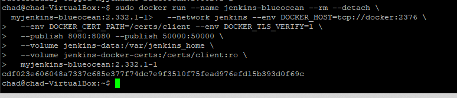

### 6. Działający Jenkins

#### Ekran startowy

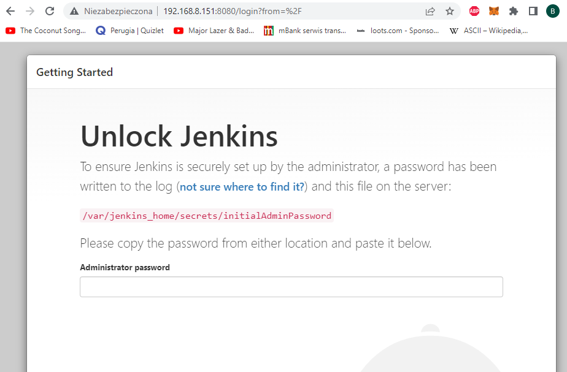

#### Hasło w logach - instrukcje jak na ekranie startowym

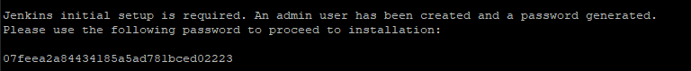

#### Działający Jenkins Panel użytkownika

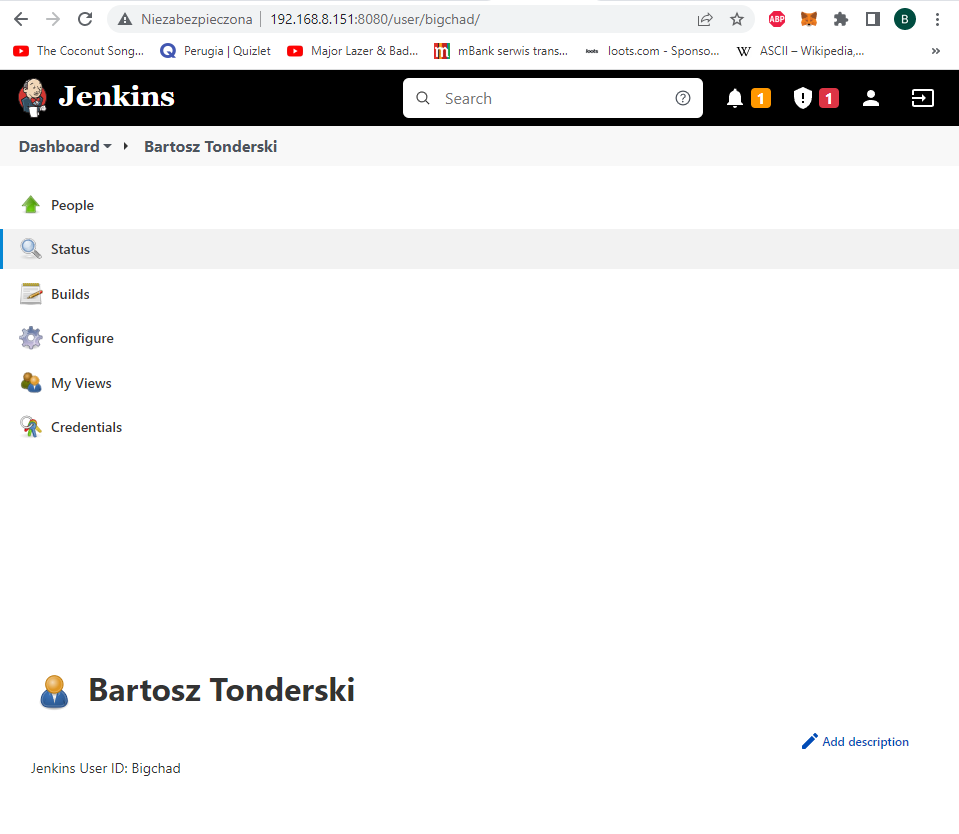
