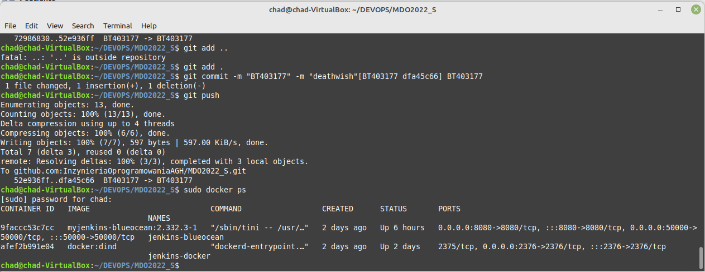
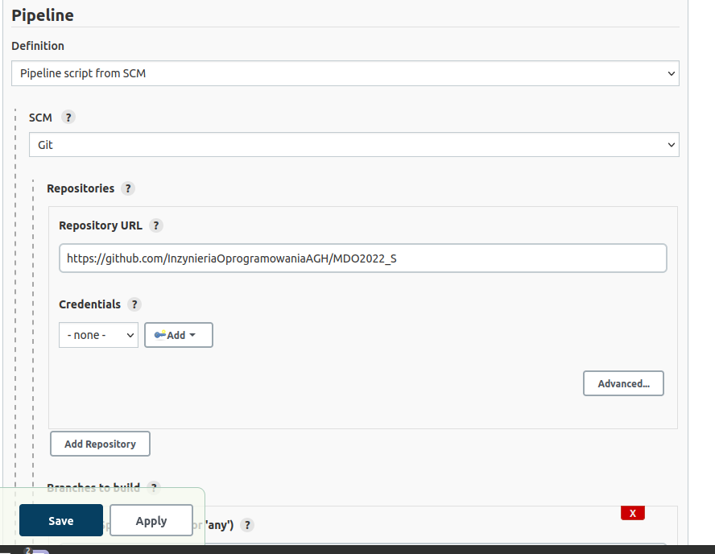
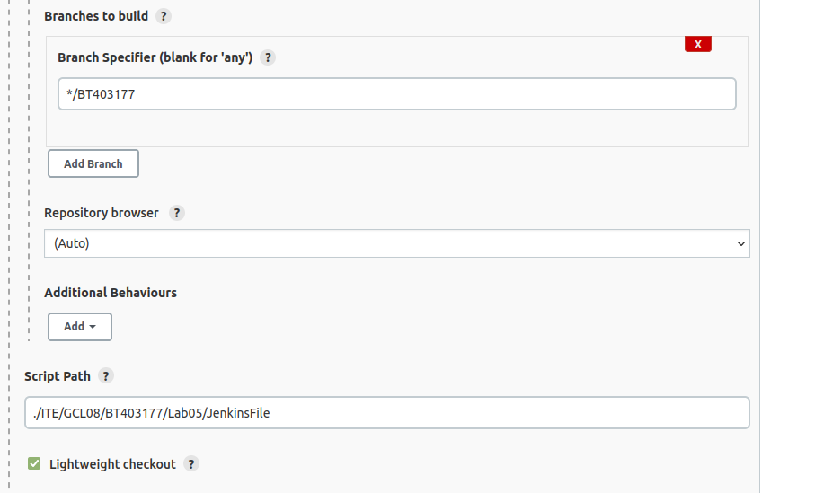
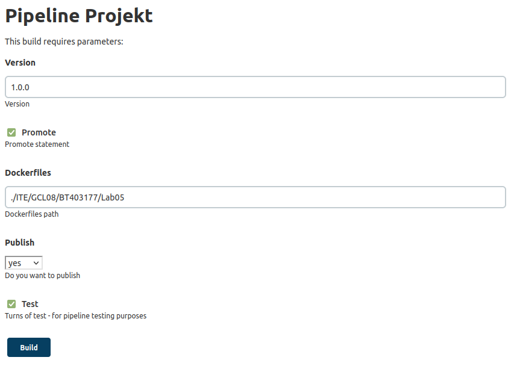
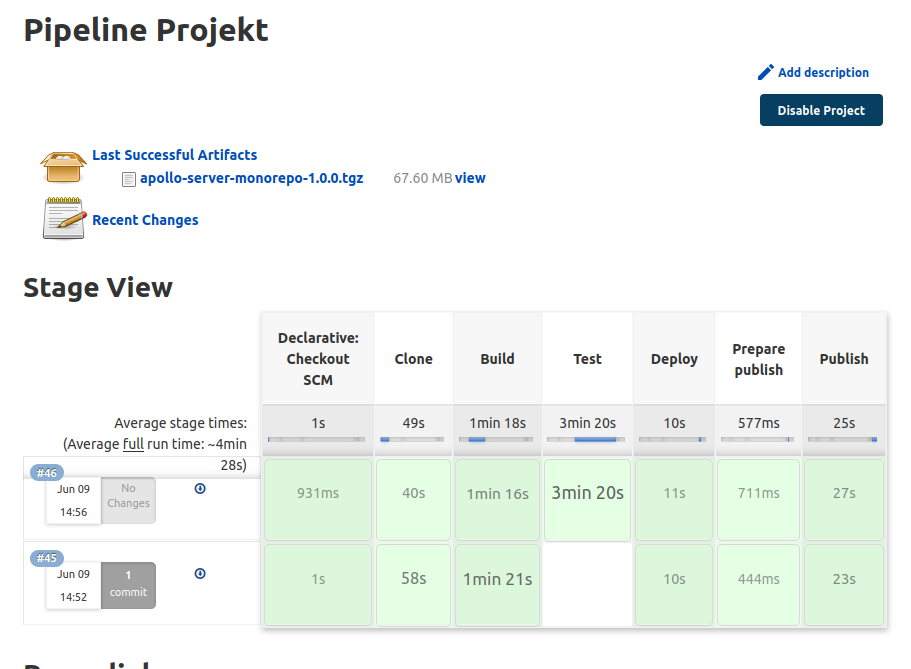
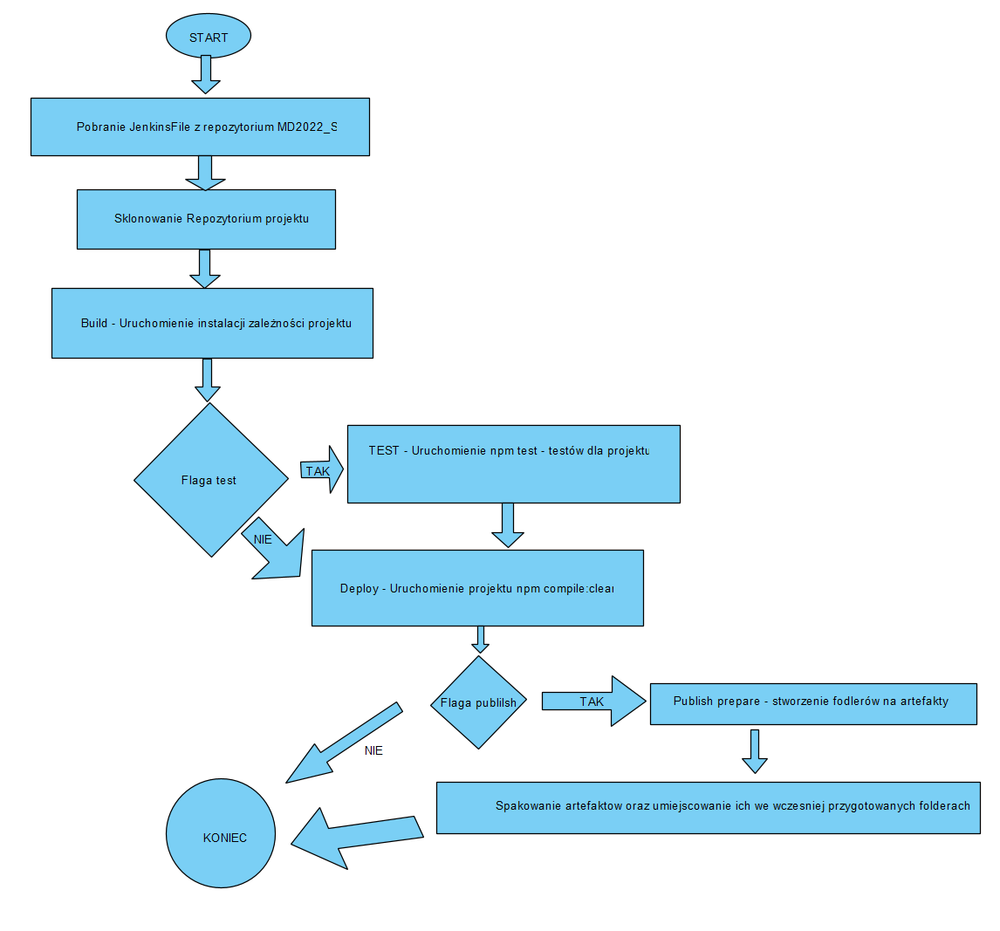

# Bartosz Tonderski - Lab 05 Projekt Pipeline
## Wprowadzenie
Celem projektu jest zbudowanie pipeline w Jenkins. Skontruowanie poszczególnych stage'ów budowania takich jak clone, build, test, deploy oraz publish.

Repozytorium do którego przygotowywany jest pipeline: https://github.com/apollographql/apollo-server

Obraz jenkinsa został postawiony w kontenerze docker'a działającego pod systemem linux mint.
Jenkins został uruchomiony jak na poprzednich laboratoriach, działające kontenery Jenkins oraz Jenkins DIND:

## Budowa pipeline
Konfiguracja Pipeline w Jenkins

## Poszczególne stage w Jenkinsie
> **Pobieranie Jenkinsfile**

Pobranie Jenkins file z repozytorium przedmiotu z własnego brancha z folderu Lab05

> **Clone**

Jenkins klonuje git'owe repozytorium na volumen przejściowy, powodowane jest to przez brak bezpsorednich dostepow do plikow kontenera wejsciowego, gdy folder juz istnieje jest najpierw usuwany. Kontenery budują sie z Dockerfile również umiejscowionego na repozytorium git. Dane zapisywane sa na volumen wyjściowy.

> **Build**

Jest to faza odpowiedzialana za instalowanie projektu oraz jego zależności. 
Faza dostaje sklonowane repozytorium na volumenie wejsciowym wywołuje na uzyskanych danych komendy npm install.
Tak przygotowane dane i zależności są zapisywane na Volumen wyjściowy.

> **Test**

Jest to faza, która w kontenerze wejściowym otrzymuje repozytorium z zainstalowanymi zależnościami poprzez npm install w poprzedniej fazie. 

Uruchamiane są testy poprzez npm test

Ostatnia opcja ' || true' wynika z tego, że 80 testów nie przechodziło przez co faza została uznawana za "FAILED", jako, że nie jestem odpowiedzialny za projekt, a chcialem testować pipeline uznałem, że ta alternatywa jest dopuszczalna.

W konfiguracji build'a Jenkinsowego dostępna jest flaga test, którą można odznaczyć - powoduje wyłaczenie fazy test, która powodowała największe obciązenie komputera oraz często failowała poprzez brak wystarczających zasobów.

> **Deploy**

Faza uruchamia projekt na wolumenie wyjściowym  z wcześniej pozyskanego obrazu projektu. Projekt wykonuje się oraz jest narzucony limit czasowy 5 sekund - jest to czas w teorii wystarczający to uruchomienia i wykonania projektu. Jeśli uruchomienie nei przebiegłow pomyslnie zwracany jest kod błedu.
Wolumen na koniec jest usuwany ponieważ jesli w 5 sekund nie zakończył działania ciągle może być w użyciu.

> **Prepare Publish**

Faza która przygotowuje foldery dla artefaktów

> **Publish**

Projekt jest pakowany poprzez npm pack oraz jest publikowany jako artefakt jeżeli zaznaczona jest flaga publish.

## Wyglad builda

## Pipeline

## Logi

Logi z buildu pipeline znajdują się w  pliku [logi](./logi.txt)

## Diagram workflow

