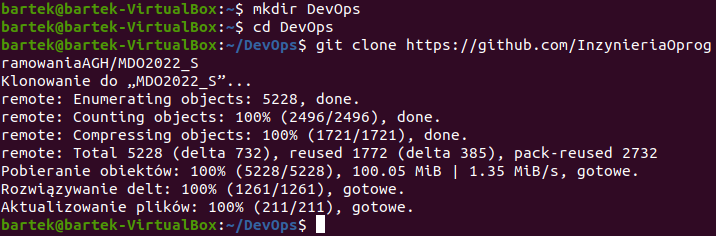
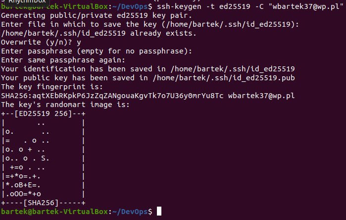
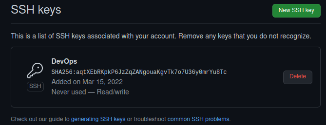
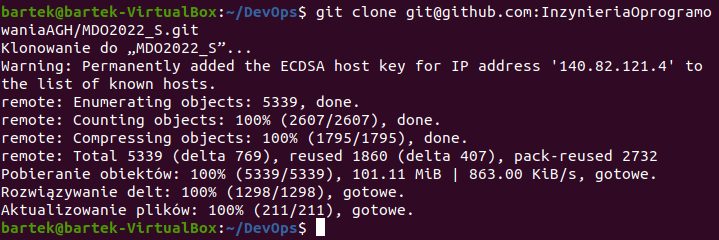
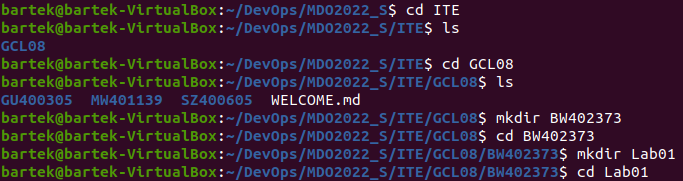
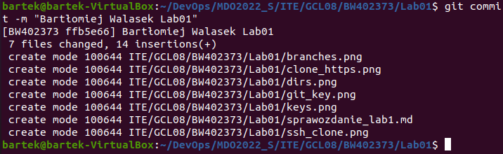
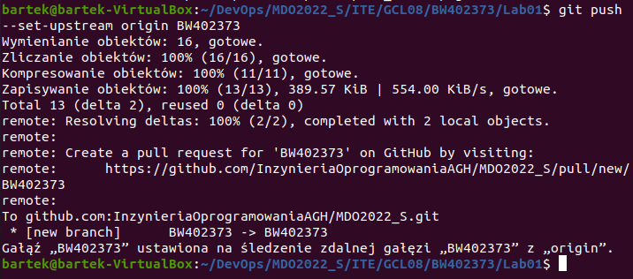

# Sprawozdanie z zajęć nr 1
1. Za pomocą zainstalowanego klienta git sklonowano repozytorium za pomocą HTTPS. 

2. Utworzono klucze SSH  

3. Dodano klucz SSH do GitHub  

4. Sklonowano repozytorium za pomocą klucza SSH  

5. Przejście do własnego brancha  

6. Utworzenie odpowiednich katalogów  

7. Wysłanie commita  

8. Wykonanie pusha  

