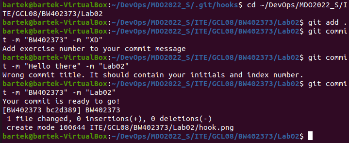
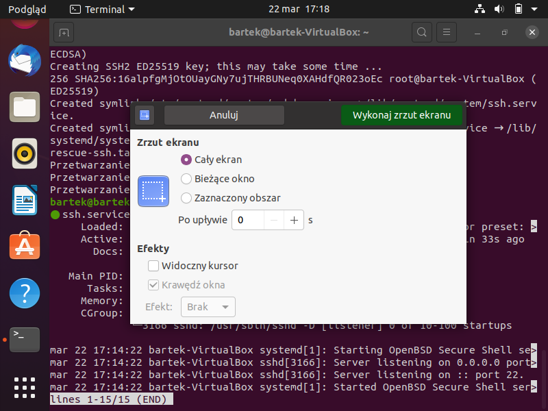
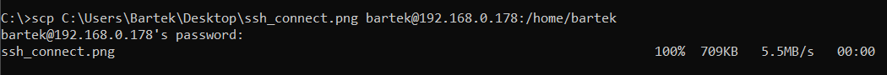
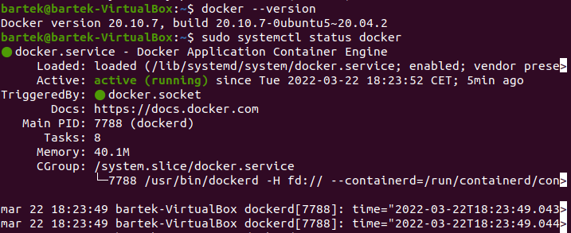
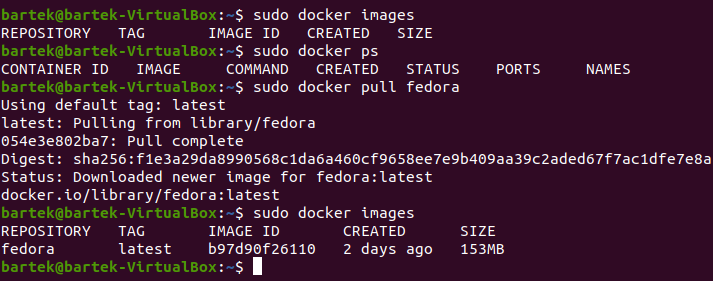
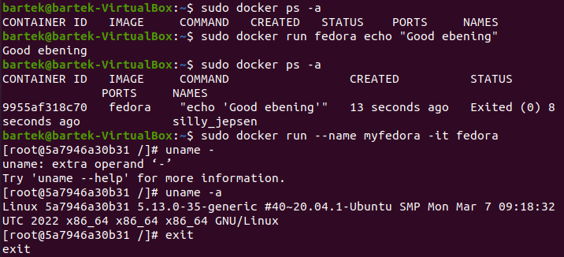
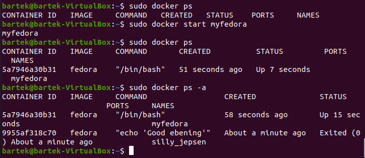
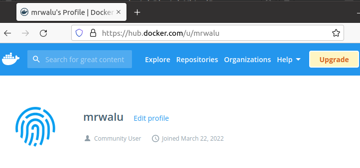

# Sprawozdanie
## Laboratorium nr 2
1. Napisano hook sprawdzający poprawność dodawania commitów z odpowiednimi komentarzami.  
[!hook](hook.png) 
#!/bin/python3

import sys

messageFile = sys.argv[1]
file = open(messageFile, 'r')
message = file.read()

title = message.split("\n")[0]
content = message.split("\n")[2]

if title != "BW402373":
        print("Wrong commit title. It should contain your initials and index number.")
        exit(1)
if not (content.find("02") != -1 or content.find("2") != -1):
        print("Add exercise number to your commit message")
        exit(2)
else:
        print("Your commit is ready to go!")
        exit(0)
        
2. Działanie hook'a  

3. Zainstalowano usługę SSH  

4. Za pomocą SSH połączono się z maszyną wirtualną z poziomu Windowsa. 

5. Wysłanie zdjęcia z Windowsa na maszynę, potwierdzający poprawne połączenie 

6. Zainstalowano środowisko dockerowe. 

7. Wykazanie działania środowiska dockerowego
- pobranie obrazu fedory 

- uruchomienie polecenia echo z fedory 

- sprawdzenie uruchomionych kontenerów na dockerze 

8. Utworzenie konta na Docker Hub 

