# Sprawozdanie - lab 3
1. Pobrano obraz node. 
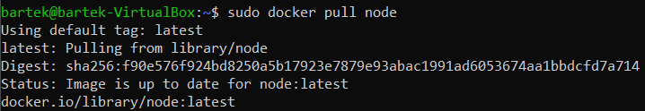
2. Uruchomiono kontenera z node. 
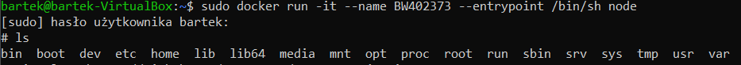
3. Sklonowano repozytorium i zainstalowano npm. 
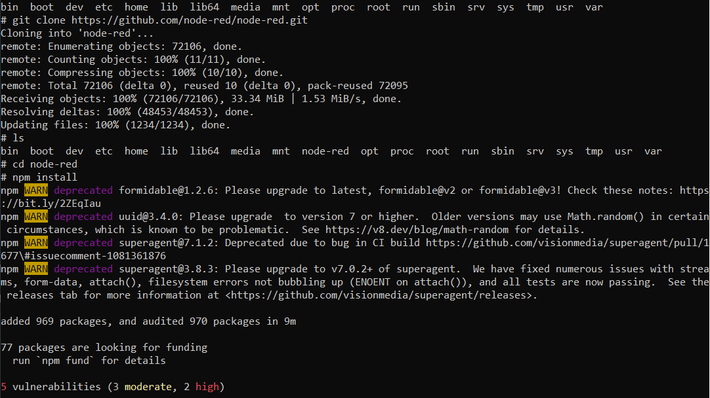
Do poprawnego działania potrzebne było uaktualnienie npm do nowszej wersji. 
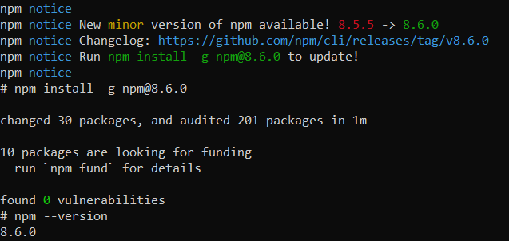
4. Uruchomiono testy. 
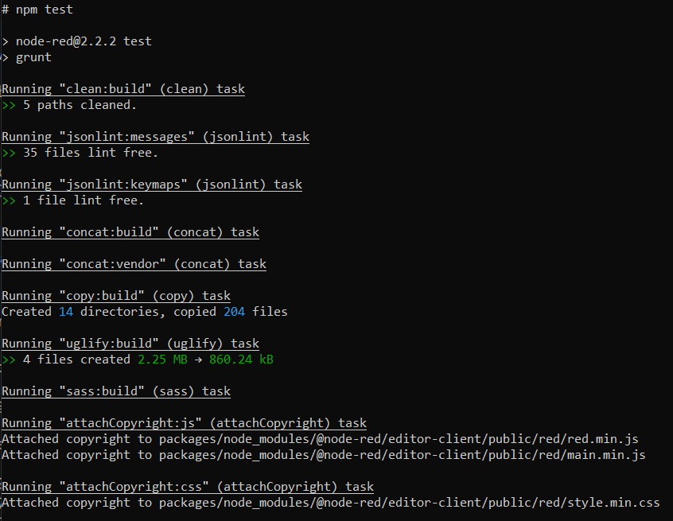
Testy nie przeszły w całości, ponieważ nie uzyskano połączenia z serwerem. 
Wszystkie testy niewymagające tego połączenia przechodzą. 
5. Napisano dockerfile automatyzujący dotychczas pokazane kroki. 
>FROM node:latest
>
>RUN git clone https://github.com/node-red/node-red.git
>RUN cd node-red && npm install
>RUN npm run build
 
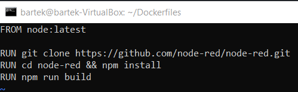
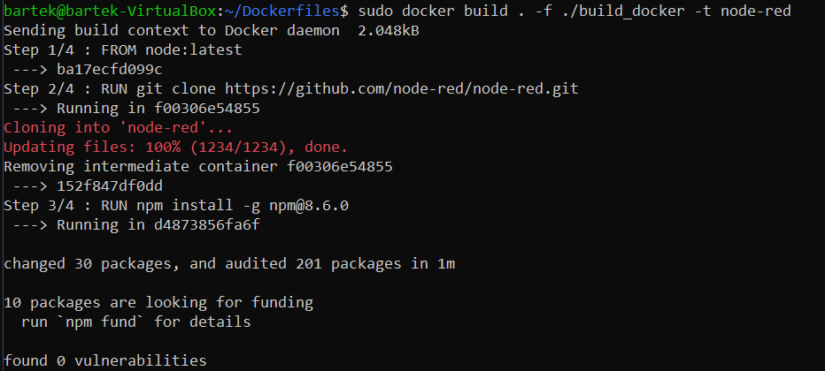
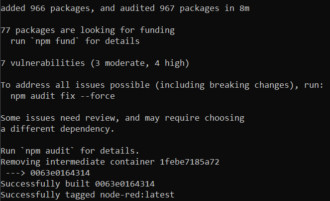
6. Dockerfile na podstawie poprzedniego uruchamiający testy. 
>FROM node-red:latest
>
>RUN cd node-red && npm test
 
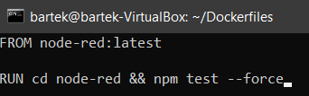
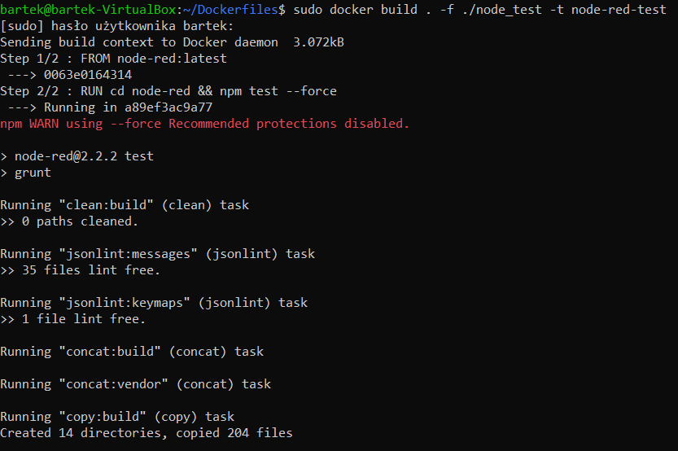
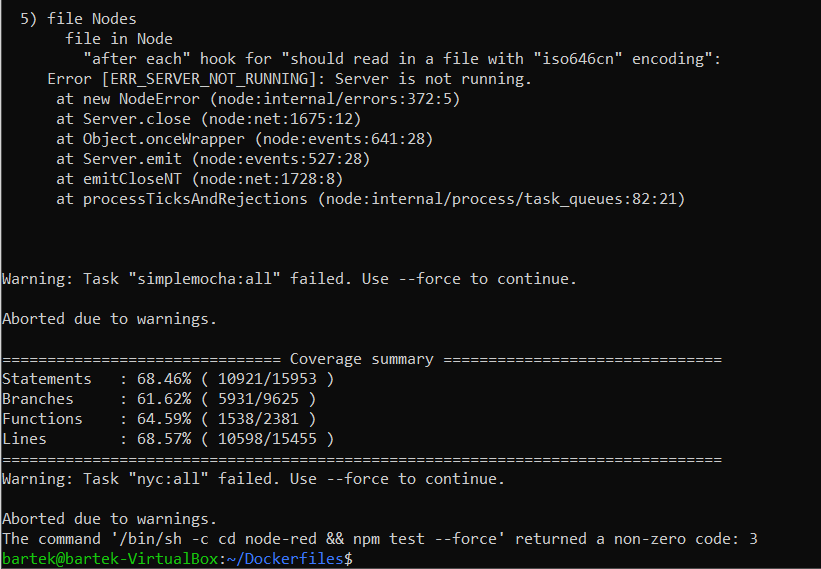
## Co pracuje w kontenerze?
W kontenerze pracuje obraz odizolowany od macierzystego systemu.
