# Sprawozdanie - laboratorium nr 4
## Dodatkowa terminologia w konteneryzacji, instancja Jenkins
### Zachowanie stanu
1. Przygotowanie woluminów wejściowego i wyjściowego. 
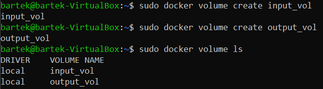
2. Sprawdzenie poprawności połączenia woluminów. 
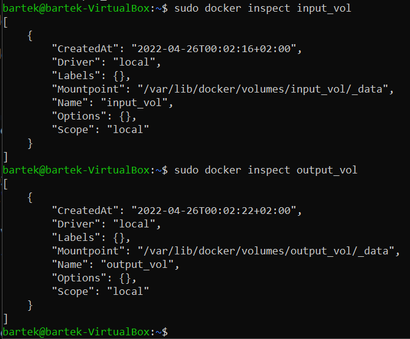
3. Uruchomienie kontenera z jednoczesnym podłączeniem woluminów. 
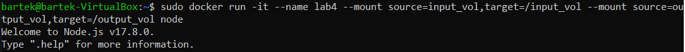
4. Sklonowanie repozytorium na wolumin wejściowy. 
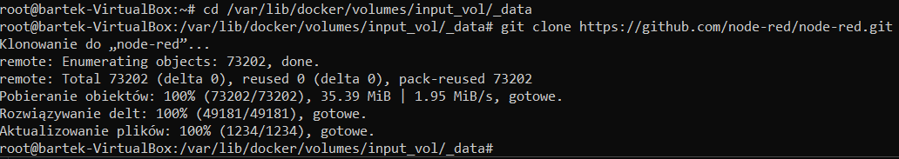
5. Skopiowanie plików bezpośrednio na kontener. 
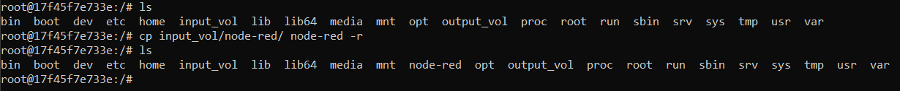
6. Instalacja zależności. 
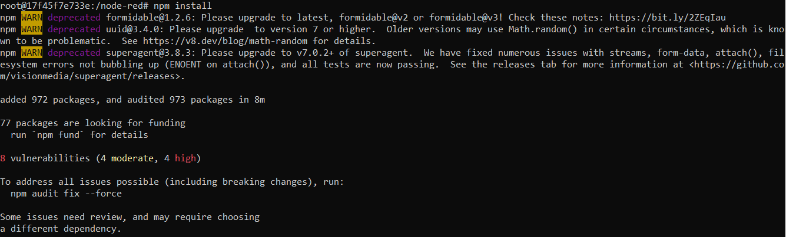
7. Zbudowanie programu.  
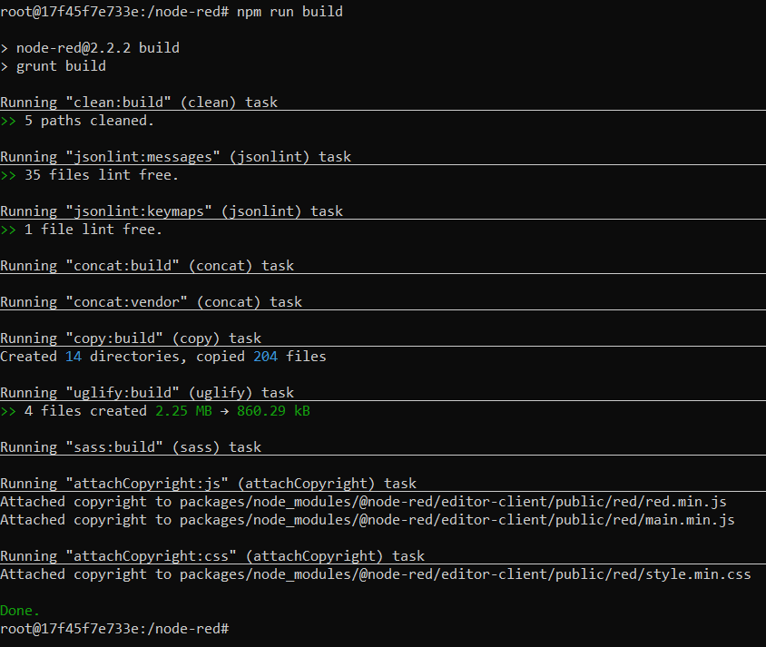
8. Skopiowanie zbudowanych plików na wolumin wyjściowy. 
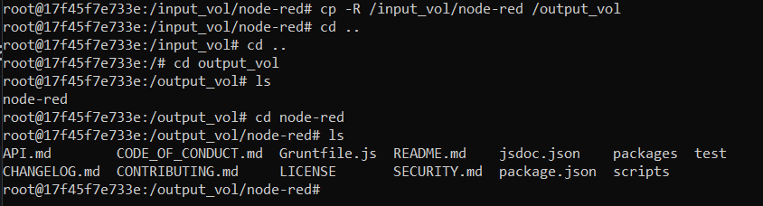
### Eksponowanie portu
9. Uruchomienie serwera iperf na dwóch kontenerach oraz nawiązanie połączenia między nimi. 
Screen obrazuje porównanie przepustowość komunikacji. 
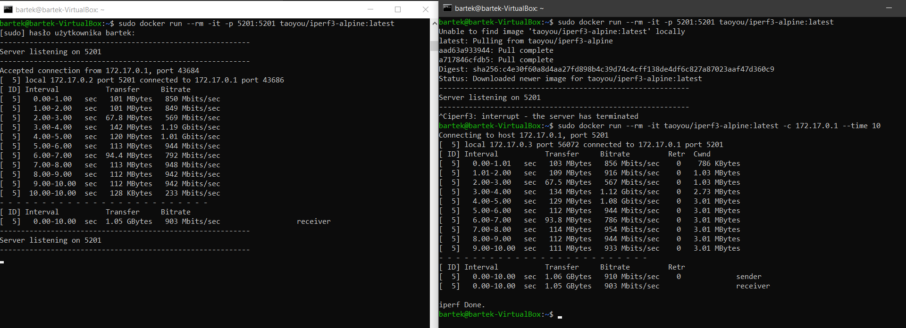
### Instalacja Jenkinsa
10. Po utworzeniu nowej sieci pobrano i uruchomiono obraz DIND. 
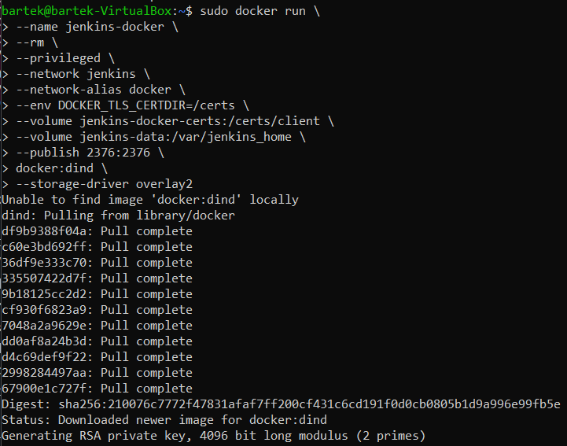
11. Na podstawie dockerfile'a skopiowanego z dokumentacji jenkinsa zbudowano program. 
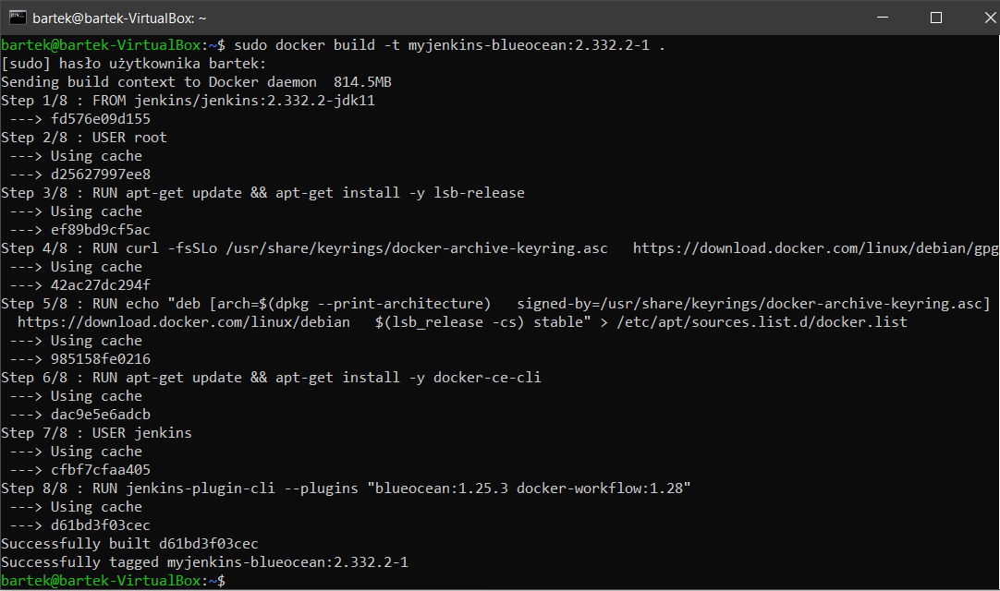
12. Uruchomienie obrazu myjenkins-blueocean jako kontenera. 
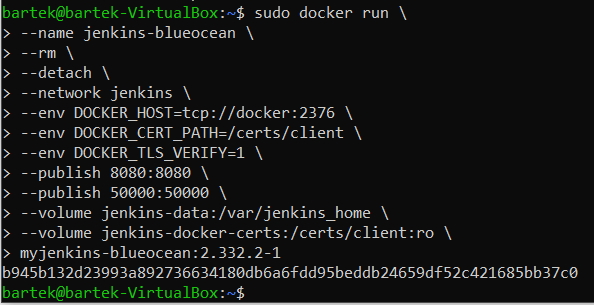
13. Utworzone obrazy Jenkins. 
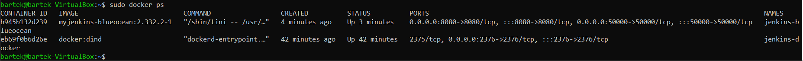
14. Pierwsze operacje na Jenkinsie. 

14.1. Odnalezienie hasła. 
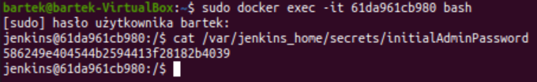
15. Instalacja wtyczek. 
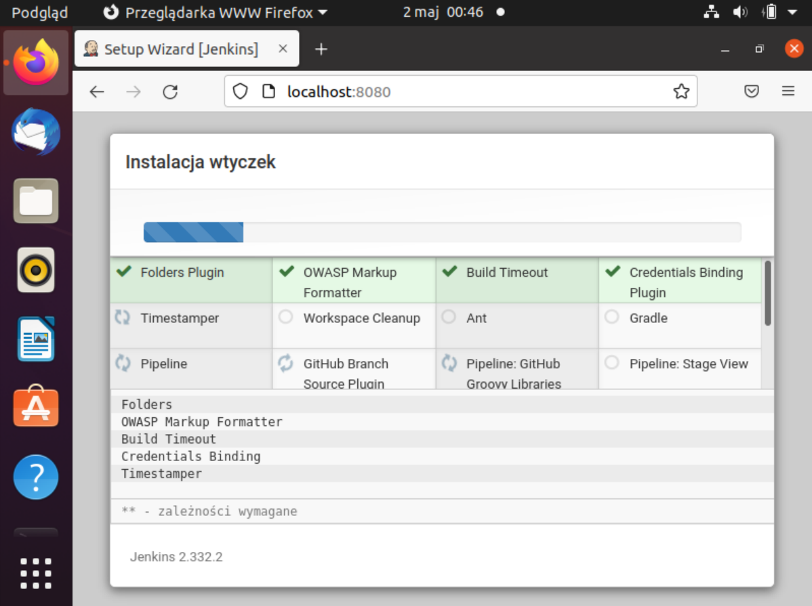
16. Utworzenie pierwszego admina. 
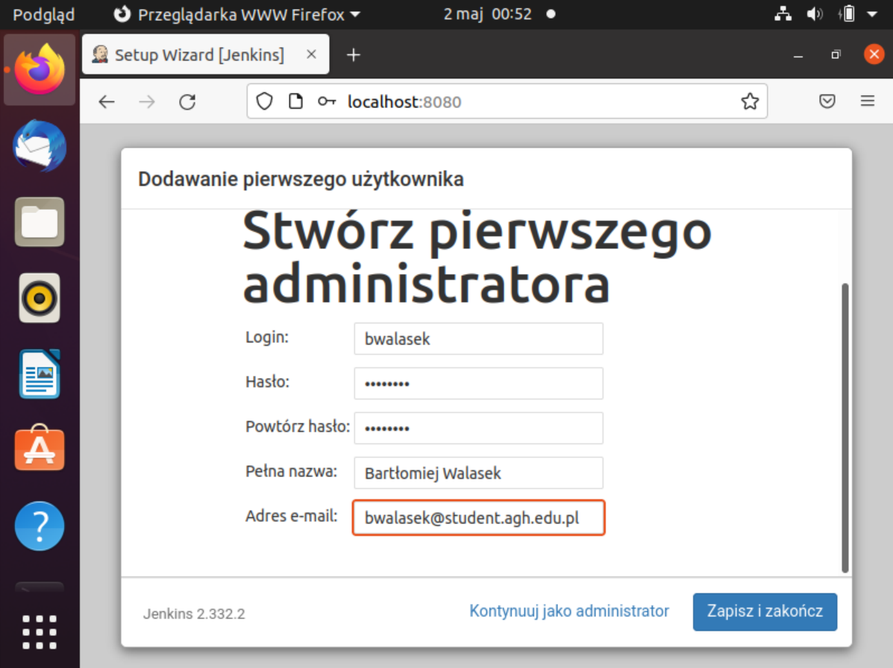
