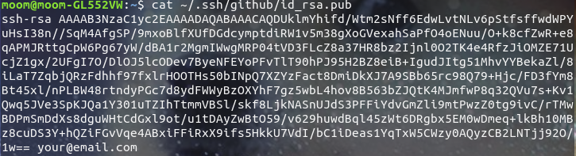
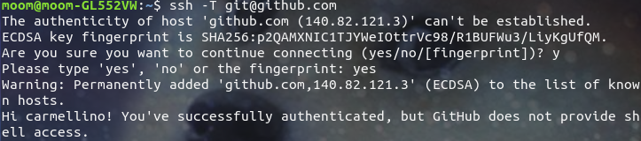
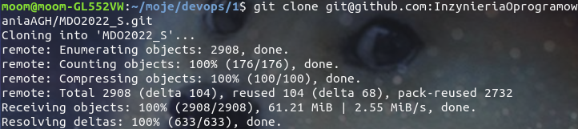
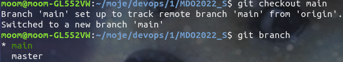
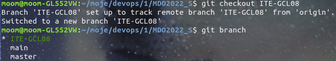
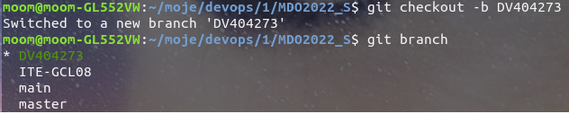
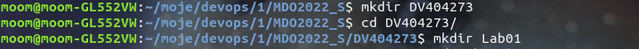
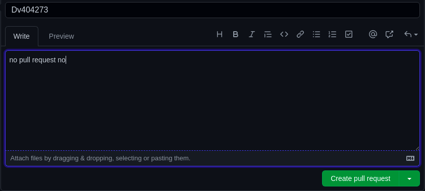

Diego Vega Dechnik 
Sprawozdanie DevOps lab01

1. Utworzono klicz ssh.

2. Sklonowano repozytorium za pomocą klucza ssh.

3. Przełączono się na brancha main.

4. Przełączono się na brancha ITE-GCL08

5. W branchu ITE-GCL08 utworzono w nim brancha DV404273

6. W branchu DV404273 utworzono folder DV404273 a w nim folder lab.01

7. Utworzono pull request

