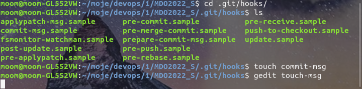
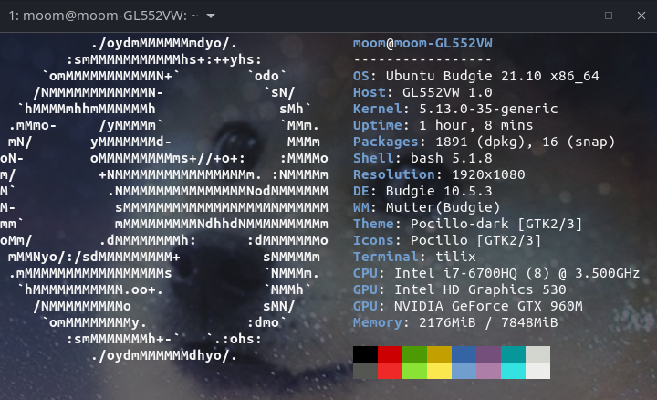
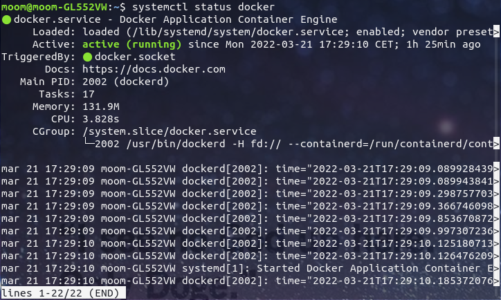
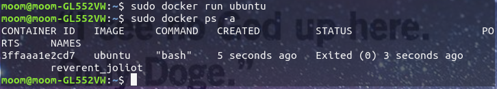

1. Przeniesiono się do lokalizacji ./git/hooks i utworzono w niej plik "commit-msg"


Treść utwozonego pliku:
-------------------------
```
#!/bin/bash
a=`head -n1 $1`
b=`tail -n1 $1`
c='DV404273'	
d='lab02'

if ! [[ "$a" = $c ]]; then
    echo "Message:"
    echo " wrote: " $a
    echo " expected: " $c
    exit 1
fi

if ! [[ "$b" = $d ]]; then
    echo "Description:"
    echo " wrote: " $b 
    echo " expected: " $d
    exit 1
fi
```
-------------------------

Działanie


3. Wykazano że maszyna wirtualna nie jest stosowana


4. Wykazano że środowisko dockerowe jest uruchomione


5. Uruchomiono obraz dystrybucji linuksowej i wyswietlono jego numer


6. Założono konto na Docker Hub
/home/moom/Pictures/6.png

