1. Stworzo kontener z obrazu ubuntu

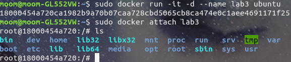

2. Zaktualizowano system kontenera

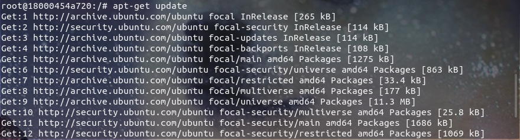

3. Zainstalowano gita

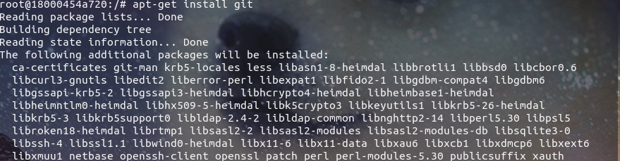

4. Utworzono folder na program i go tam pobrano

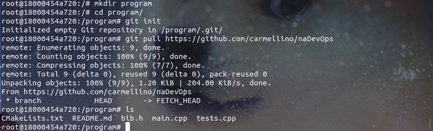

5. Zainstalowano cmake

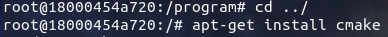

6. Zainstalowano g++

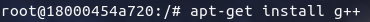

7. Zainstalowano biblioteke gTest


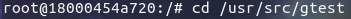

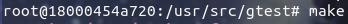
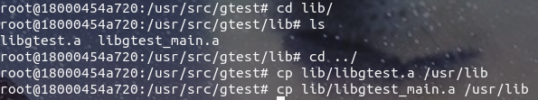

8. Skompilowano pobrany program

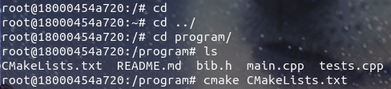
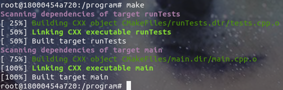

9. Uruchomiono testy

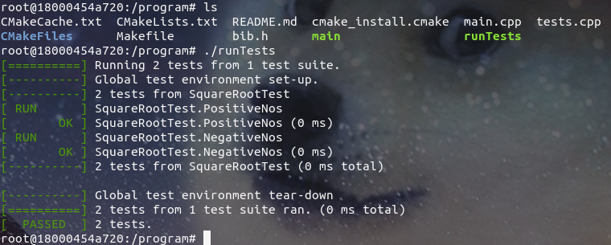

10. Stworzono plik Dockerfile o nazwie Dockerfile

```
FROM ubuntu:latest
RUN apt-get update -y
RUN apt-get install git -y
ENV TZ=Europe/Warsaw
RUN ln -snf /usr/share/zoneinfo/$TZ /etc/localtime && echo $TZ > /etc/timezone
RUN apt-get install cmake -y
RUN apt-get install g++ -y
RUN apt-get install libgtest-dev -y
WORKDIR "/usr/src/gtest"
RUN cmake CMakeLists.txt
RUN make
RUN cp lib/libgtest.a /usr/lib
RUN cp lib/libgtest_main.a /usr/lib
WORKDIR "/"
RUN mkdir program
WORKDIR "/program"
RUN git init
RUN git pull https://github.com/carmellino/naDevOps
RUN cmake CMakeLists.txt
RUN make
# RUN ./runTests
```

11. Zbudowano za pomocą pliku Dockerfile Obraz dockerfilius

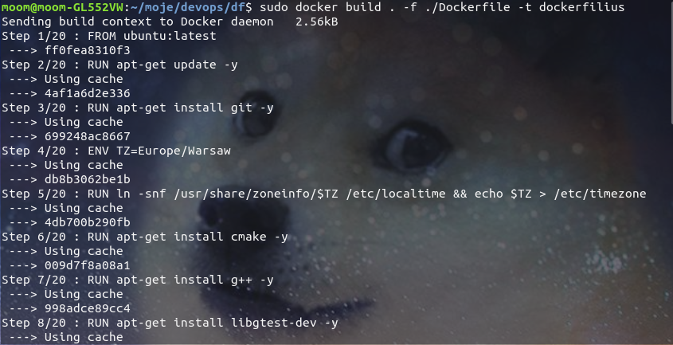

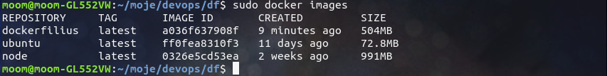

12. Stworzono drugi plik Dockerfile o nazwie Dockerfile2

```
FROM dockerfilius:latest
WORKDIR "/program"
RUN ./runTests
```

Zbudowano za pomocą pliku Dockerfile2 obraz dockertestius

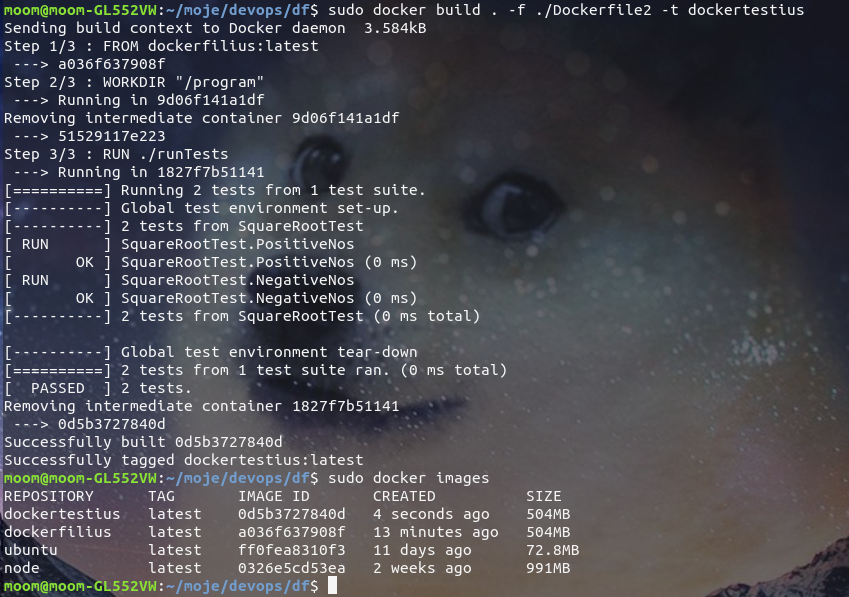
