1. Przygotowano wolumin wejściowy i wyjściowy

2.  Uruchomion kontener

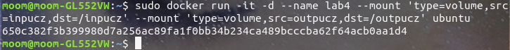

3. Zainstalowano niezbędne wymagania

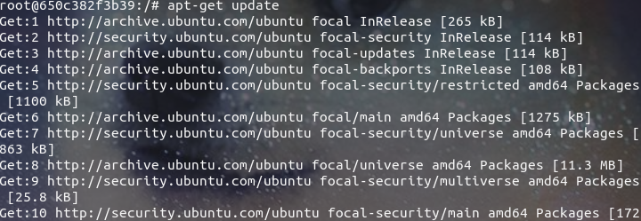

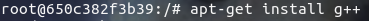

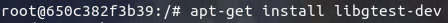

4. sklonowano repozytorium na wolumin wejściowy i zbudowano go

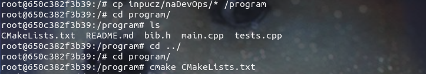

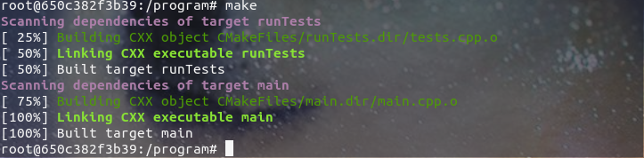

5. Zapisano zbudowane pliki w woluminie wyjściowym

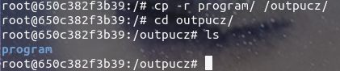

6. Zainstalowano i uruchomiono iperf3

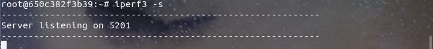

7. Połączono się z kontenerem z innego kontenera

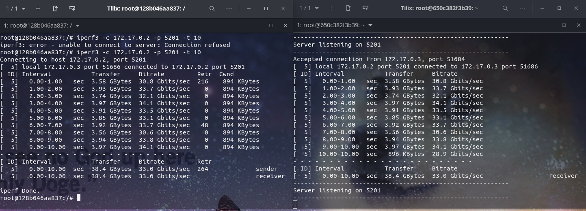

8. Połączono się z konteneram z hosta

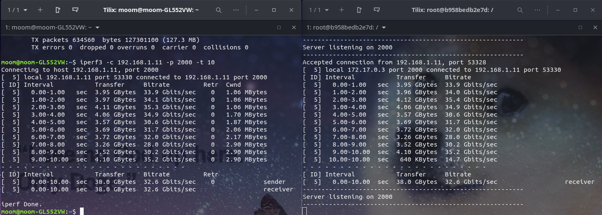

9. Zainstalowano jenkinsa z pomocą dokumentacji 

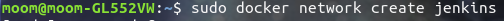

