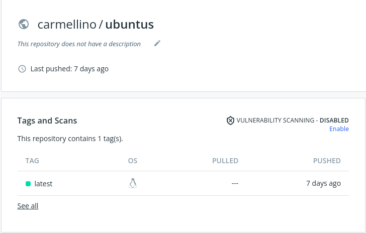
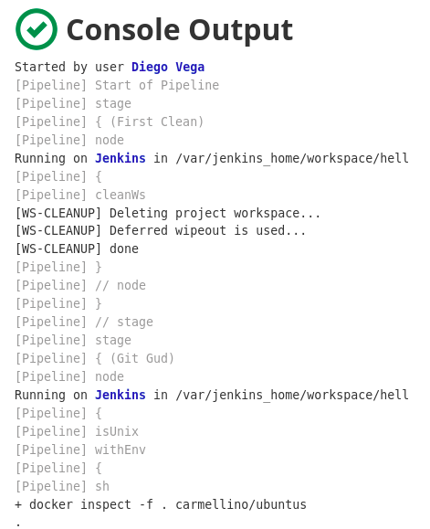
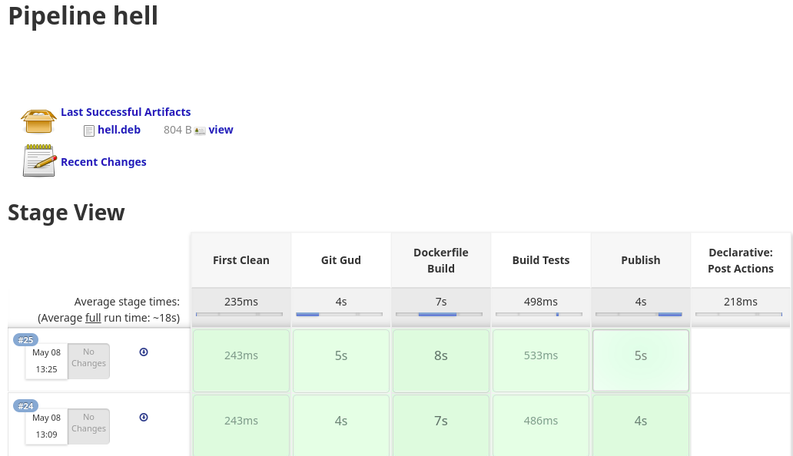
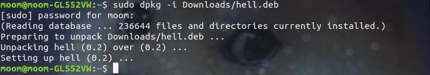
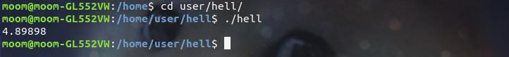
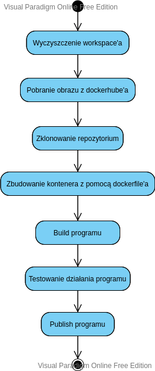

# Wstęp

- Budowanym programem jest prosty program napisany w języku C++ składający się z:
    * pliku bib.h
    ```
    #include <math.h>

    double squareRoot(const double a) 
    {
        double b = sqrt(a);
        if(b != b) 
            return -1.0;
        else
            return sqrt(a);
    }

    ```

    * main.cpp
    ```
    #include<iostream>
    #include"bib.h"
    using namespace std;
    int main()
    {
        cout<<squareRoot(24)<<endl;
        return 0;
    }
    ```

- Program kompilowany jest za pomocą Cmake.
```
cmake_minimum_required(VERSION 2.6)
 
find_package(GTest REQUIRED)
include_directories(${GTEST_INCLUDE_DIRS})
 
add_executable(main main.cpp)
add_executable(runTests tests.cpp)
target_link_libraries(runTests ${GTEST_LIBRARIES} pthread)
```

- Program testowany jest za pomocą Google Test.
```
// tests.cpp
#include "bib.h"
#include <gtest/gtest.h>
 
TEST(SquareRootTest, PositiveNos) { 
    ASSERT_EQ(6, squareRoot(36.0));
    ASSERT_EQ(18.0, squareRoot(324.0));
    ASSERT_EQ(25.4, squareRoot(645.16));
    ASSERT_EQ(0, squareRoot(0.0));
}
 
TEST(SquareRootTest, NegativeNos) {
    ASSERT_EQ(-1.0, squareRoot(-15.0));
    ASSERT_EQ(-1.0, squareRoot(-0.2));
}
 
int main(int argc, char **argv) {
    testing::InitGoogleTest(&argc, argv);
    return RUN_ALL_TESTS();
}
```

- Program przeznaczony jest do systemu Linux Ubuntu.

- Założonym artefaktem, który ma zostać uzyskany jest plik .deb służący do instalacji programu.

- Założoną lokalizacją, w której ma znaleźć się zainstalowany program jest /home/user/hell/

# Podjęte Kroki

- Utworzono obraz "carmellino/ubuntus" za pomocą dockerfile'a:
```
FROM ubuntu:latest
RUN apt-get update -y
RUN apt-get install git -y
```
Obraz ten będzie odpowiedzialny za pobranie programu, dockerfile’a instalującego dependencje
potrzebne do zbudowania programu oraz pliku control.

- Połączono dockera z dockerhubem za pomocą komendy:
`sudo docker login -u carmellino`
A następnie Przesłano utworzony obraz na dockerhub za pomocą komendy:
`docker push carmellino/ubuntus`



- Utworzono dockerfile'a o treści:
```
FROM ubuntu:latest
RUN apt-get update -y
RUN apt-get install git -y
ENV TZ=Europe/Warsaw
RUN ln -snf /usr/share/zoneinfo/$TZ /etc/localtime && echo $TZ > /etc/timezone
RUN apt-get install cmake -y
RUN apt-get install g++ -y
RUN apt-get install libgtest-dev -y
WORKDIR "/usr/src/gtest"
RUN cmake CMakeLists.txt
RUN make
RUN cp lib/libgtest.a /usr/lib
RUN cp lib/libgtest_main.a /usr/lib
WORKDIR "/"
```
Następnie przesłano go do repozytorium programu.
Dockerfile ten odpowiedzialny będzie za stworzenie środowiska do zbudowania programu.

- Utworzono plik control o treści:
```
Package: hell
Version: 0.2
Maintainer: King Foo
Architecture: all
Description: hellhellhell
```
Następnie przesłano go do repozytorium programu. Plik control jest potrzebny do zbudowania pliku .deb.

- Utworzono nowy pipeline w jenkinsie ze skryptem:
```
pipeline
{
    agent none
    stages
    {
        stage('First Clean')
        {
            agent any
            steps{
                cleanWs()
            }
        }
        stage('Git Gud') 
        {
            agent 
            {
                docker 
                {
                    image 'carmellino/ubuntus' 
                    args '-u root:sudo'
                }
            }
            steps 
            {
                sh 'ls'
                sh 'git clone https://github.com/carmellino/naDevOps.git'
                sh 'mv naDevOps/Dockerfile Dockerfile'
            }
        }
        stage('Dockerfile Build')
        {
            agent {dockerfile{filename 'Dockerfile' args '-u root:sudo'}}
            steps
            {
                sh 'mkdir build'
                sh 'cp naDevOps/* build'
                sh '(cd build;cmake CMakeLists.txt;make;)'
            }
        }
        stage('Build Tests')
        {
            agent any
            steps
            {
                sh '(cd build;./runTests)'
            }
        }
        stage('Publish')
        {
            agent {docker {image 'ubuntu' 
            args '-u root:sudo'}}
            steps
            {
                sh 'mkdir hell && mkdir hell/DEBIAN'
                sh 'mkdir hell/home'
                sh 'mkdir hell/home/user'
                sh 'mkdir hell/home/user/hell'
                sh 'cp build/main hell/home/user/hell/hell'
                sh 'cp naDevOps/control hell/DEBIAN/control'
                sh 'dpkg-deb --build hell'
                archiveArtifacts artifacts: 'hell.deb', fingerprint: true
            }
        }
    }
}
```

* Stage "First Clean" odpowiedzialny jest za czyszczenie workspace'a przed rozpoczęciem budowania.
* Stage "Git Gud" odpowiedzialny jest za sklonowanie repozytorium zawierającego program, dockerfile'a oraz pliku control.
* Stage "Dockerfile Build" tworzy kontener ze środowiskiem wymaganym do zbudowania programu.
* Stage "Build Test" odpowiedzialny jest za testowanie działania zbudowanego programu.
* Stage "Publish" tworzy plik .deb, a następnie zapisuje go jako artefakt.



Otrzymany artefakt:


- Pobrano otrzymany artefakt na system ubuntu i zainstalowano go za pomocą komendy:
`sudo dpkg –i Downloads/hell.deb`


- Sprawdzono poprawną instalację programu:


Program został zainstalowany w założonej lokalizacji i działa poprawnie.


# Diagram aktywności

