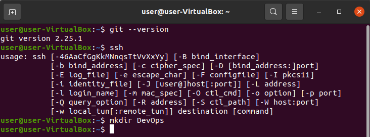
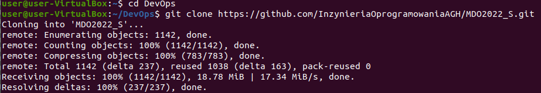
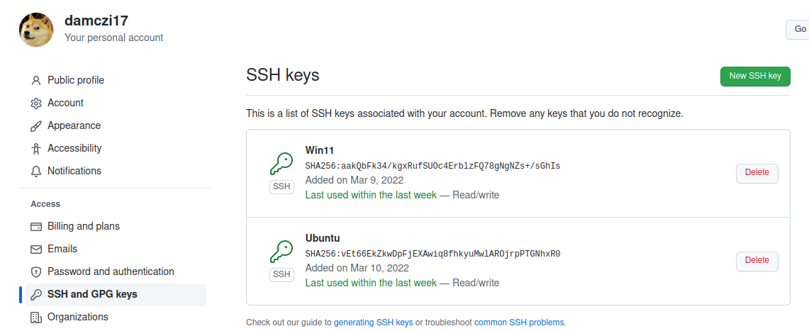
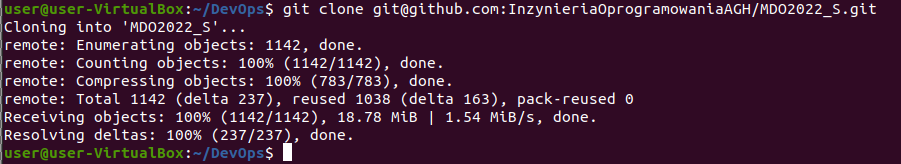
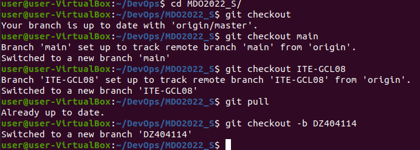
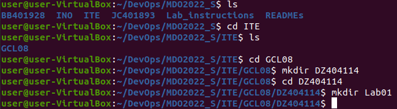
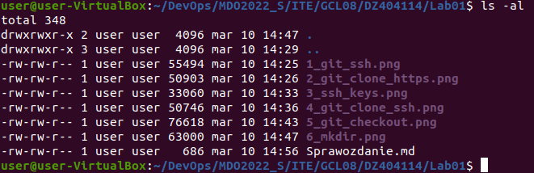
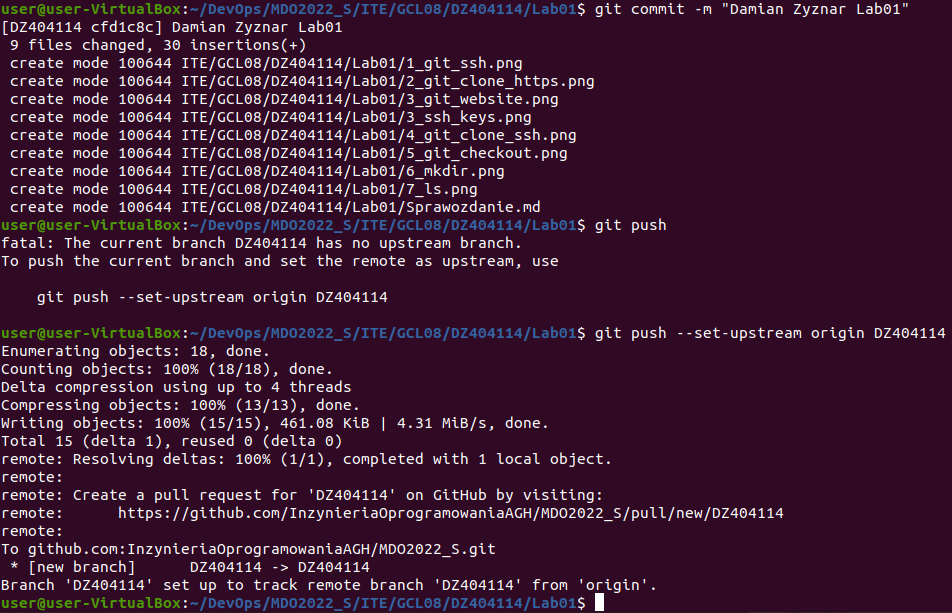

# Sprawozdanie Lab01 Damian Zyznar ITE-GCL08

 1. Sprawdzenie wersji gita, oraz ssh.

 2. Skolonowanie repozytorium przy pomocy HTTPS.

 3. Wykazanie instniejących kluczy SSH w systemie i w ustawieniach gita.

 4. Sklonowanie repozytorium przy pomocy SSH.

 5. Zmiana brancha na main, następnie na ITE-GCL08 i utworzenie swojego brancha.

 6. Utworzenie potrzebnych folderów.

 7. Utworzenie sprawozdania i dodanie potrzebnych screenów w folderze Lab01.
 

 8. Utworzenie commita i wykonanie pusha.

  

# Wnioski:

<strong>git clone</strong> służy do klonowania repozytorium na lokalny komputer.

<strong>git branch</strong> służy do wyświetlenia nazwy gałęźi, na której aktualnie się znajdujemy.

<strong>git status</strong> sprawdzenie statusu plików w repozytorium.

<strong>git checkout</strong> służy do zmiany brancha. Flaga -b 'nazwa' pozwala utworzyćnowego brancha i od razu przejść do niego.

<strong>git add</strong> służy do dodawnie wszystkich plików nowych, zmodyfikowanych, ale nie usuniętych.

<strong>git commit</strong> tworzy nowy commit, który zawiera całą zawartość ostatniego commita. Flaga -m "Wiadomość" dodaje komentarz do commita.

<strong>git push</strong> służy do wysłania zmian do zdalnego repozytorium.

