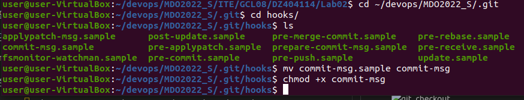
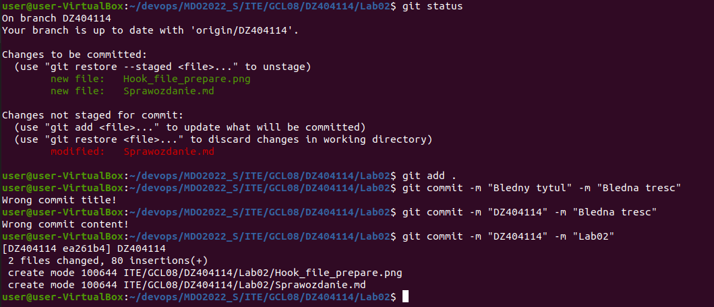
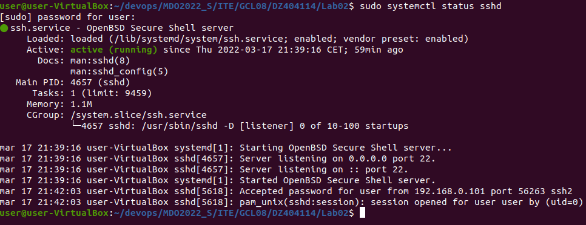
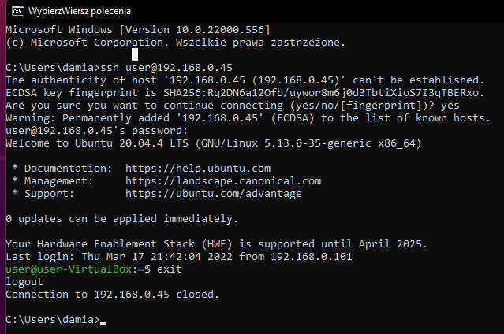
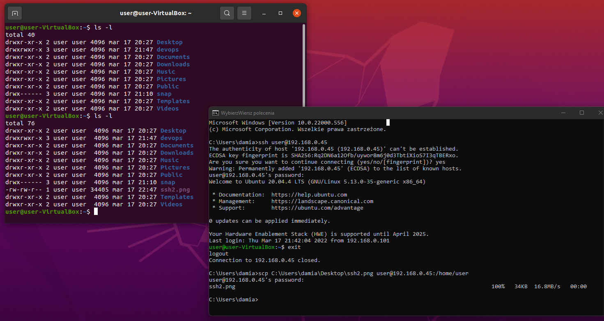
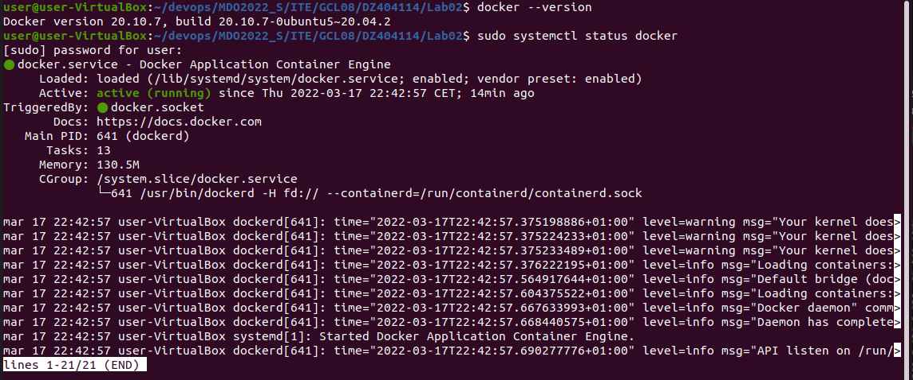
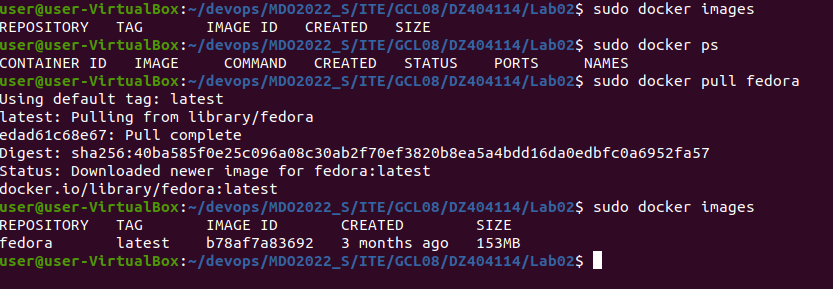
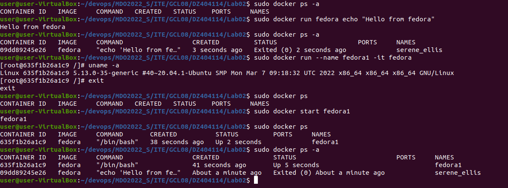
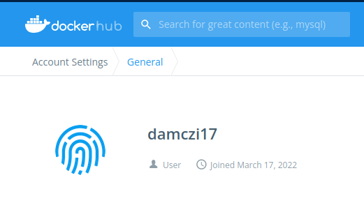

# Sprawozdanie Lab02 Damian Zyznar ITE-GCL08

 1. Przygotowanie git hook'a, który będzie sprawdzał tytuł, oraz treść commita. Użyto do tego hook'a commit-msg.



Kod git hooka:
```
#!/usr/bin/python3

import sys

filePath=sys.argv[1]
fileOpen=open(filePath,'r')
fileContent=fileOpen.read()

commitTitle=fileContent.split('\n')[0]
commitMessage=fileContent.split('\n')[2]

if commitTitle != "DZ404114":
    print("Wrong commit title!")
    exit(1)
if not (commitMessage.find("2") != -1):
    print("Wrong commit content!")
    exit(1)
else:
    exit(0)
```

Sprawdzenie poprawności działania git hooków




 2. Rozpoczęcie przygotowania środowiska Dockerowego. W chwili wykonywania sprawozdania usługa sshd była już zainstalowana.



 3. Połączenie się z Windowsa za pomocą ssh do Ubuntu.




Udowodnienie, faktycznego połączenia za pomocą przesłania pliku ```ssh2.png``` z Windowsa do Ubuntu, oraz wykazanie drzewa plików na Ubuntu przed i po przesłaniu.



 4. Wykazanie zainstalowanego dockera, i jego działanie.



 5. Udowodnienie działania dockera i pobranie obrazu fedory.

 

  5. Uruchomienie kontenera z dystrubucją fedory.

Kolejno wykonano:
- Wyświetlono wszystkie kontenery dostępne lokalnie;
- Uruchomiono z fedory polecenie ```echo "Hello from fedora"```;
- Kolejno widać kontener i komendę którą wykonał;
- Utworzenie kontenera o nazwie fedora1 i wyświetlenie wersji systemu;
- Wyjście z kontenera i sprawdzenie czy działa;
- Kontener nie był uruchomiony, więc go uruchomiłem i sprawdziłem jakie komendy zostały na nim wykonane.



6. Utworzenie konta na Docker hub.


