# Sprawozdanie Lab04 Damian Zyznar ITE-GCL08

# Zachowywanie stanu

1. Utworzenie 2 woluminów o nazwach inputVolume i outputVolume.

    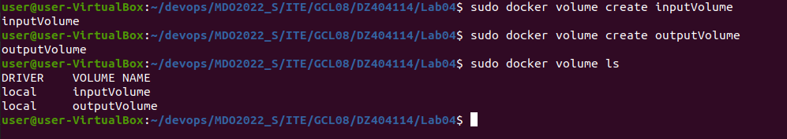

2. Utworzenie kontenera na podstawie obrazu node i podpięcie do niego utworzonych wcześniej woluminów.

    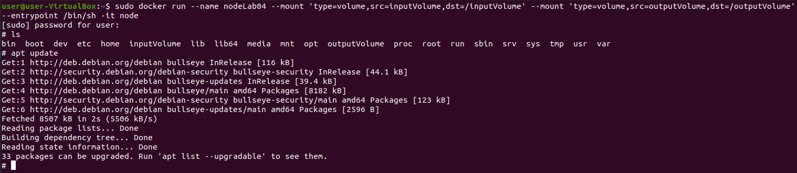

3. Sklonowanie do woluminu wejściowego repozytorium gita.

    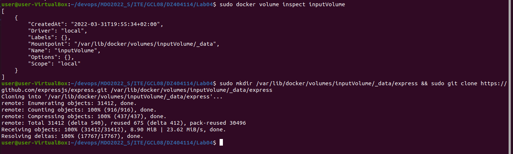

4. Udowodnienie istnienia repozytorium w kontenerze. Polecenia wykonane przed i po kolonowaniu.

    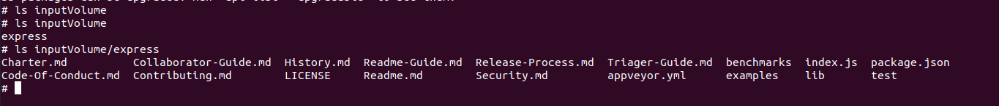

5. Skopiowanie repozytorium z woluminu wejściowego do wyjściowego i wykoanie builda za pomocą ```npm```.

    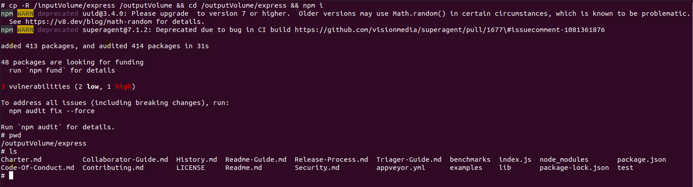

6. Sprawdzenie istnienia programu z poziomu maszyny wirtualnej.

    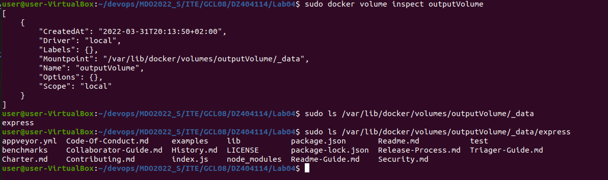

# Eksponowanie portu

1. Pobranie serwera ```iperf3``` na kontener, oraz zainstalowanie net-tools aby sprawdzić adres IP kontenera.

    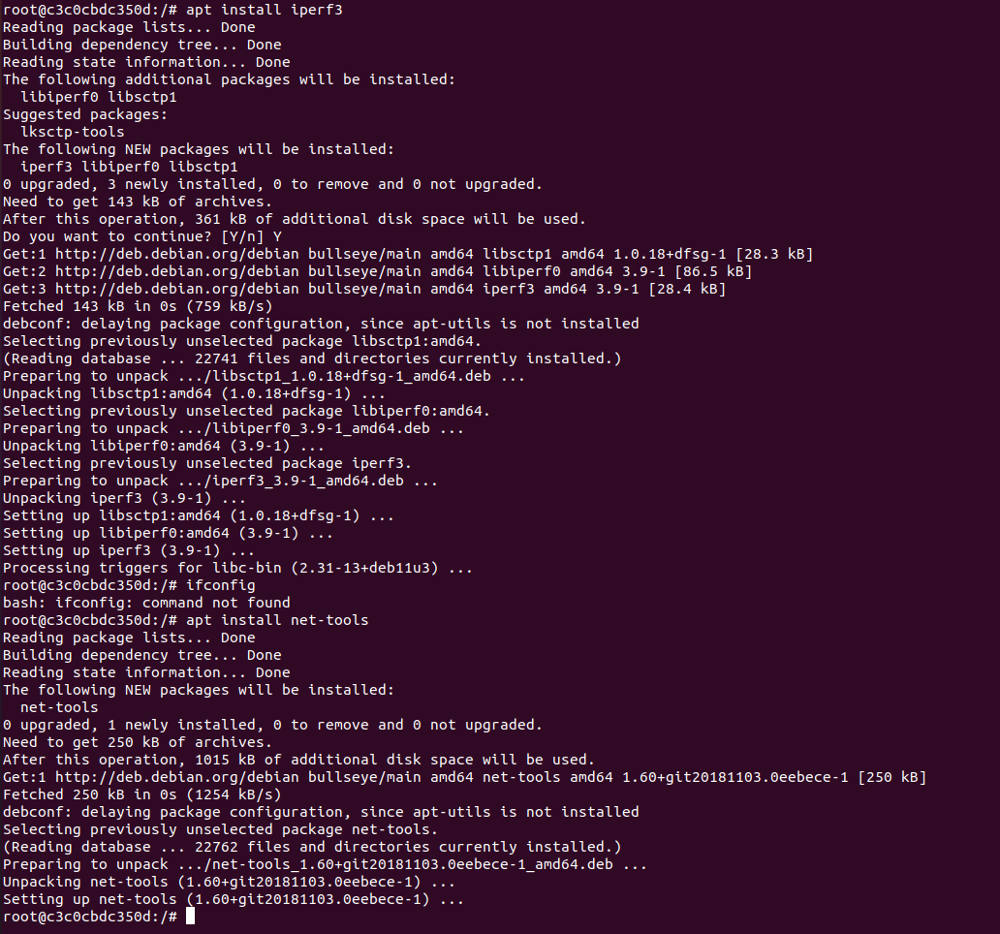

2. Uruchomienie nasłuchiwania na porcie ```2000``` w kontenerze, utworzenie drugiego kontenera, zainstalowanie serwera iperf3 i sprawdzenie ruchu pomiędzy kontenerami.

    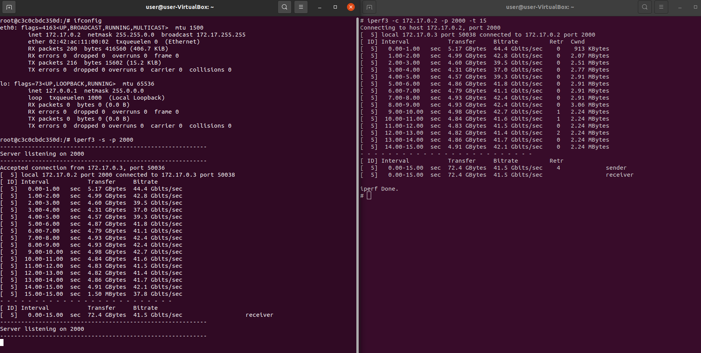

3. Zainstalowanie serwera ```iperf3``` na hoście i sprawdzenie ruchu pomiędzy hostem, a kontenerem.

    

4. Sprawdzenie adresu IP hosta.

    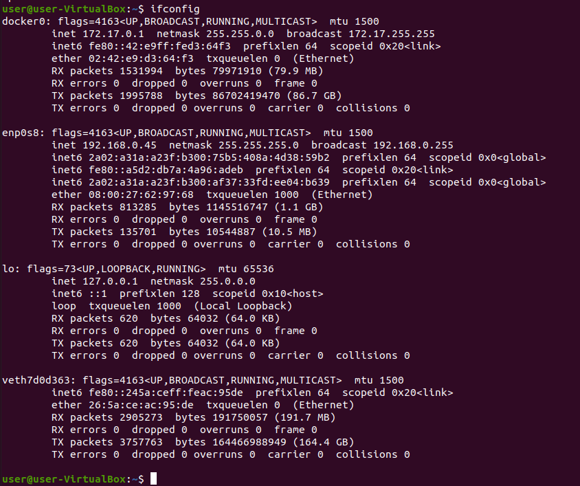

5. Pobranie serwera ```iperf3``` na system spoza hosta - Windows, dodanie iperf3 do PATH.

    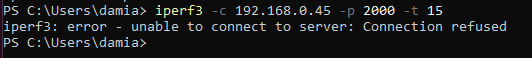

    Widzimy tu błąd połączenia, ponieważ kontener nie publikuje portu 2000 do hosta, czyli host nie nasłchuje a tym porcie. Rozwiązaniem tego problemu jest uruchomienie kontenera z opcją ```--publish```.
    
6. Uruchomienie kontenera z opcją publish dla portów w zakresie od 2000 do 2000 i sprawdzenie nasłuchiwanych portów przez hosta.

    

7. Sprawdzenie ruchu pomiędzy maszyną spoza hosta a kontenerem.

    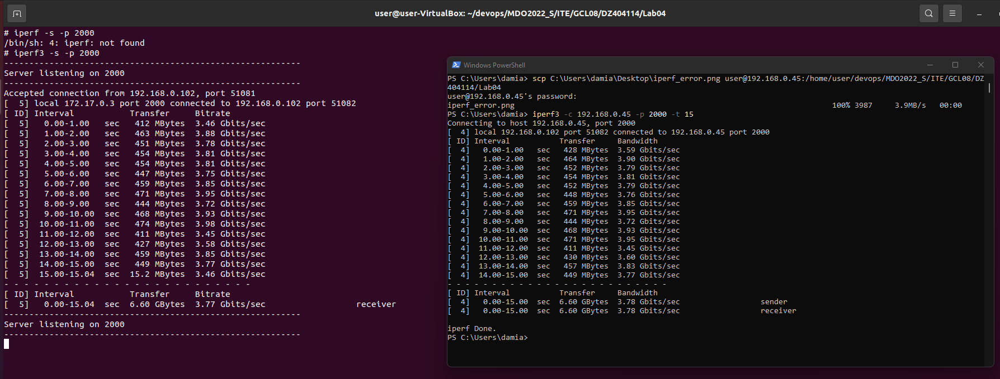

8. Zestawienie prędkości wykonanych połączeń.


|                  | Container to container | Host to container   | Outside network host to container |
| :--------------: | :--------------------: | :-----------------: | :-------------------------------: |
| Interval \[sec\] | Birate \[Gbit/sec\]    | Birate \[Gbit/sec\] | Birate \[Gbit/sec\]               |
| 0.00-1.00        | 44,4                   | 45,9                | 3,46                              |
| 1.00-2.00        | 42,8                   | 46,7                | 3,88                              |
| 2.00-3.00        | 39,5                   | 45                  | 3,78                              |
| 3.00-4.00        | 37,0                   | 47,6                | 3,81                              |
| 4.00-5.00        | 39,3                   | 47,1                | 3,81                              |
| 5.00-6.00        | 41,8                   | 45,2                | 3,75                              |
| 6.00-7.00        | 41,1                   | 42,3                | 3,85                              |
| 7.00-8.00        | 42,4                   | 47,9                | 3,95                              |
| 8.00-9.00        | 42,4                   | 46,7                | 3,72                              |
| 9.00-10.00       | 42,7                   | 46,8                | 3,93                              |
| 10.00-11.00      | 41,6                   | 45,2                | 3,98                              |
| 11.00-12.00      | 41,5                   | 47,7                | 3,45                              |
| 12.00-13.00      | 41,4                   | 44,7                | 3,58                              |
| 13.00-14.00      | 41,7                   | 45,6                | 3,85                              |
| 14.00-15.00      | 42,1                   | 47,4                | 3,77                              |
| <strong>Avarage connection bitrate</strong> | <strong>41,4</strong>                   | <strong>46,1</strong>                | <strong>3,8 </strong>                     |


Na podstawie otrzymanych wyników można zauważyć, że najszybszym połączeniem jest połączenie hosta z kontenerem o średniej prędkości transmisji **46,1 Gbit/sec**. Wynika to z bezpośredniego połączenia pomiędzy hostem, a kontenerem. Nieco wolniejszym połączeniem jest połączenie pomiędzy dwoma kontenerami o średniej prędkości transmisji **41,4 Gbit/sec**. Najwolniejszym połączeniem jest połączenie hosta z zewnątrz sieci do kontenera, o średniej transmisji **3,8 Gbit/sec**, co wynika z trasy jaką musi przebyć pakiet.

<br>


# Instalacja Jenkinsa

1. Stworzenie sieci mostkowanej w Dockerze.

    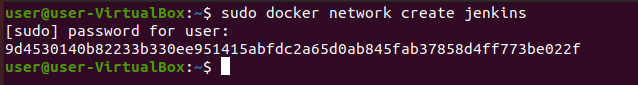

2. Pobranie i uruchomienie obrazu docker:dind.

    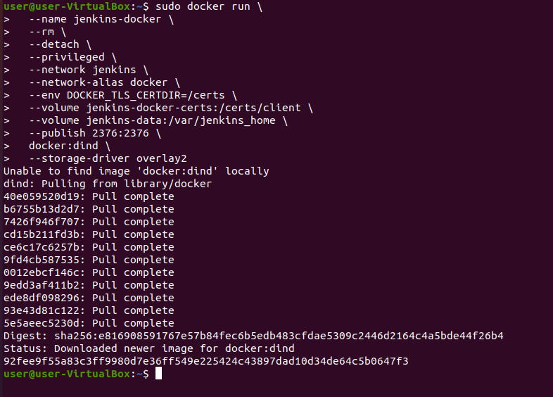

3. Utworzono Dockerfile:
    ```
    FROM jenkins/jenkins:2.332.1-jdk11
    USER root
    RUN apt-get update && apt-get install -y lsb-release
    RUN curl -fsSLo /usr/share/keyrings/docker-archive-keyring.asc \
      https://download.docker.com/linux/debian/gpg
    RUN echo "deb [arch=$(dpkg --print-architecture) \ 
      signed-by=/usr/share/keyrings/docker-archive-keyring.asc] \
      https://download.docker.com/linux/debian \ 
      $(lsb_release -cs) stable" > /etc/apt/sources.list.d/docker.list
    RUN apt-get update && apt-get install -y docker-ce-cli
    USER jenkins
    RUN jenkins-plugin-cli --plugins "blueocean:1.25.3 docker-workflow:1.28"
    ```
4. Utworzenie obrazu na podstawie Dockerfile.

    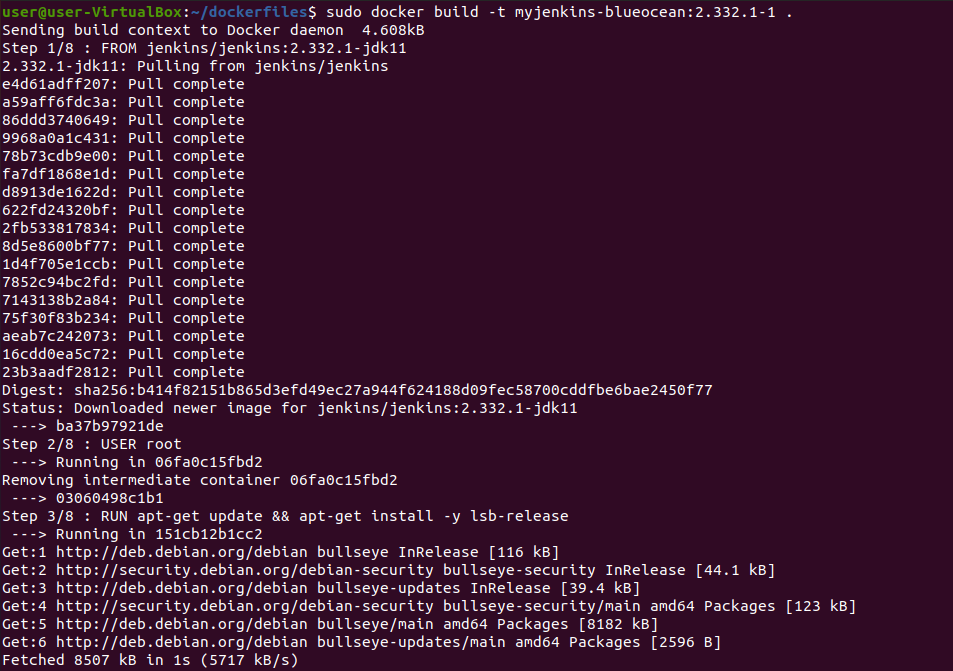

5. Uruchomienie kontenera na podstawie utworzonego obrazu.

    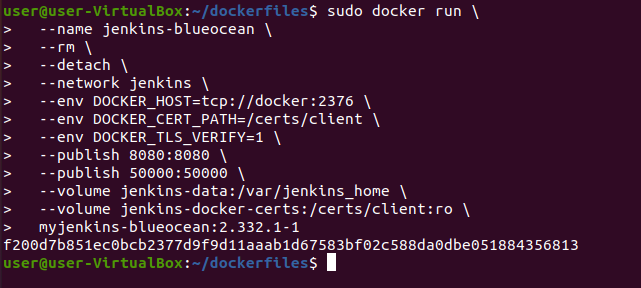

6. Sprawdzenie uruchomionych kontenerów i wyświetlenie logów kontenera jenkins, w celu pobrania hasła do inicjalizacji admina.

    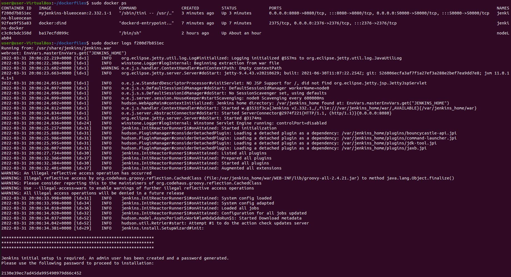

7. Wyświetlenie ekranu logowania.

    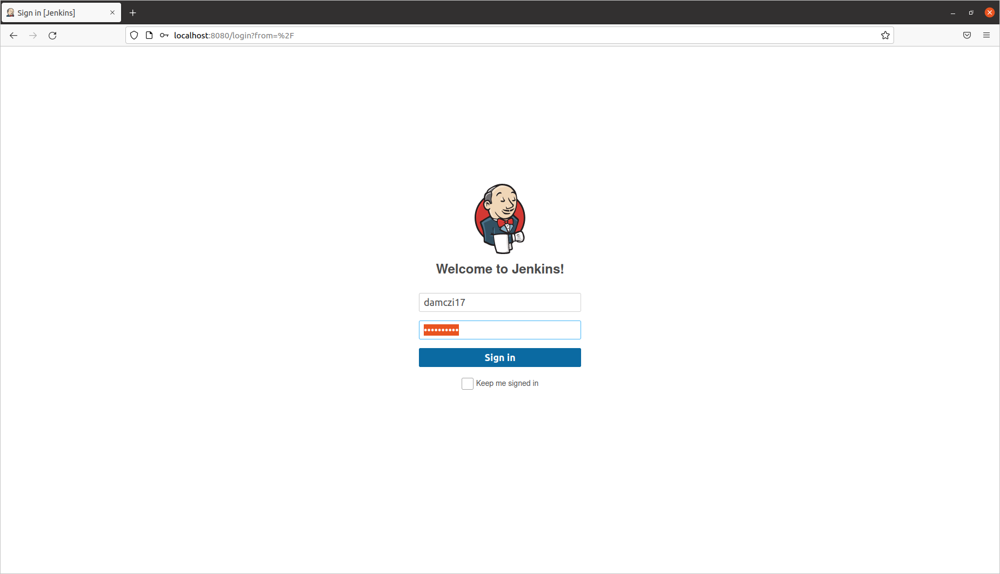

    