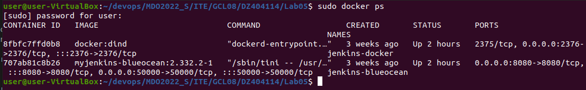
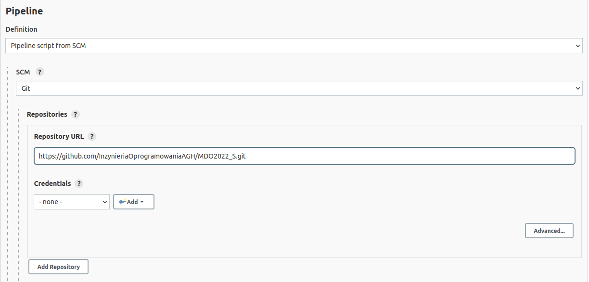
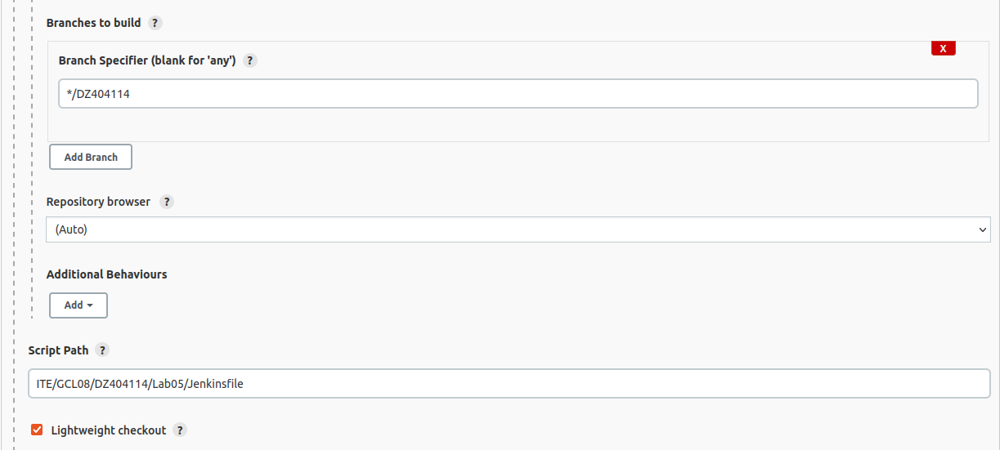
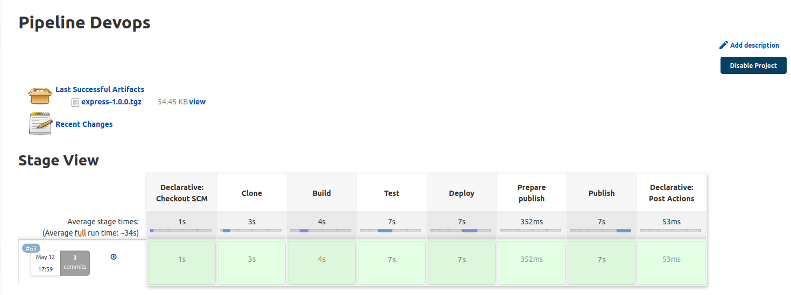
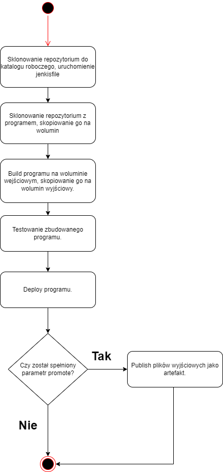
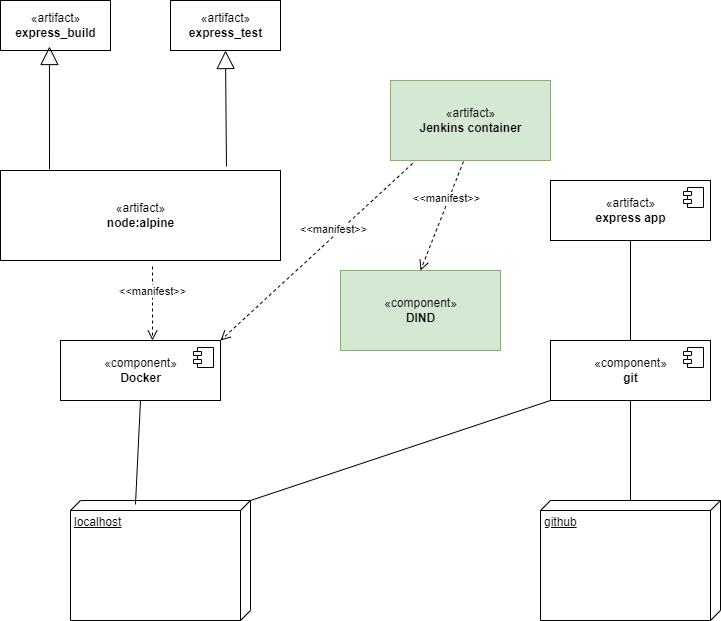

# Sprawozdanie Lab05 Damian Zyznar ITE-GCL08

<br>

# Założenia wstępne

**Cel labortariów:** Przygotowanie Pipeline'u przeprowadzającego build, test, deploy i publish programu używanego we wcześniejszych laboratoriach. 

**Technologie użyte w laboratorium:** Jenkins, Docker, git, npm.

Używany program to express, napisany w Node.JS - szybki, minimalistyczny framework webowy dla node.

Link do repozytorium programu na gicie: https://github.com/expressjs/express.git

Do wykonania laboratorium niezbędne są skonfigurowane kontenery Jenkins i DIND. Instalacja została dokonoana podczas wczesniejszych laboratoriów. 

Działające kontenery Jenkins i DIND:



# Budowa Pipeline'u
Pierwszym krokiem jest utworzenie nowego pipeline'u i dodanie w konfiguracji link do repozytorium, które zostanie sklonowane do naszej przestrzeni roboczej w kontenerze Jenkinsa.



Następnie dodajemy nazwę brancha, oraz ścieżkę do Jenkinsfile'a, którego kod wykona się w Piepline.



<h2>Poszczególne etapy w Jenkinsfile</h2>

- **```Stage Clone```**

    Celem etapu ```Clone``` jest sklonowanie repozytorium programu express z platformy github, oraz umieszczenie go na woluminie wejściowym ```input-volume```.
    
    Aby wykonać krok sprawdzono istnienie kontenera o takiej samej nazwie, jaki zostanie utworzony. Jeśli takowy kontener nie istnieje, to polecenie zwróci true. Następnie utworzono wolumin wejściowy i uruchomiono kontener z podpiętym wolumienm. Przy poleceniu docker run użyto flagi ``--rm``, aby kontener od razu po zakończeniu pracy został usunięty. Za pomcą basha sprawedzono czy w katalogu głównym istnieje katalog express. Jeśli takowy nie istnieje, to rozpoczyna się klonowanie repozytorium. Po udanym sklonowaniu następuje klonowanie repozytwoluminie wejściowym input-volumerium na wolumin. Na końcu wyświetlono zawartość woluminu. Do wykonania tego kroku wybrano obraz node, ponieważ zaweira git'a oraz basha.

- **```Stage Build```**

    Celem etapu ```Build``` jest zbudowanie programu za pomocą narzędzia ```npm``` na woluminie wejściowym ```input-volume```, a następnie skopiowanie zbudowanego programu na wolumin wyjściowy ```output-volume```.

    W tym celu utworzono wolumin wyjściowy, oraz uruchomiono kontener z utworzonego wcześniej obrazu na podstawie dockerfile. Dockerfile korzysta z obrazu node:alpine, ponieważ jest to "lekki" zamiennik obrazu node. Dockerfile doinstalowuje basha. Kontener buduje na wolumienie wejściowym program za pomocą npm install. Po udanym kroku kopiujemy build na na wolumin wyjściowy. 

- **```Stage Test```**

    Celem etapu ```Test``` jest przetestowanie programu za pomocą narzędzia ```npm``` na woluminie wejściowym ```input-volume```.

    Uruchomiono kontener z wczesniejszego obrazu, podpięto wolumin wejściowy i uruchomiono polecenie ```npm test```.

- **```Stage Deploy```**

    Celem etapu ```Deploy``` jest uruchomienie programu za pomocą narzędzia ```npm``` na woluminie wyjściowym ```output-volume```.

    Uruchomiono kontener z wcześniej utworzonego obrazu, podpięto wolumin wyjściowy, na którym jest zbudowany program i uruchomiono polecenie ```npm run```. Po uruchomieniu kontenra i wykonaniu przez niego poleceń program czeka 5 sekund i sprawdza exit code, jaki został zwrócony przez kontener. Po udanym exit code kontener zostaje usunięty.

- **```Stage Prepare publish```**

    W tym etapie sprawdzono istnienie katalogu ```artifacts``` w obszarze roboczym ```workspace```. Ten etap i kolejny zostaną uruchomione tylko wtedy, gdy parametr Promote == true
    
    Problemem w tym kroku okazał się brak uprawnień roota użytkownika jenkins. Nie można z poziomu jenkinsa usunąć plików w folderze artifacts. Zostaje to wykonane w kolejnym kroku, jednak za pomocą kontenera node:alpine, w którym podpięty jest ten katalog jako bind.

- **```Stage Publish```**

    Celem etapu ```Publish``` jest spakowanie zbudowanego programu do archiwum i zarchiwizowanie artefaktu.

    Użyto agenta na podstawie obrazu node:alpine z uprawnieniami root'a, usunięto wszystkie pliki z katalogu artifacts, ustawiono wersję publisha, oraz użyto ```npm pack``` do spakowania programu. Kolejno przeniesiono archiwum do katalogu artifacts oraz zarchiwizowano artefakt.

- **```post```**

    Wyświetlenie komunikatu o powodzeniu, lub niepowodzeniu piepeline'a.

# Uruchomienie Pipeline'a


# Działanie Pipeline'a




<a href="./logs.txt">Logi z Pipeline'u w pliku logs.txt</a>

# Diagram aktywności



# Diagram wdrożeniowy

