# Sprawozdanie Lab09 Damian Zyznar ITE-GCL08

 

**Cel labortariów:** Przygotowanie systemu pod uruchomienie, Instalacja nienadzorowana, Infrastructure as a code

Artefakt utworzony w poprzednim laboratorium został poborany z Jenkinsa.

 

# Przygotowanie systemu pod uruchomienie
Pierwszym krokiem było pobranie obrazu Fedory w wersji 36 beta netinstall, oraz jej zainsalowanie z następującymi parametrami:
- Utworzenie partycji

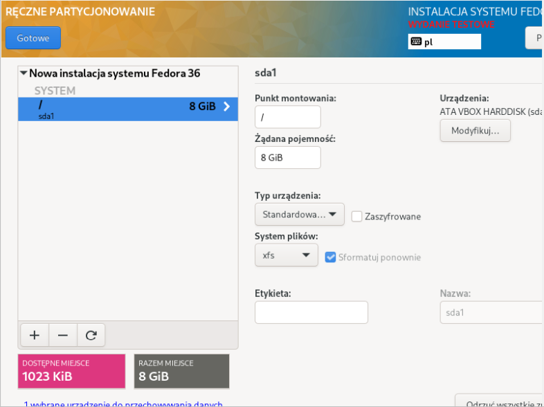

- Włączenie konta root'a. Ważnym elementem jest zezwolenie na łączenie się przez SSH, ponieważ w kolejnych krokach na serwer zostanie przesłany artefakt na serwer przez SSH. 

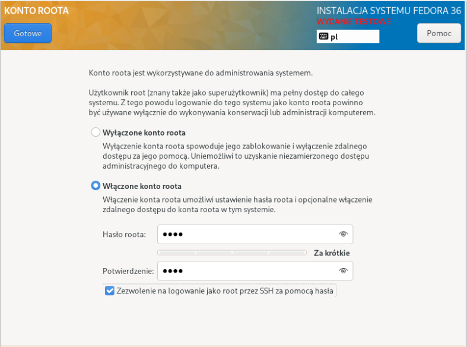

- Ustawienie nazwy

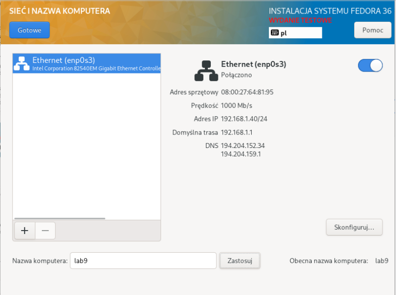

- Ustawienie środowiska instalowania. Wybrano minimalną instalację.

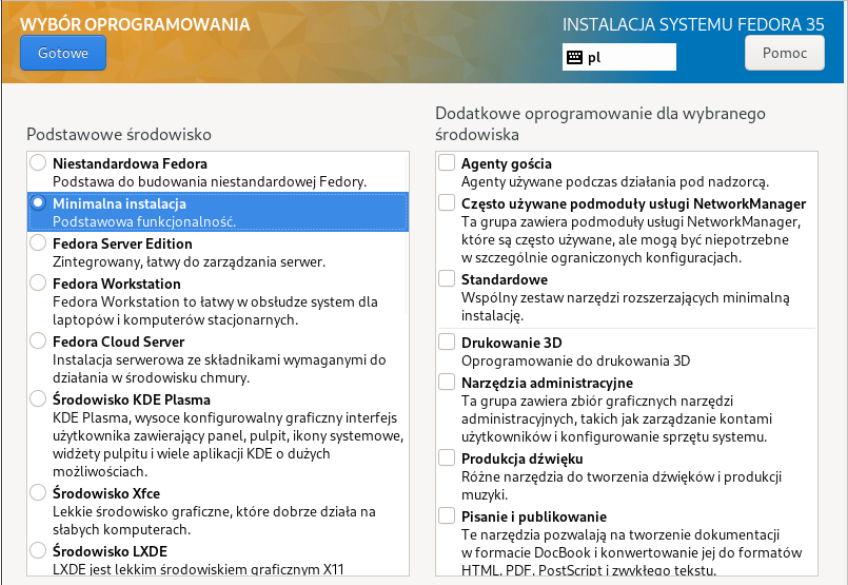

Po prawidłowym zainstalowaniu się systemu sprawdzono adres IP maszyny, w celu pobrania pliku `anaconda-ks.cfg` przez SSH za pomocą programu WinScp, który będzie służył do późniejszej instalacji nienadzorowanej.

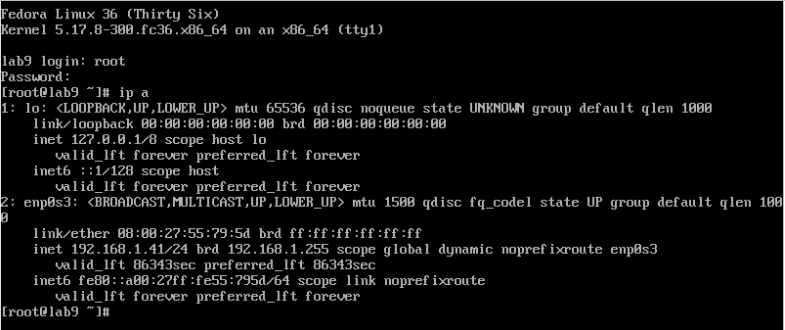

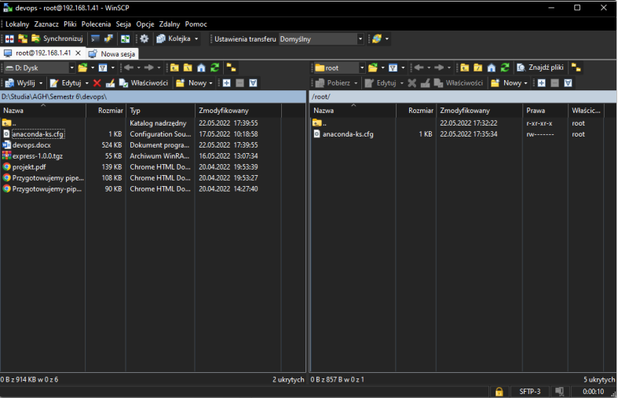

<h2>Instalacja i konfiguracja serwera</h2>

Utworzono kolejną maszynę wirtualną i przeprowadzono instalację Fedory w taki sam sposób jak poprzednio. Jedyną zmianą była zmiana nazwy na serwer.

- Instalacja httpd (usługa została zainstalowana wczesniej)

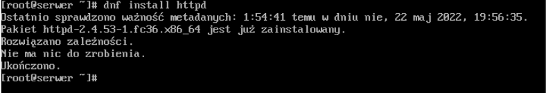

- Dodanie wyjątków w zaporze sieciowej i jej przeładowanie

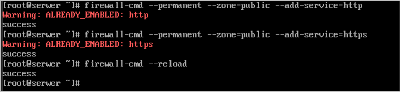

- Włączneie usługi httpd i sprawdzenie jej działania

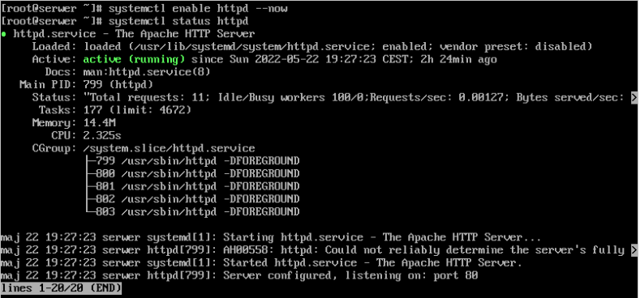

- Sprawdzenie adresu IP maszyny i przesłanie artefaktu za pomocą programu WinScp na serwer.

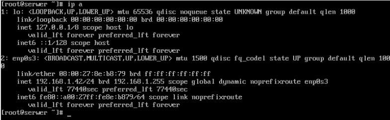

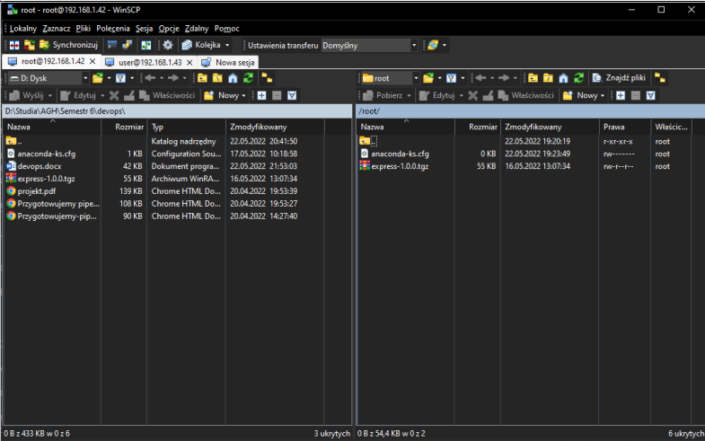

- Utworzenie katalogu `/var/www/html/express` (katalog /var/www domyślnie udostępniany przez usługę httpd) i skopiowanie do niego artefaktu.

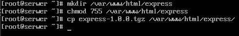

<h2>Pobranie artefaktu z serwera</h2>

- Instalacja pakietu wget.

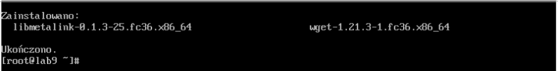

- Pobranie artefaktu

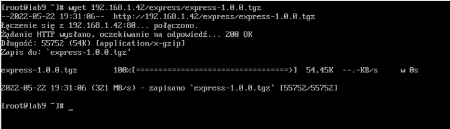

- Instalacja pakietu npm (pakiet zainstalowany wcześniej)

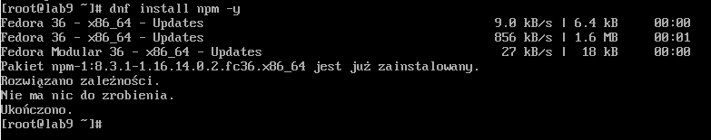

- Instalacja programu express

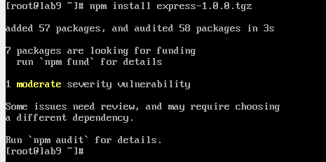

# Instalacja nienadzorowana
W celu przeprowadzenia instalacji nienadzorowanej zmodyfikowano pobrany wczesniej plik `anaconda-ks.cfg` i przesłano go do repozytorium na githubie.

W pliku dokonano następujących zmian:

- Zmiana trybu instalacji z graficznej na tekstową,
- Dodanie repozytoriów Fedory,
- Dodanie instalacji pakietów wget i npm,
- Dodanie sekcji post, w której dokona się pobranie artefaktu z serwera.

<a href="./anaconda-ks.cfg">anaconda-ks.cfg</a>

Uruchomiono instalację z obrazu fedory, przy pomocy pliku z githuba.

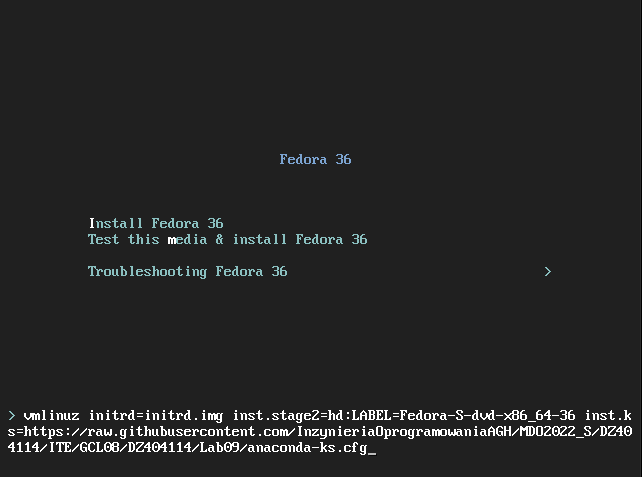

Ważnym aspektemw w tym podpuncie jest utworzenie dysku twardego w maszynie wirtualnej takiej samej wielkości, lub większego niż rozmiar partycji podany w pliku anaconda. Jeśli warunek nie zostanie spełniony instalacja się nie powiedzie.

# Infrastructure as a code

- Zamontowanie w napędzie optycznym obrazu Fedory.

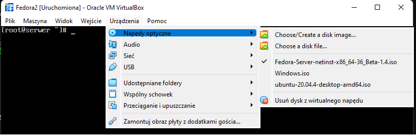

- Utworzenie katalogu `/media/iso` i zamontowanie w nim obrazu z napędu.

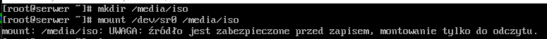

- Utworzenie katalogu roboczego `/root/fedora_iso` i skopiowanie do niego obrazu z katalogu `/media/iso`.

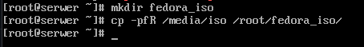

- Skopiowanie pliku anaconda-ks.cfg do obrazu i zmiana jego nazwy na ks.cfg

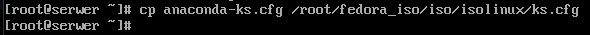

- Modyfikacja pliku isolinux.cfg

- Zainstalowanie pakietu genisoimage.

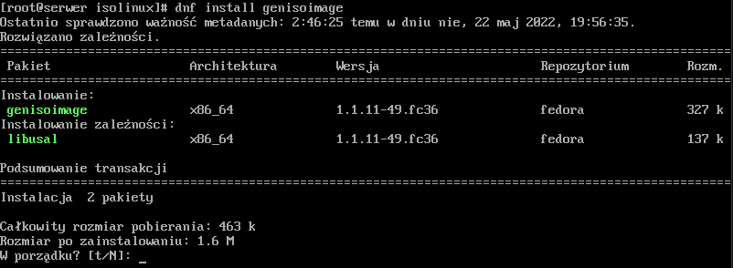

- Utworzenie nowego obrazu ISO. Rezultat pokazany powyżej komendy.

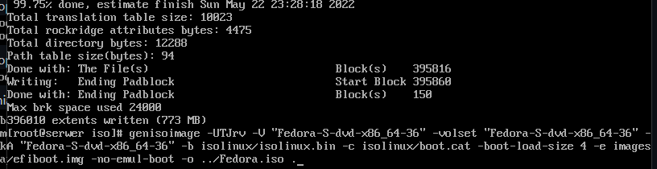

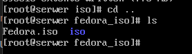

Następnie pobrano za pomocą WinScp wygenerowany obraz ISO, utworzono nową maszynę wirtualną i uruchomiono instalację z obrazu. Instalacja powiodła się.