# Sprawozdanie Lab11 Damian Zyznar ITE-GCL08

<br>

**Cel labortariów:** Wdrażanie na zarządzakne kontenery Kubernetes

</br>


# Instalacja klastra Kubernetes
Aby zaopatrzyć się w implementację stosu k8s: minikube potzrbne było narzędzie curl. Pierwszym krokiem była jego instalacja. Następnie pobrano i zainstalowano minikube'a

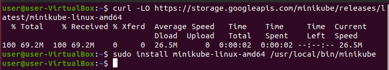

Pobranie pakietów instalacyjnych kubectl, oraz sprawdzenie sumy kontrolnej, co znacząco wzmacnia bezpieczeństwo instalacji:

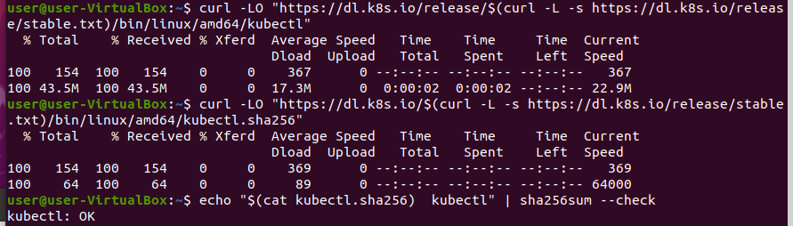

Instalacja kubestl:

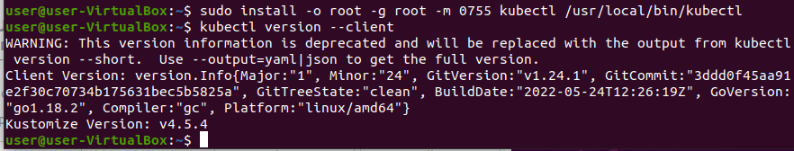

Próba pierwszego uruchomienia minikube:

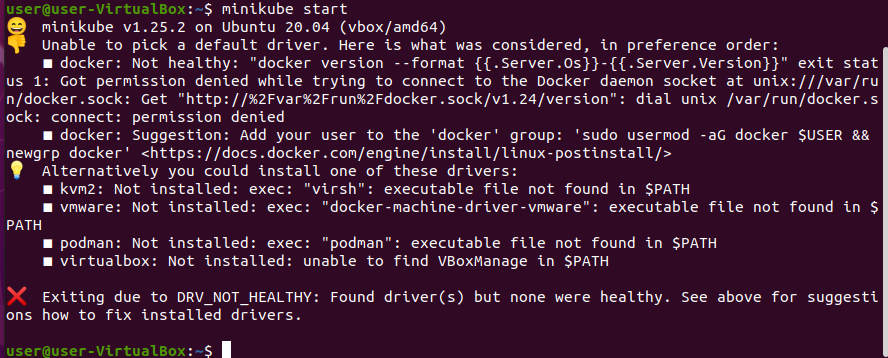

Wykonano zaleconą operację dodania użytkownika do grupy docker i uruchomiono minikube.

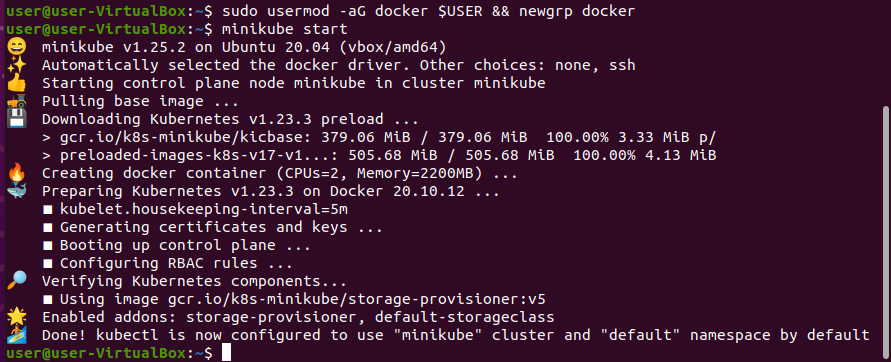

Wyświetlenie działających node'ów i pod'ów. Klaster składa się z jednego noda - master.

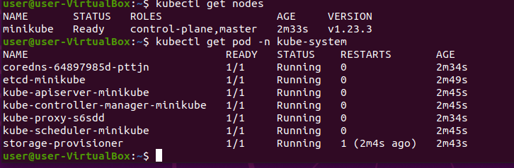

Uruchomienie dashbord'u

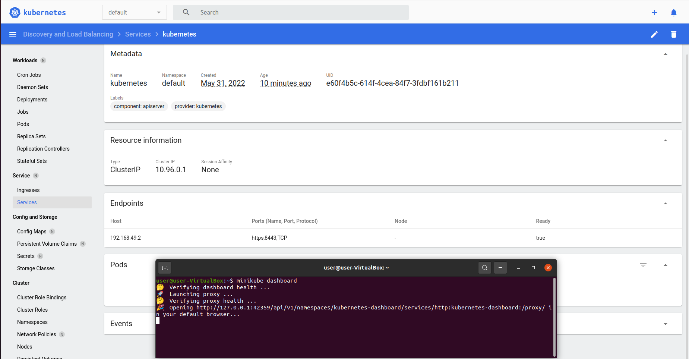

Największym wymaganiem sprzętowym do instalacji kubernetesa jest 20 GB wolnej przestrzeni dyskowej. Wymagania dotyczące procesora i pamięci RAM nie są zbyt wygórowane i zostaną spełnione przez dużą większość obecnych komputerów. Minikube potrzebuje również środowiska konteneryzajci, w tym przypadku jest to docker.

# Analiza posiadanego kontenera

Aplikacja używana we wcześniejszych laboratoriach jest napisania w Node.Js i podczas uruchomienia przykładowych skryptów udostępnia port 3000, więc aplikacja jak najbardziej nadaje się do wykonania tego laboratorium.

Utworzono następujący Dockerfile:

```
FROM node:latest

WORKDIR /usr/app

COPY package*.json ./

RUN npm install

COPY . .
EXPOSE 3000
CMD [ "node", "examples/content-negotiation"]
```

Uruchamiany tu jest przykładowy skrypt ```content-negotiation```, oraz udostępniany jest port 3000.

Build obrazu:

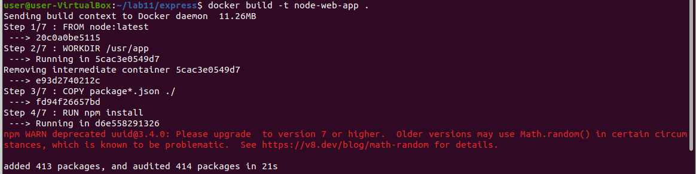

Uruchomienie kontenera i przekierowanie portu 3000 z kontenera na port 49160 w localhost, oraz przedstawienie działania.

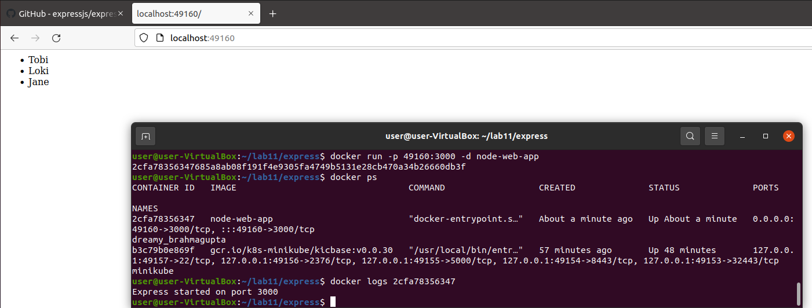


# Uruchamianie oprogramowania

Utworzenie pliku definicji pod.yml dla aplikacji.

```
apiVersion: v1
kind: Pod

metadata:
  name: express
  labels:
    app: express

spec:
  containers:
    - name: express
      image: node-web-app
      imagePullPolicy: Never
      ports:
      - containerPort: 3000
      
```
Utworzono pod'a za pomocą polecenia ```kubectl -y apply -f pod.yml``` i sprawdzono jego działanie:
=-
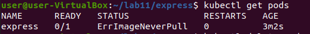

Pod nie działa. Jest to spowodowane tym, że w node, w którym obecnie pracujemy nie ma docker image o nazwie ```node-web-app```. Ustawienie w pliku definicji ```imagePullPolicy: Never``` mówi, że obraz nie będzie pobierany z internetu, tylko będzie poszukiwany w lokalnej bazie obrazów w aktualnym nodzie. Problem rozwiązano za pomocą optymalizacji przepływu pracy i uruchomienu docker build na podstawie utworzonego wcześniej ```Dockerfile```:

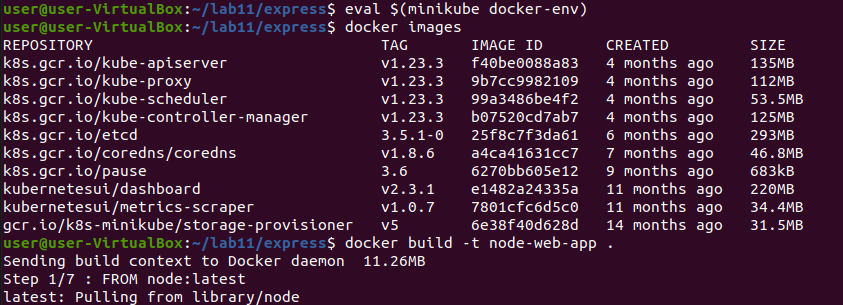

Kolejnopodjęto kolejną próbę utworzenia Pod'a.

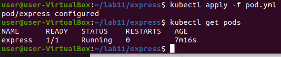

Pod działa prawidłowo, dashboard:

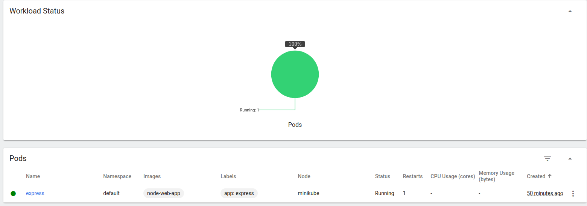

Kolejnym krokiem było wyprowadenie portu celem dotarcia do eksponowanej funkcjonalności i przedstawienie działania w przeglądarce.

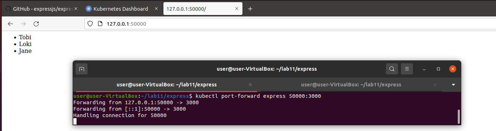

# Przekucie wdrożenia manualnego w plik wdrożenia

Utworzenie drugiego pliku Pod do wdrożenia z 3 replikami:

```
apiVersion: apps/v1
kind: Deployment
metadata:
  name: express
  labels:
    app: express
spec:
  replicas: 3
  selector:
    matchLabels:
      app: express
  template:
    metadata:
      labels:
        app: express
    spec:
      containers:
      - name: express
        image: node-web-app
        imagePullPolicy: Never
        ports:
        - containerPort: 3000
```

Utworzenie Pod'a i przedstawienie działania:

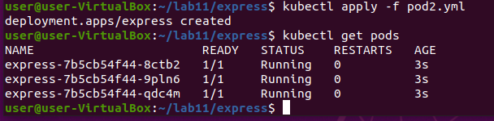

# Sprawozdanie Lab12 Damian Zyznar ITE-GCL08
pods_dashboard

Modyfikacja utworoznego w poprzednich laboratoriach pliku Pod i zmienie ilości replik do liczby 4.

```
spec:
  replicas: 4
```

Utworzenie pod'a

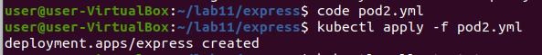

Zbadanie stanu wdrożenia za pomocą ```kubectl rollout```, oraz wyświetlenie podów:

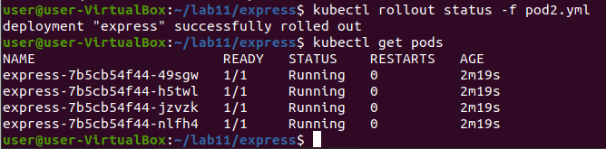

Wyświetlenie statusu w dashboardzie:

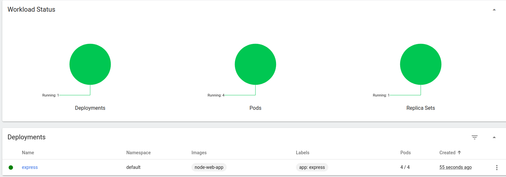

Zmiana ilości replik na 9, utworzenie poda i sprawdzenie statusu:

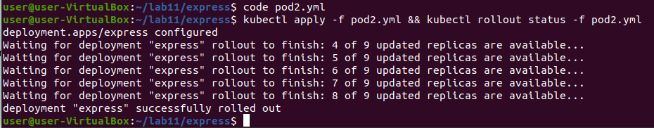

Dashboard:

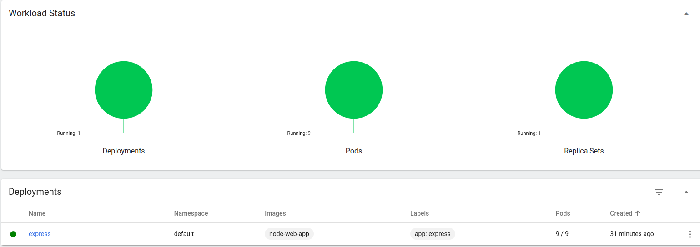

Zmiana ilości replik na 1, utworzenie poda i sprawdzenie statusu:

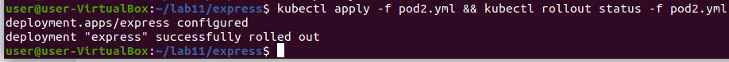

Dashboard:


Oraz 0 replik:

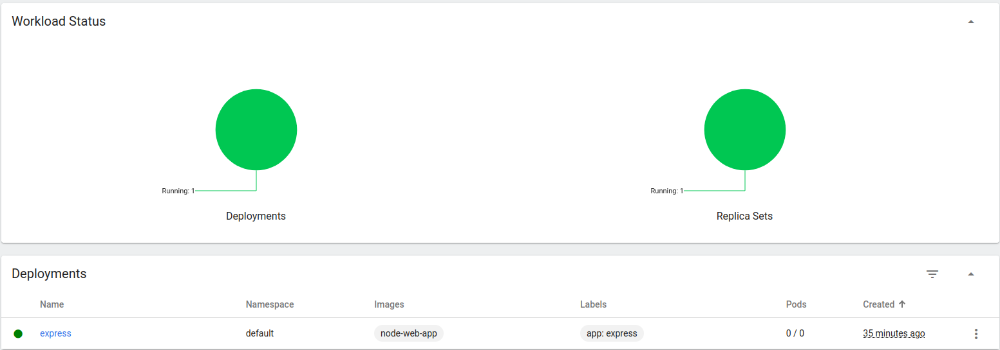

# Przygotowanie nowego obrazu

W celu skorzystania z DockerHub'a zalogowano się na maszynie wirtualnej przy pomocy klucza sha.

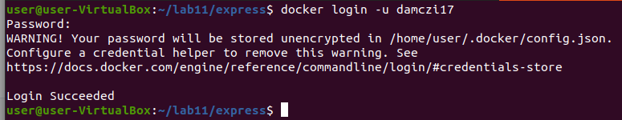

Utworzenie obrazu i wypchnięcie go na dockerhub

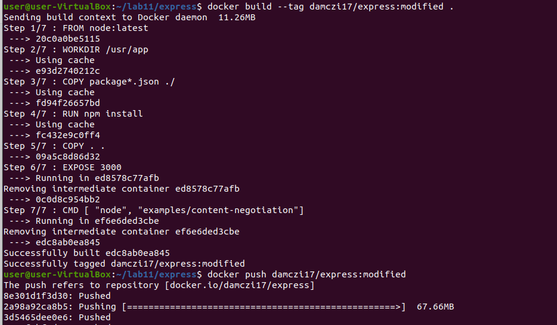

Usunięcie kilku niezbędnych skryptów w programie, oraz utworzenie obrazu i wypchnięcie go na dockerhub.

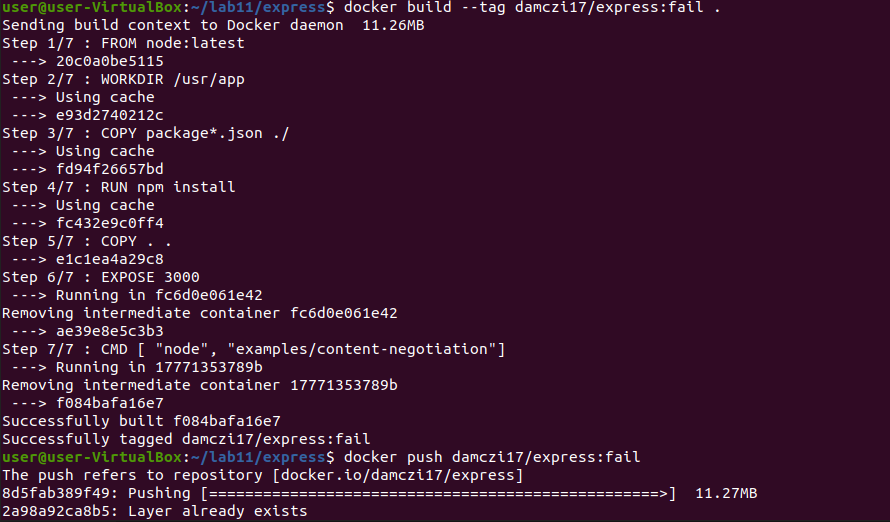

Udowodnienie istnienia obrazów w zdalnym repozytorium:

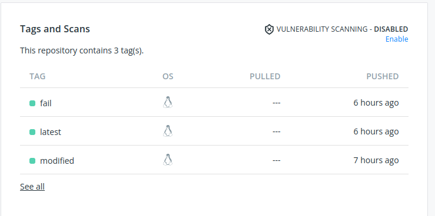

Zmiana w pliku definicji pod.yml obrazu na ten obierany z dockerguba, oraz usunięcie linii ImagePullPolicy: Never. Teraz jeśli w repozytorium lokalnym nie będzie obrazu, to zostanie on pobrany z repozytorium z dockerhub. 

```
apiVersion: apps/v1
kind: Deployment
metadata:
  name: express
  labels:
    app: express
spec:
  replicas: 1
  selector:
    matchLabels:
      app: express
  template:
    metadata:
      labels:
        app: express
    spec:
      containers:
      - name: express
        image: damczi17/express:latest
        ports:
        - containerPort: 3000
```

Działanie w dashboardzie:

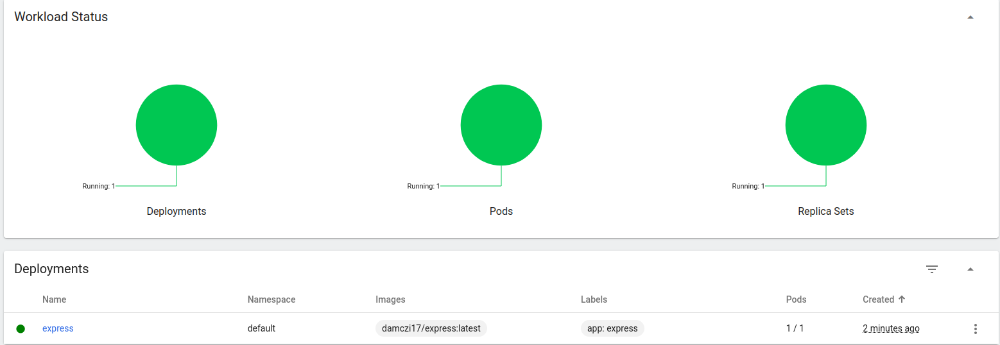

Zmiana obrazu na błędny i działanie w dashboardzie:

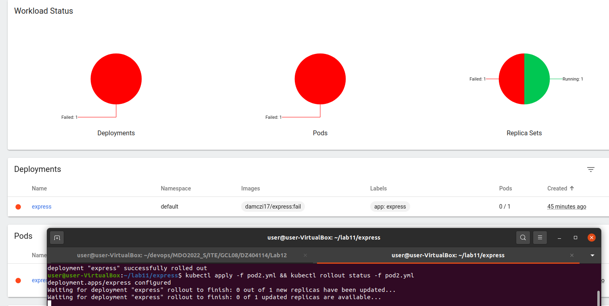

Wyświetlono hisotrii poprzednich wdrożeń i wyświetenie szczegółów wdrożenia 1:


Przywrócenie 1 wdrożenia:

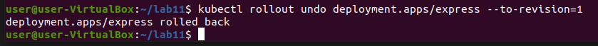

# Kontrola wdrożenia

W tym kroku utworzono prosty skrypt w bashu, który sprawdza czas tworzenia się wdrożenia. Jeśli czas jest większy niż 60 sekund skrypt zwraca informacje o błędzie.

```
#!/bin/bash

if [ $# -ne 2 ]; then
	echo "This script requires exactly 2 arguments."
	exit 1
fi

name=$1
deployment=$2

kubectl apply -f $name
timeout 60 /usr/local/bin/minikube kubectl rollout status $deployment

if [ $? -eq 0 ]; then
	echo "Deployment was successful."
    exit 0
else
	echo "Deployment failed."
    exit 1
fi
```

Działanie skryptu:

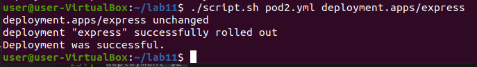


# Strategie wdrożenia

- **Strategia Recreate**

Ta strategia zabija stare wersje aplikacji i wdraża nowe wersje. W tej strategii najpierw zabijane są wszystkie stare wersje, gdy to nastąpi wdrażane są nowe.

```
spec:
  strategy:
    type: Recreate
```

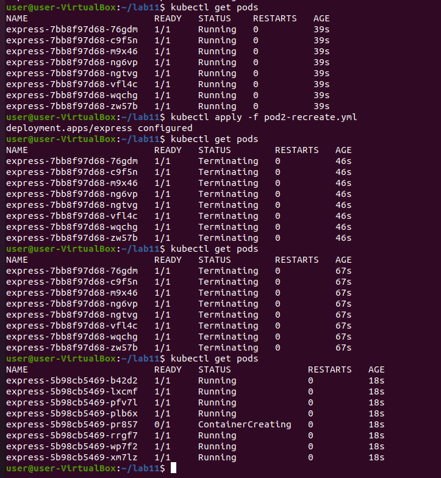

- **Strategia RollingUpdate**

W strategii RollingUpdate nastepuje zakończenie działania uruchomnionych podów, a następnie ich uruchomienie. W tym przypadku nastepuje to w sposób progresywny.

```maxSurge``` określa ilość podów które mogą zostać dodane w określonym czasie, 

```maxUnavaliabe``` określa ilość podów które mogą być niedostępne w czasie wdrożenia

```
spec:
  strategy:
    type: RollingUpdate
    rollingUpdate:
      maxSurge: 3
      maxUnavailable: 0 
```

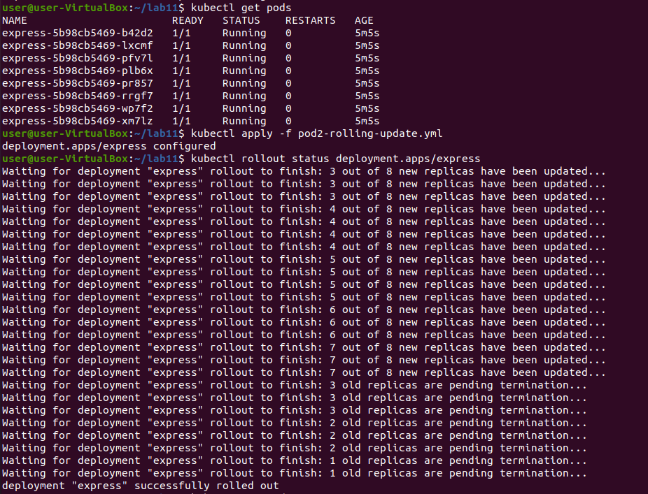

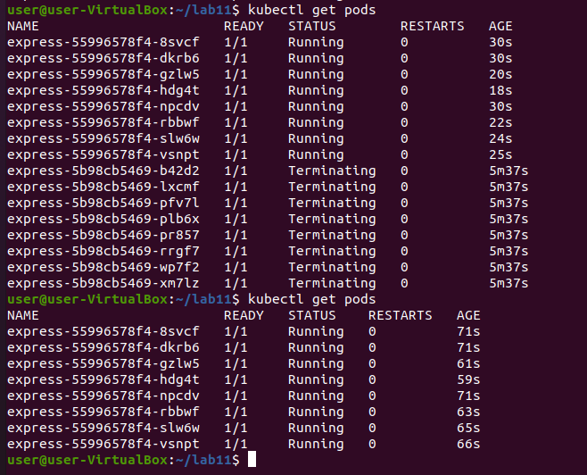

- **Strategie Canary**

Strategia wdrażania canary polega na wdrażaniu nowych wersji aplikacji obok stabilnych wersji.

```
metadata:
  labels:
    app: express
    version: "3.0.0"
```

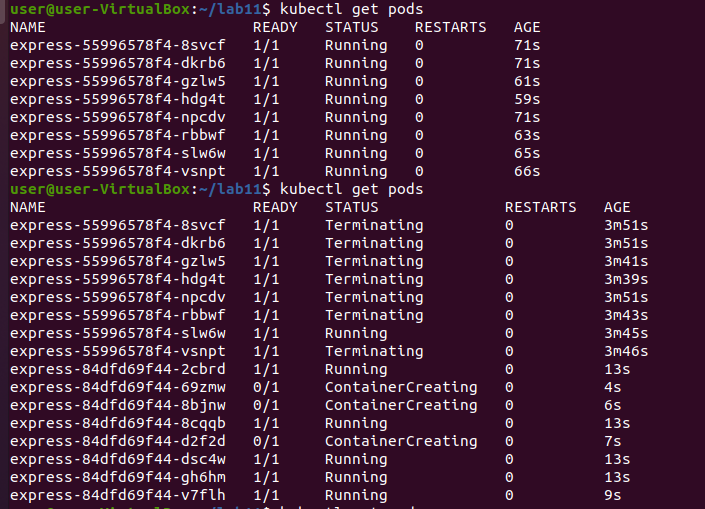