# Sprawozdanie Laboratorium nr 2


## cel ćwieczenia:
* pierwszym krokiem było przygotowania git hooka rozwiązującego najczęstsze problemy z commitami, hooki miały sprawdzać czy tytuł commita zaczyna się od inicjałów i numer indeksu oraz czy w tresci commita.
w ścieżce /.git/hooks należało znaleźć plik commit-msg i w nim umieścić skrypt sprawdzający tytu commita

``` #!/usr/bin/env bash
INPUT_FILE=$1
START_LINE=`head -n1 $INPUT_FILE`
Wanted="^(GU400305)"
Wanted2=".*(Lab)[0-9][0-9]*."
if ! [[ "$START_LINE" =~ $Wanted ]]; then
  echo "Incorrect title please change the  title "
  exit 1
fi


for IFS= read -r line
do
        if [[ $line =~ $Wanted2 ]]; then
                exit 0
        fi
done < <(sed 1d $INPUT_FILE)

echo "Incorrect title please change the title"
exit 1
```
* test popwyższego zadania:
zle dane
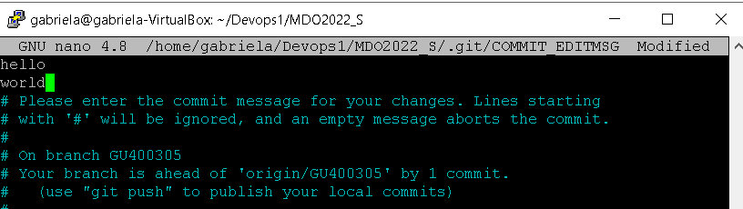
dobre dane
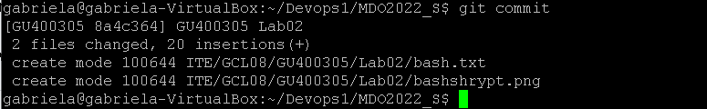
* skrypt w bashu do sprawdzenia tytułu:

* kolejnym krokiem było przygotowanie środowiska Dockerowego, oraz zapewnienie dostępu do wirtaulnej maszyny przez zdalny terminal, wykorzystałam przy tym klucz SSH
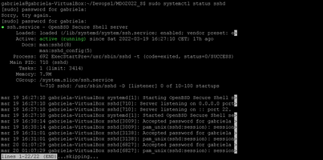
laczenie odbywalo sie poprzez putty i win scp
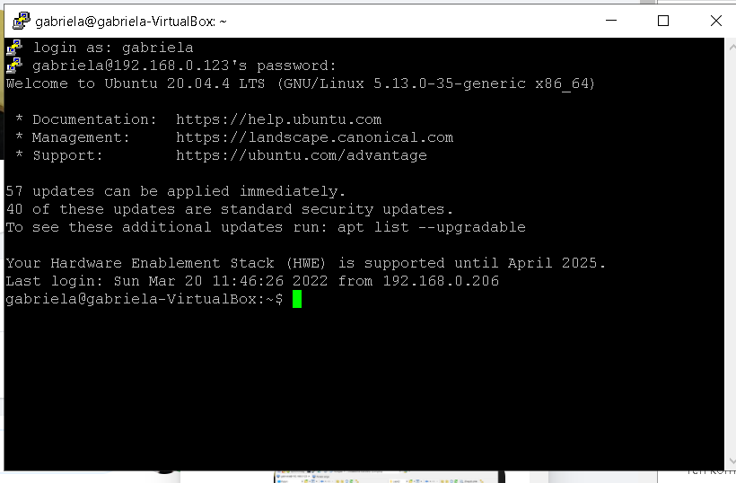
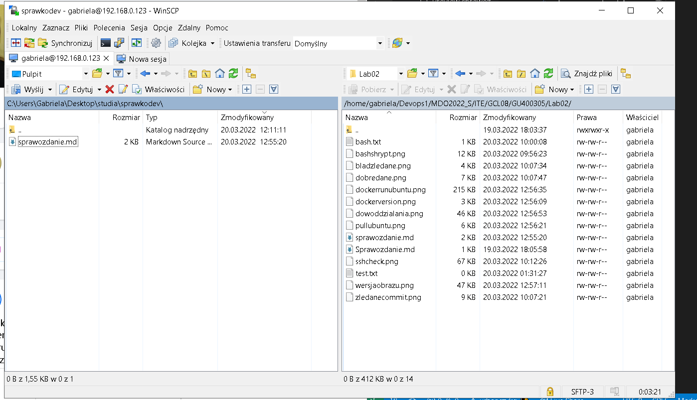

* Natępnie zainstalowałam dockera. wersja dockera:
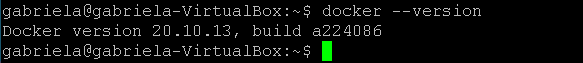

* Kolejno sprawdzanie działania środowiska 
* wykazanie że środowisko dockerowe jest uruchomione i działa, z definicji
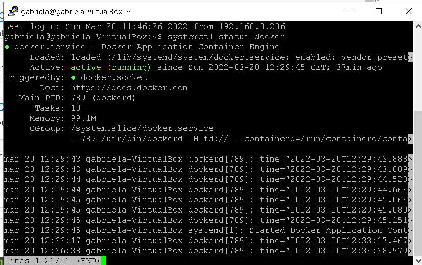
    
* spullowania obrazu Ubuntu sudo docker
 pull ubuntu
 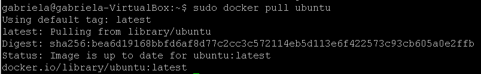
* Uruchomienie poprzez docker run
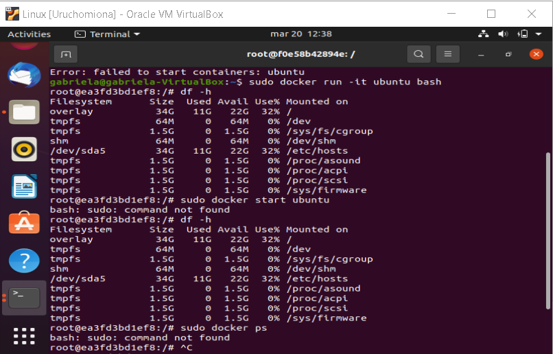


* sprawdzenie czy obraz jest uruchomony poprzez sudo docker ps
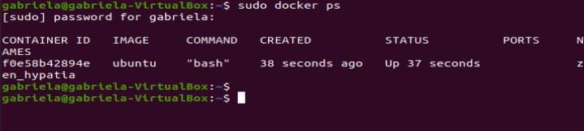
* wyświeltenie numeru wersji obrazu
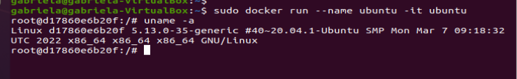
* ostatnim krokiem było założenie konta na Docker Hub
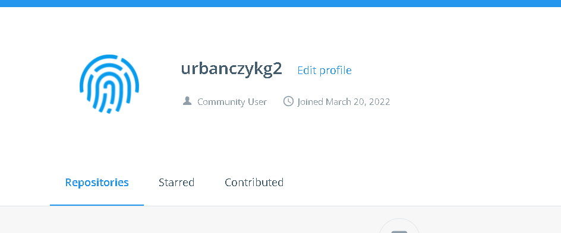
## wnioski

* do połączenia po ssh z komputerem używałam putty a do przesyłania danych z windowsa na linuxa WINSCP
* niestety niektóre screeny są z połączenia przez putty a reszta z linuxa ponieważ w pewnym momencie cały linux mi się zepsuł, ale zdołałam go naprawić i wszystko działa
