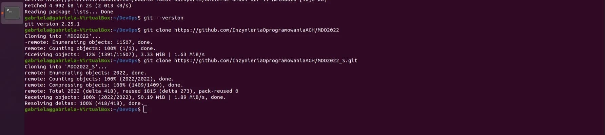
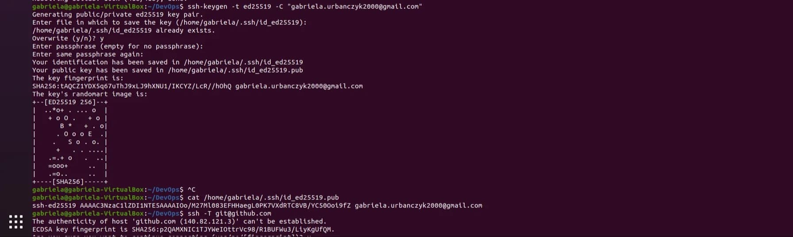
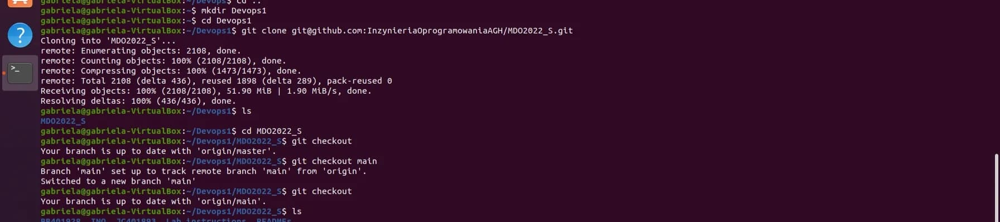
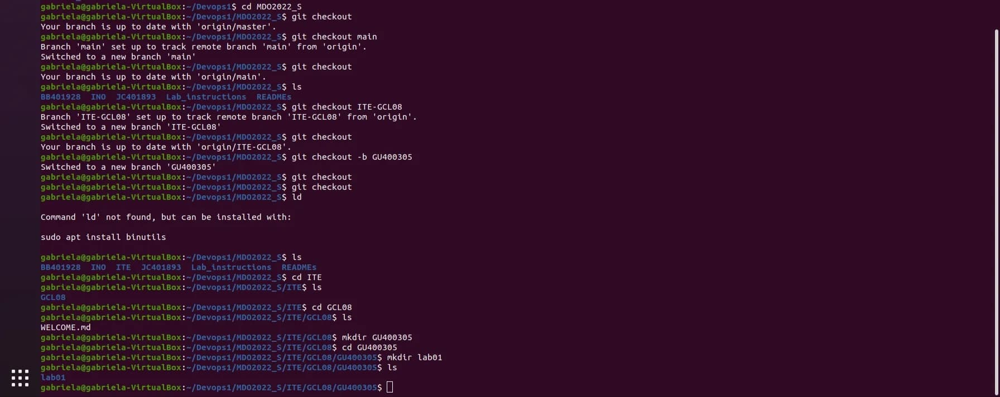

# Sprawozdanie Lab01 Gabriela Urbanczyk

## Cel cwiczenia
celem cwiczenia byla konfiguracja srodowiska poptrzebnego doo wykonywania dalszych laboratoriow. 

## Przebieg cwiczenia
1. pierwszym krokiem bylo zainstalowanie gita.
2. nastepnie sklonowanie repopzytorium za pomoca metody HTTPS

3. utworzenie dwoch kluczow ssh
4. skonfiigurowanie wyzej wymienionych kluczy jako metode dostepu do githuba.

5. sklonowanie repopzytorium za pomoca kluczy ssh

6. przelaczenie sie na galaz main oraz do katalogu grupy i utworzenie swojego wlasnego branccha.
7. w katalogu grupy utworzenie swojego wlasnego katalogu a w nim katalogu o nazwie lab01 

8. dodanie do katalogu  lab01 nowego pliku ze sprawozdaniem, wyslanie zmian do zdalnego repozytorium

## Wnioski
1. w zadaniu uzylismy podstawowych  komend gita takich jak:
    * git --version - sprawdzenie wersji gita zainstalowanej na komputerze
    * git clone - klonowanie repozytorium do repozytoium lokalnego
    * git branch nazwa_brancha - sprawdzene na jakim branchu sie znajdujemy
    * git checkout - zmiana brancha (gdy dodam flage -b wtedy stworzy nam sie nowy branch i automatycznie sie na niego przeniesiemyy)
    * git add nazwa_pliku- dodawanie zmian, plikow do repozytorium, zamiast nazwy mozemy dac kropke wtedy dodadza sie wszystkie zmiany jakie stworzylismy 
    * git commit -m komenatrz - zrobienie commita, -m daje nam mozliwosc na dodanie komentarza do zalaczonych zmian
    * git push --set-upstream origin nazwa_brancha wyslanie zmian do zdalneego repoozytorium.
2. klucze shh sluza do autoryzacji do serwera, klucz publiczny nalzey umiescic na serwerze a klucz prywatnny na komputerze z ktorego sie laczyny