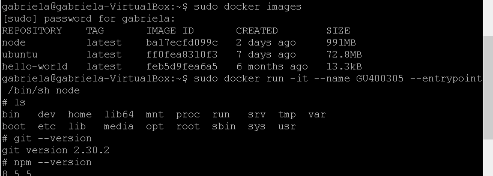
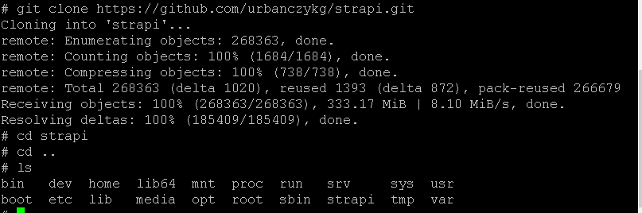
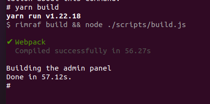
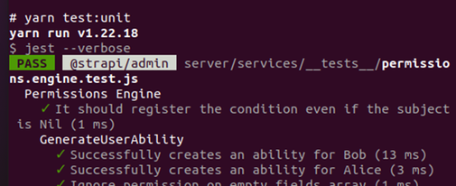
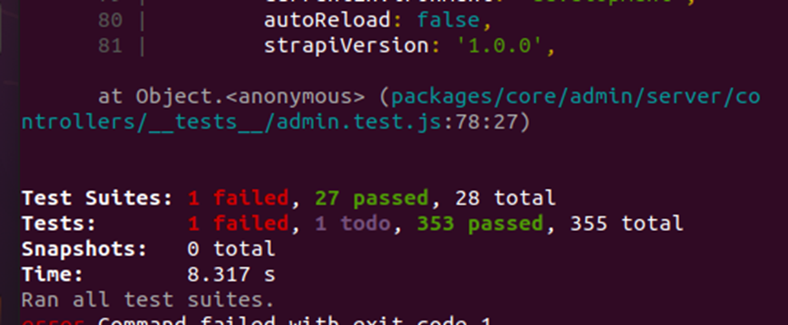

# sprawozdanie nr 3

## przebieg ćwiczenia:
* pierwszym krokiem było znalezienie odpowiedniego repozytorium z otwartą licencją posiadający test.
* uruchomienie kontenera sprawdzenie czy mam wszystkie potrzebne narzędzia i sklonowanie repozytorium

 

* zbudowanie projektu 
 
* uruchomienie testów
 
 
 * kolejnym krokiem było napisanie dwóch dockerfile i nie wiem czemu ale przestała mi działać wirtualna maszyna i zdążyłam od tamtego czwartu przeinstalować 5 razy linuxa i za każdym razem zacina mi się przy używaniu Dockera i muszę resetować wirtualkę przy czym nie chce się ona uruchomić przez pół godziny kolejne i trzeba ją restartować dopóki się nie włączy. i znowu puszczać i znowu się zacina, więc chyba jestem zmuszona zrobić formata całego systemu.  zacina się w takim momencie puszczania Dockerfile

* uruchamianie Dockerfile odbywa się poprzez komendę:
sudo docker  build . -f <nazwaDockerfile> -t nazwa kontenera
* gdy się tak zacinało mi w kółko zauważyłam że stworzyło mi się bardzo wiele obrazów o nazwie none więc ogólnie to się wykonywało tylko linux albo wirtaulna maszyna nie chciała współpracować.
* postaram się to naprawić jak najszybciej i dosłać w pełni zrobione ćwiczenie, lecz na formata komputera potrzebuję trochę więcej czasu.
