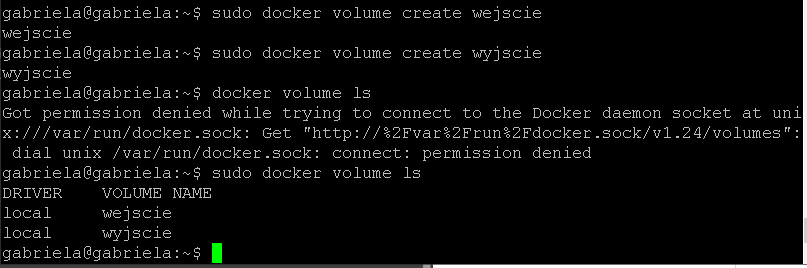
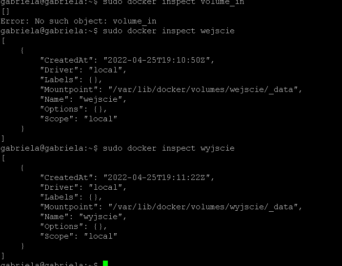
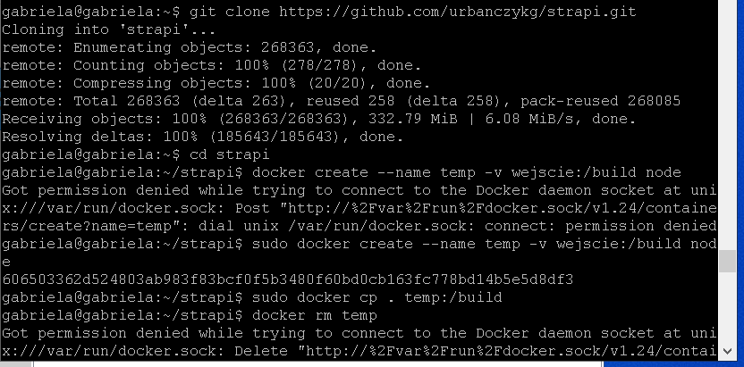
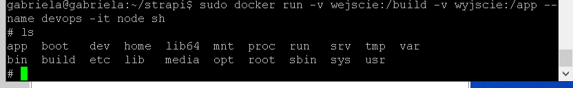
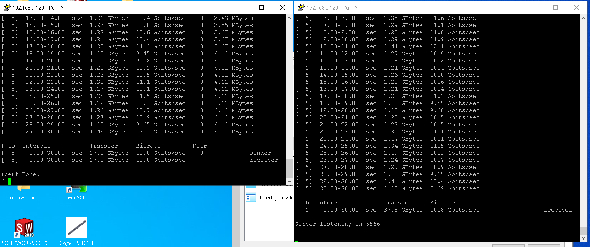
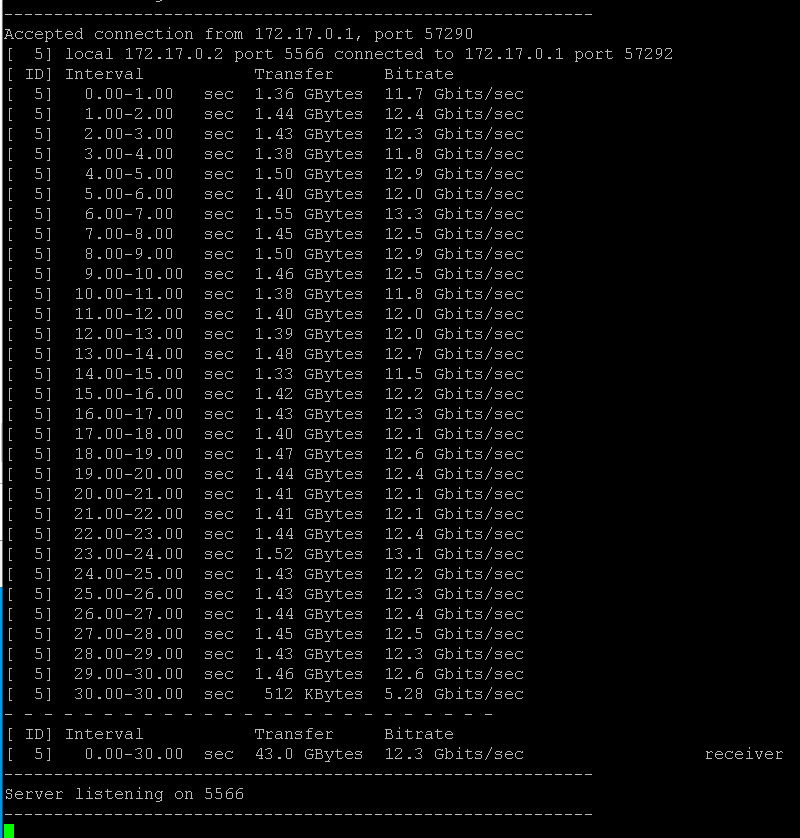
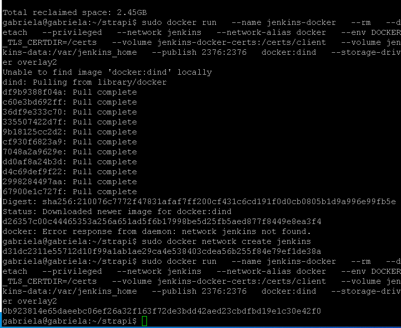
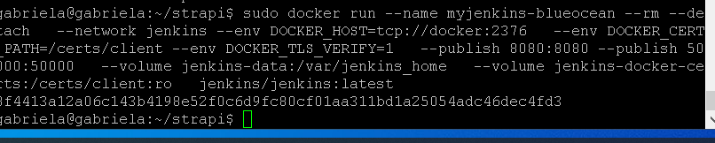

## sprawozdanie Lab 04 Gabriela Urbańczyk

1. pierwszym krokiem było utworzenie dwóch woluminów wejściowego i wyjściowego

2. build w woluminie wejsciowym

3. zapisanie na woluminie wyjsciowym

4. zbadanie ruchu  po połączeniu kontenerów 

5. połączenie spoza kontenera  i ruch 

6. instalacja jenkinsa i zainicjowanie instancji

niestety za sprawą problemów technicznnych napoptkanych ze środowiskiem, o których Pana informowałam, sprawozdanie jest dość mocno spóźnione. Na szczescie udało się popkonać trudności ze środowiskiem i mogę w końcu nadrabiać zaległości. 