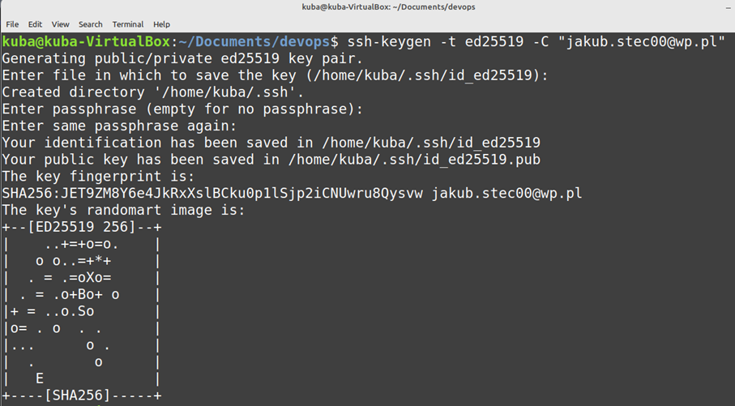
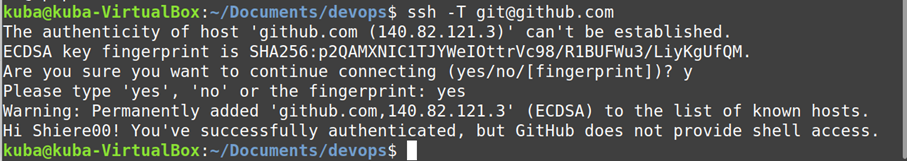
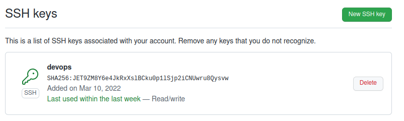
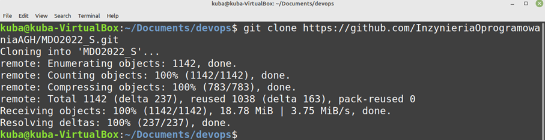
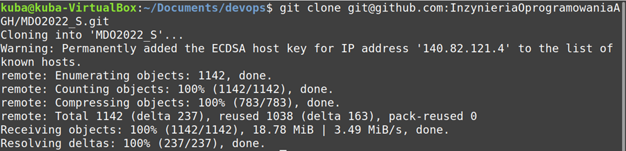
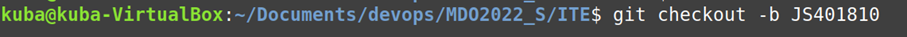
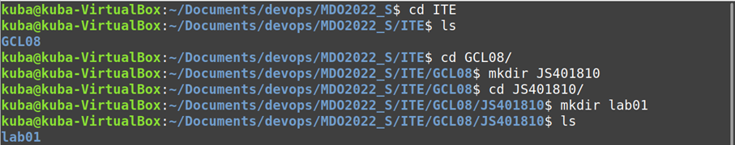

# Metodyki devops - sprawozdanie z laboratorium nr 1
Wprowadzenie do gita, gałęzie, ssh.

Wykonanie laboratoirum:
* instalacja klienta git (sudo apt install git)

* instalacja obsługi kluczy SSH (ssh-keygen -t ed25519 -C "email@email.com")

* sklonowanie repo za pomocą HTTPS (git clone https://github.com/InzynieriaOprogramowaniaAGH/MDO2022_S)

* utworzenie kluczy SSH, podpięcie je do gita i sklonowanie repo z ich wykorzystaniem

* przełączenie się na gałąź main, a potem na gałąź swojej grupy (git checkout nazwa_galezi)

* utworzenie gałęzi ze swoich inicjałów i nr indeksu (git checkout -b nazwa_galezi)

* po przejściu na swojego brancha utworzenie we właściwym katalogu nowych katalogów o swoich inicjałach oraz indeksie, oraz katalog Lab01, w którym zostanie umieszczone sprawozdanie i zrzuty ekranu. (mkrid nazwa_katalogu)

* nastepnym krokiem jest dodanie pliku ze sprawozdaniem oraz wysłanie zmian do zdalnego źródła

* później spróbowałem wciągnąć swoją gałaź do gałęzi grupowej 

* sprawozdanie zaktualizowałem orwaz wraz z zrzutami ekranu wysłałem do zdalnego źródła

* na zakończenie wystawiłem Pull Request do gałęzi grupowej

PODSUMOWANIE

