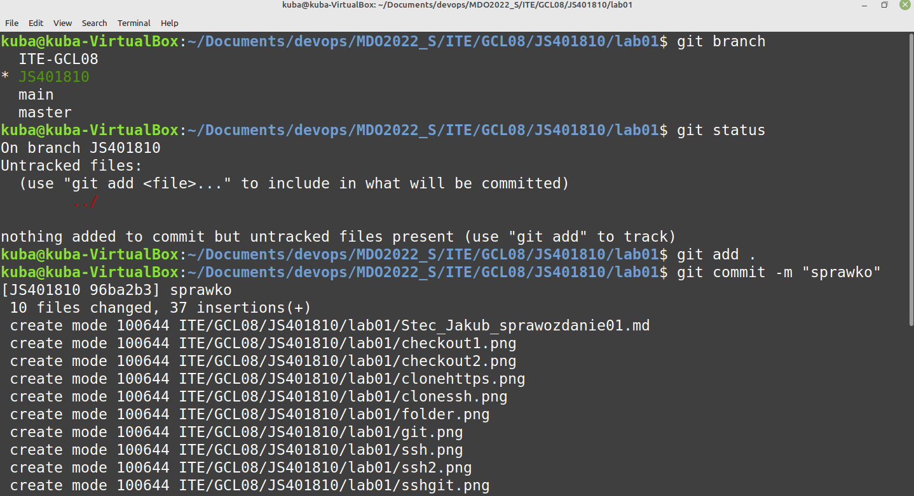
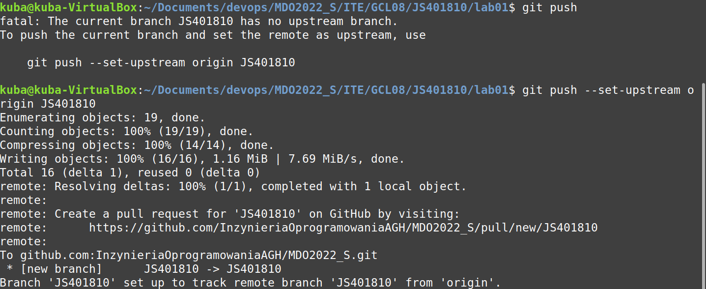

# Metodyki devops - sprawozdanie z laboratorium nr 1
#               Wprowadzenie do gita, gałęzie, ssh.

Wykonanie laboratoirum:

1. instalacja klienta git (sudo apt install git)

2. instalacja obsługi kluczy SSH (ssh-keygen -t ed25519 -C "email@email.com")

3. sklonowanie repo za pomocą HTTPS (git clone https://github.com/InzynieriaOprogramowaniaAGH/MDO2022_S)

4. utworzenie kluczy SSH, podpięcie je do gita i sklonowanie repo z ich wykorzystaniem

5. przełączenie się na gałąź main, a potem na gałąź swojej grupy (git checkout nazwa_galezi)

6. utworzenie gałęzi ze swoich inicjałów i nr indeksu (git checkout -b nazwa_galezi)

* po przejściu na swojego brancha utworzenie we właściwym katalogu nowych katalogów o swoich inicjałach oraz indeksie, oraz katalog Lab01, w którym zostanie umieszczone sprawozdanie i zrzuty ekranu. (mkrid nazwa_katalogu)

7. nastepnym krokiem jest dodanie pliku ze sprawozdaniem oraz wysłanie zmian do zdalnego źródła

8. sprawozdanie zaktualizowałem oraz wraz z zrzutami ekranu wysłałem do zdalnego źródła

9. na zakończenie wystawiłem Pull Request do gałęzi grupowej

# PODSUMOWANIE
* git clone - 				                          Sklonowanie repozytorium - pobranie do repozytorium lokalnego
* git branch nazwa - 				                    Wyświetlenie nazwy gałęzi na której sie znajdujemy
* git checkout nazwa - 				                  Przełączenie na podanego brancha
* git add plik - 					                      Dodanie pliku do repozytorium	
* git commit -m komentarz - 				            Wykonanie commita do remota. Odnośnik -m umożliwia dodanie komentarza	
* git push --set-upstream origin JS401810 - 		Wysłanie zmian na remota. Stworzona zostanie nowa gałąź.

