# Metodyki devops - git hooks, ssh, docker

## Wykonanie laboratorium:


**1. Przygotuj git hook, który rozwiąże najczęstsze problemy z commitami**   
   * **hook sprawdzający, czy tytuł commita nazywa się <inicjały><numer indeksu>**
   * **hook sprawdzający, czy w treści commita pada numer labu, właściwy dla zadania**

      Należy przejrzeć ukryte katalogi za pomocą ls -al, przejść do ścieżki ``` \.git\hooks\ ``` i zmodyfikować te, które są używane w naszym zadaniu. Dodatkowo nadaje konieczne uprawnienia.

      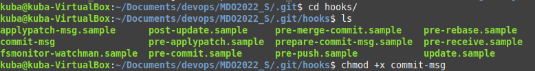

    Tworzę skrypt w pythonie, którego zadaniem jest sprawdzanie tytułu commita. Wykorzystałem do tego hook commit-msg. Jest on wykonywany w trakcie tworzenia wiadomości commita. Sprawdzany jest przesyłany tytuł commita. Dodatkowo również wprowadzona została funkcjonalność, która sprawdza czy w treści commita pada numer labu, dla danego zadania.

    **TESTOWANIE**
        
       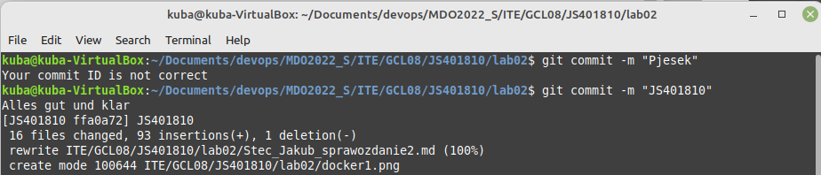  

      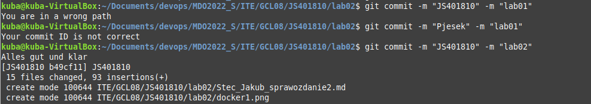

**2. Umieszczam hook w postaci inline, aby dało się go przejrzeć**
    ```#!/usr/bin/python3 
import sys 

msg=sys.argv[1] 
fileName=open(msg,'r') 
message=fileName.read() 

msg1=message.split('\n')[0] 
msg2=message.split('\n')[2] 

if msg1 != "JS401810": 
    print("Your commit ID is not correct") 
    exit(1) 
if not (msg2.find("02") != -1): 
     print("You are in a wrong path") 
     exit(1) 
else: print("Alles gut und klar") 
exit(0)```
    
  

**3. Rozpocznij przygotowanie środowiska Dockerowego**
    * **Zapewnienie dostępu do wirtualnej maszyny przez zdalny terminal, wykorzystując SSH**
     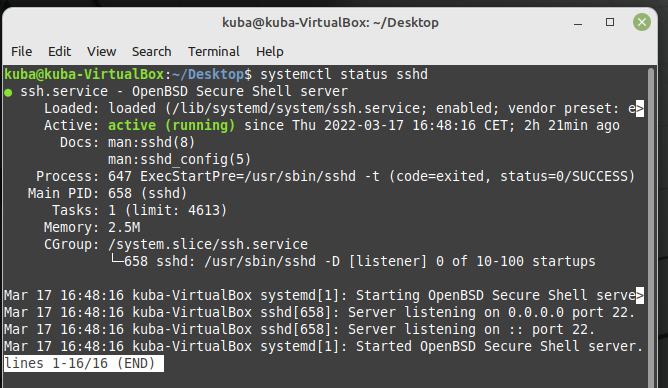

    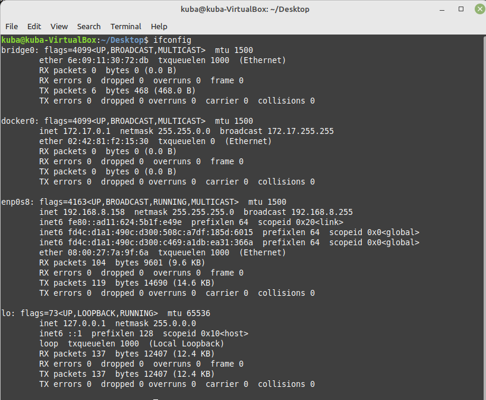

    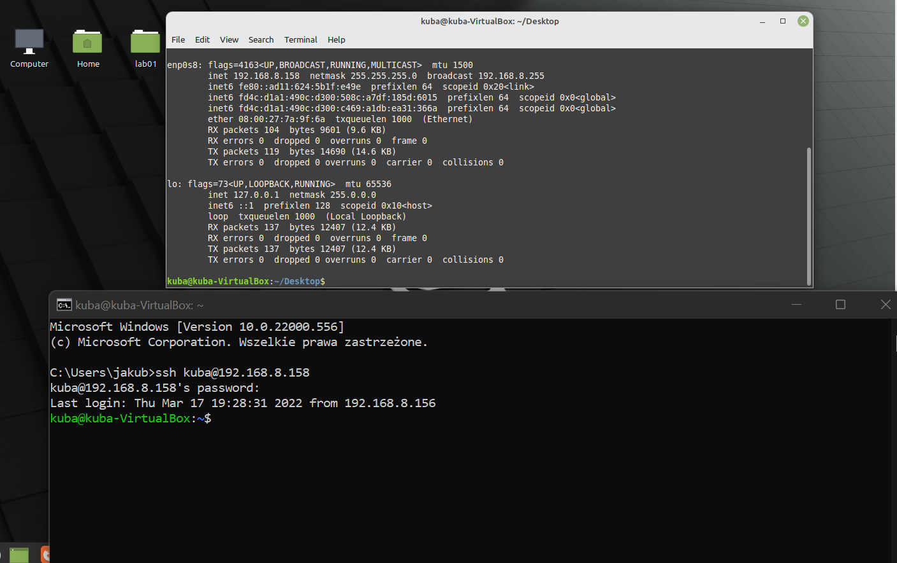

    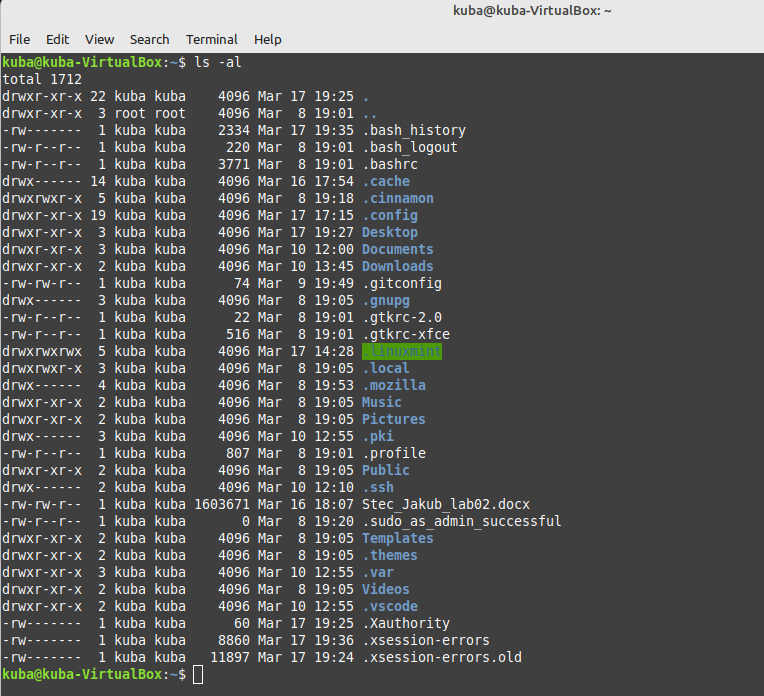

    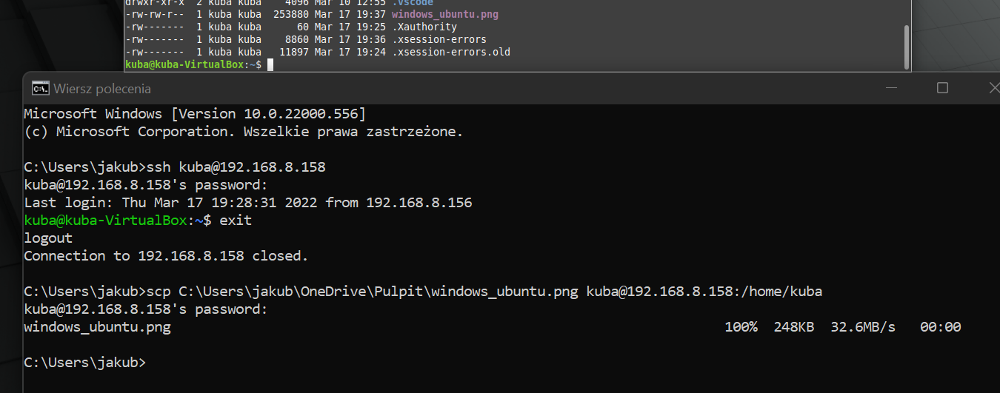

        
   * **środowisko dockerowe miałem zainstalowane już przed laboratorium**
    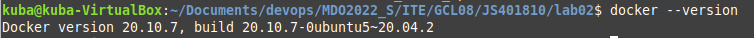
    

**4. Działanie środowiska**

   * **wykaż, że środowisko dockerowe jest uruchomione i działa (z definicji - systemctl status docker):**

       
  
      * **wykaż działanie z sposób praktyczny (z własności):**
      * **pobierz obraz dystrybucji linuksowej i uruchom go**
      * **wyświetl jego numer wersji**

        Najpierw spullowałem obraz Ubuntu:
       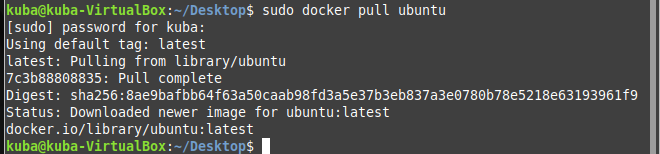

        Po pobraniu obrazu wykazuje jego działanie i uruchamiam poprzez ```docker run```.
       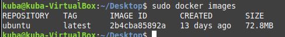
       

        Na koniec wyświetlam numer wersji orbazu.
       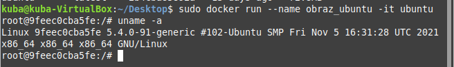       

**5. Załóż konto na Docker Hub**

Zakładam konto z podstawowym personalnym planem.

  

  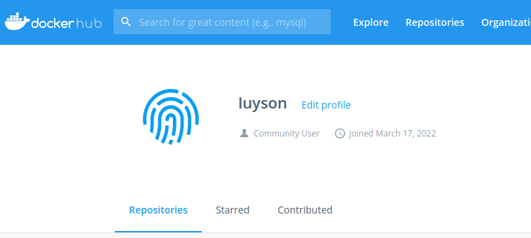

