# Metodyki devops - Docker files, kontener jako definicja etapu

## Wykonanie laboratorium:


**1.Repozytorium oprogramowania:**
https://github.com/cytoscape/cytoscape.js?files=1

   * **- zawierające otwartą licencję**
   * **- umieszczone wraz z narzędziami środowiskowymi (w tym przypadku jest to npm)**
   * **- zawierające testy (npm test)**

* **Pobieranie obrazu node**
       
   

* **Uruchomienie kontenera z node i podłączenie TTY**

  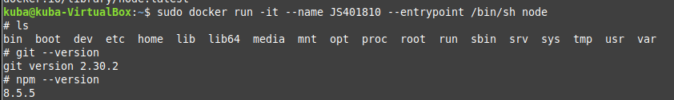 

* **Sklonowanie repozytorium i sprawdzenie konfiguracji środowiska**

  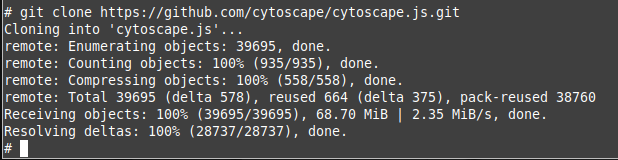 

* **Instalacja dependencji**

  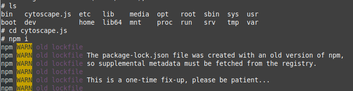 

  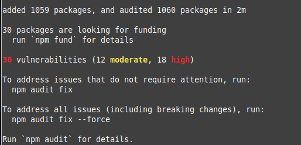

* **Uruchomienie testów**

  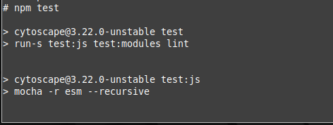

  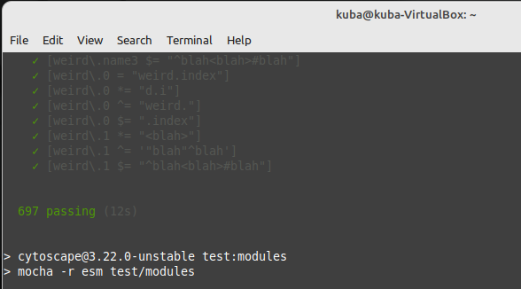 

  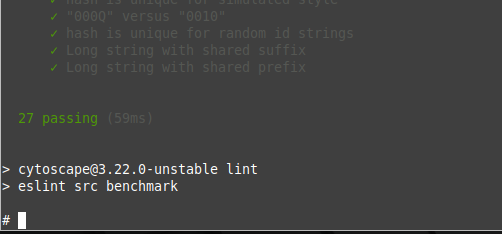 

**2. Stwórzenie dwóch plików Dockerfile do automatyzuji kroków powyżej**
  
* **Kontener do przeprowadzania wszystkich kroków aż do builda**

```
FROM node:latest

#clone repo and build
RUN apt update
RUN git clone https://github.com/cytoscape/cytoscape.js.git
RUN cd cytoscape.js && npm i
```

  

  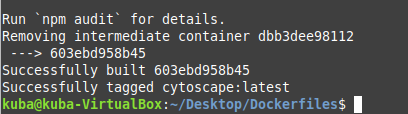 

  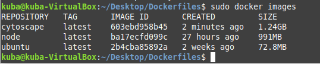 
  
* **Kontener bazujący na pierwszym i przeprowadzający testy**

```
#previous image name
FROM cytoscape:latest

RUN cd cytoscape.js && npm test
```

 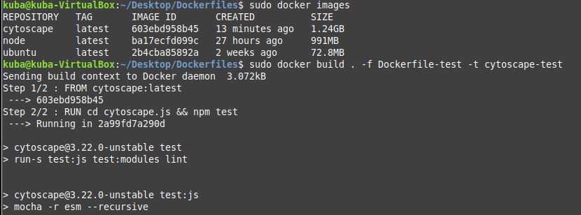

 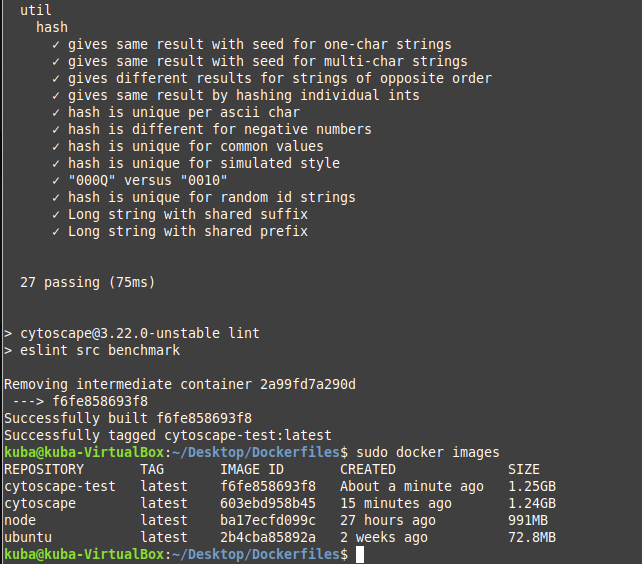

W obu przypadkach obrazy zbudowały się poprawnie, co pokazują powyższe zrzuty ekranu.

* **Wykazanie poprawności działania kontenera**
Utworzyłem kontener na podstawie wcześniej stworzonych obrazów, wszystko działa poprawnie.

 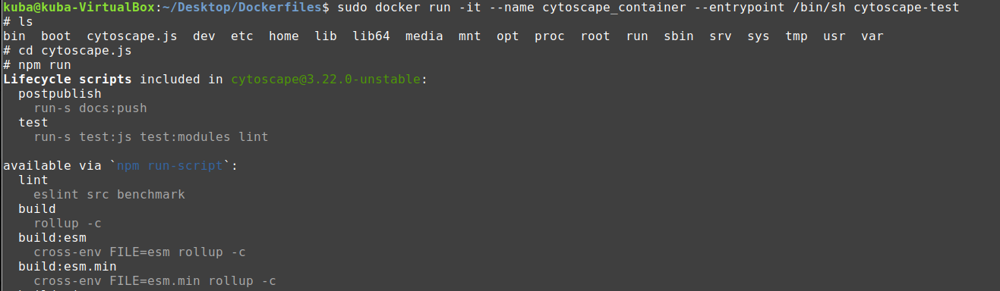

 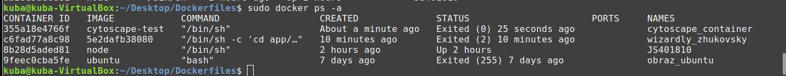

 * Kontener w dużym skrócie jest to samodzielny(odizolowany) byt umieszczony na małym fragmencie naszego dysku twardego. Na tym fragmencie dysku znajdują się pliki wymagane do prawidłowego uruchomienia i działania aplikacji / programu / procesu.

 * Obraz stanowi podstawę do stworzenia kontenera. Podczas tworzenia kontenera pliki z obrazu kopiowane są na fragment dysku twardego przeznaczonego tylko dla tego kontenera. Przy uruchamianiu wykonywana jest domyślna komenda startowa zdefiniowana w obrazie. 

* **Co pracuje w takim kontenerze?**
- W kontenerze pracuje obraz, który jest odizolowany od macierzystego systemu.

