# Metodyki devops - Dodatkowa terminologia w konteneryzacji, instancja Jenkins

## Wykonanie laboratorium:

**Część 1: Zachowywanie stanu:**
   * **Przygotowanie dwóch woluminów Jednego wejściowego i wyjściowego.**
   * wolumin tworzę za pomocą komendy "docker volume create <nazwa>"

  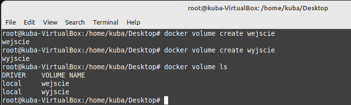

* **Uruchomienie i podłączenie do kontenera**
  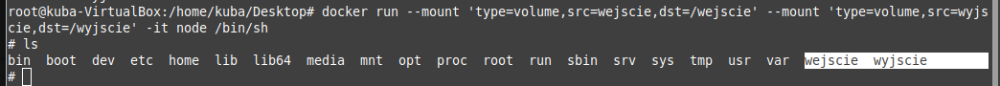

* **Po uruchomieniu kontenera instalacja**

  * Zanim sklonuje repo sprawdzam za pomocą "docker volume inspect <nazwa>" szczegóły danego wolumina, aby następnie w przejsć do poprawnego katalogu, gdzie znajduje się wolumin i sklonować repozytorium.

  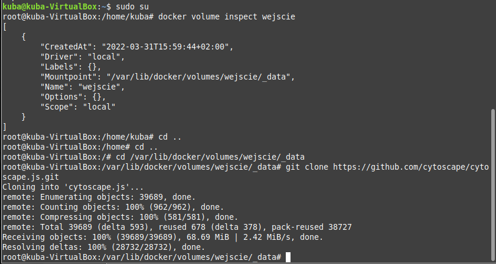

  * Jak widać poniżej repozytorium znajduje się na woluminie wejściowym.

  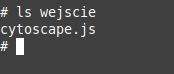

  * Następnie przeprowadziłem build za pomocą "npm i" w kontenerze (na woluminie wejściowym).

  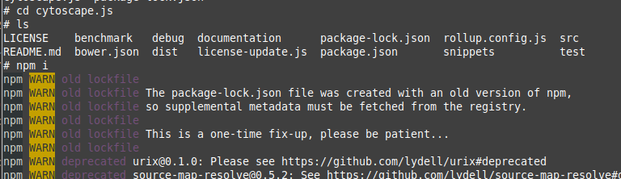 
  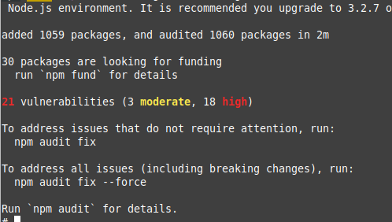

  * Po zbuildowaniu zapisałem powstałe pliki na woluminie wyjściowym. (wykorzystując polecenie "cp -r <ścieżka1> <ścieżka2>", lecz niestety nie złapałem tego na screenie)

  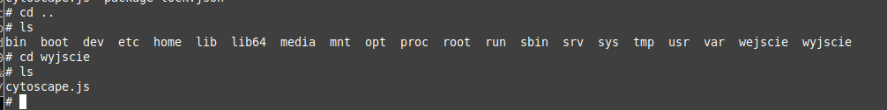

**Część 2: Eksponowanie portu**
  
* **Przed przystąpieniem do realizacji tej części laboratorium należy pamiętać, że operujemy na adresach ip kontenerów oraz hostóœ. Aby być w stanie wyciągnąć takowe adresy musimy każdorazowo zainstalować pamiętać o zupdateowaniu (polecenie "apt update"), instalacji w kontenerze pakietu net-tools (apt install net-tools) oraz instalacji i uruchomienia iperf3 <apt install iperf3>**

* 1. Połączenie kontener-kontener i zbadanie ruchu. W nowym kontenerze także należało doinstalować iperf i uruchomić nasłuchiwanie za pomocą komendy "iperf3 -c <adres_ip> -t <czas_nasłuchiwania>", opcjonalnie można także dodać flagę -p, aby wskazać konkretny port.

  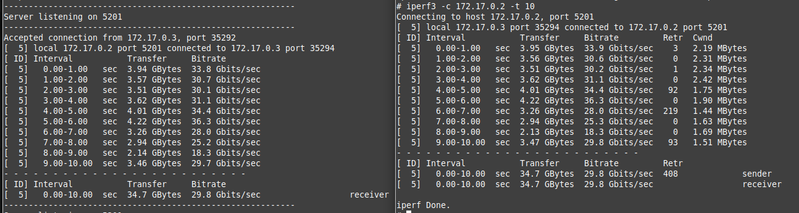

* 2. Połączenie host-kontener i zbadanie ruchu. Tym razem należało doinstalować iperf3 na hoście oraz za pomocą ipconfig sprawdzić ip.

  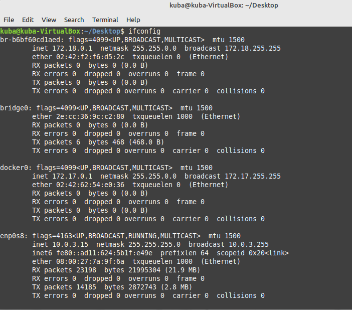

  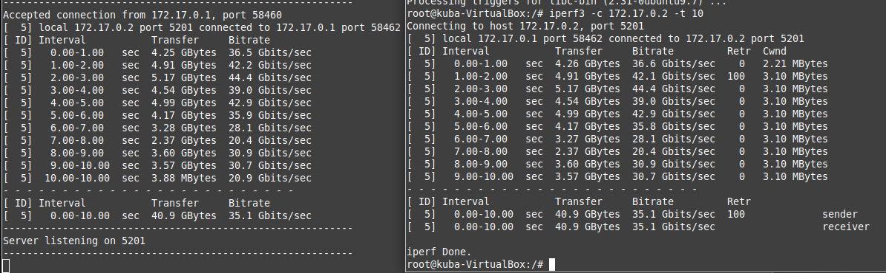

* 3. Połączenie spoza hosta i zbadanie ruchu
    - aby przystąpić do wykonania tej części należało zainstalować na windows serwer iperf3 i dodać do ścieżki.
    - jak widać przy próbie połączeenia pojawia się problem: chodzi o błąd połączenia, ktory jest spowodowany tym, że kontener nie publikuje    odpowiedniego portu do nasłuchiwania przez hosta.

  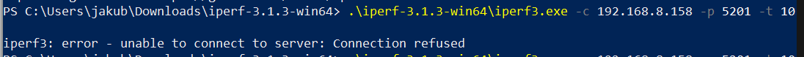

    - aby uporać sie z tym problemem należy uruchomić kontener dodając flagę <--publish nr_portu:nr_portu> 

  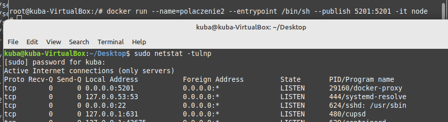
    
    - wykonująć powyższe kroki można rozpocząć nasłuchiwanie i obserwację ruchu między maszyną spoza hosta i kontenerem.

  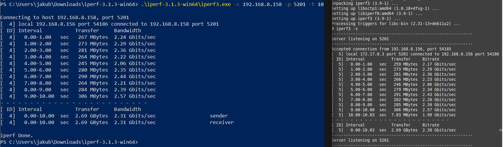
  
  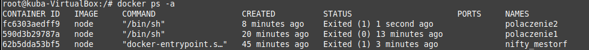

* 4. Porównanie szybkość wykonanych połączeń:
    - w przypadku połączenia kontener-kontener szybkość ta wynosi około ~ 30 Gbit/sec
    - w przypadku połączenia host-kontener szybkość ta wynosi około ~ 35 Gbit/sec
    - w przypadku połączenia spoza hosta szybkość ta wynosi około ~ 2.25 Gbit/sec

 * **Na podstawie powyższych wartości szybkość widać, że najszybsze połączenie jest w relacji host-kontener. Wynika to z faktu ich bezpośredniego połączenia. Równie wysoką wartość szybkość osiąga także połączenie kontener-kontener, jest ona jednak o ok 5 Gbit/sec niższa. Najwolniej przebiega komunikacja spoza hosta. Tak niska szybkość jest wynikiem skomplikowanej trasy, którą musi przejść pakiet od momentu wysłania do odebrania.**

**Część 3: Instalacja Jenkins'a**
* 1. Na początek tworzę sieć mostkowaną w dockerze oraz dwa woluminy. Następnie tworzę także kontener, w którym tworzę obraz docker:dind.

  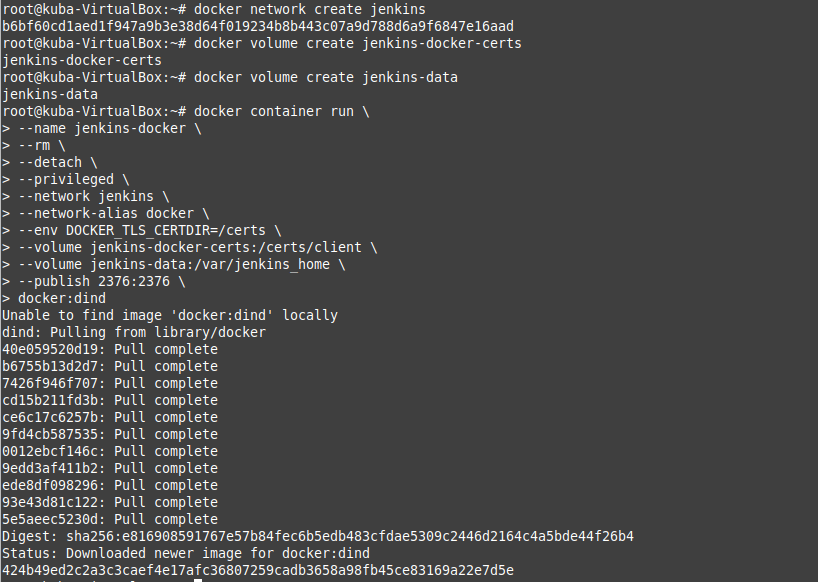

* 2. Podobnie postępuje z obrazem blueocean.

  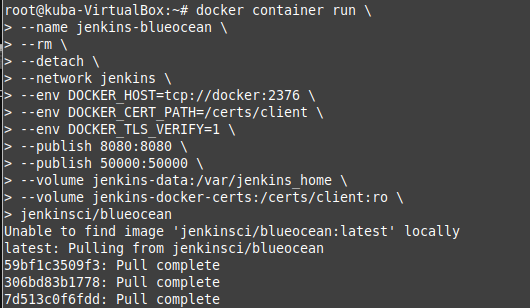
  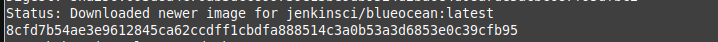

    - powstałe kontenery

  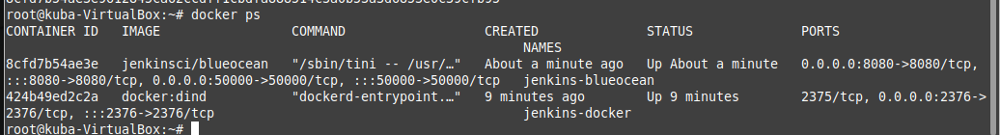

* 3. Na podstawie kontenera należy sprawdzić w logach hasło, które umożliwi odblokowanie Jenkinsa "sudo docker logs <id_kontenera>"

  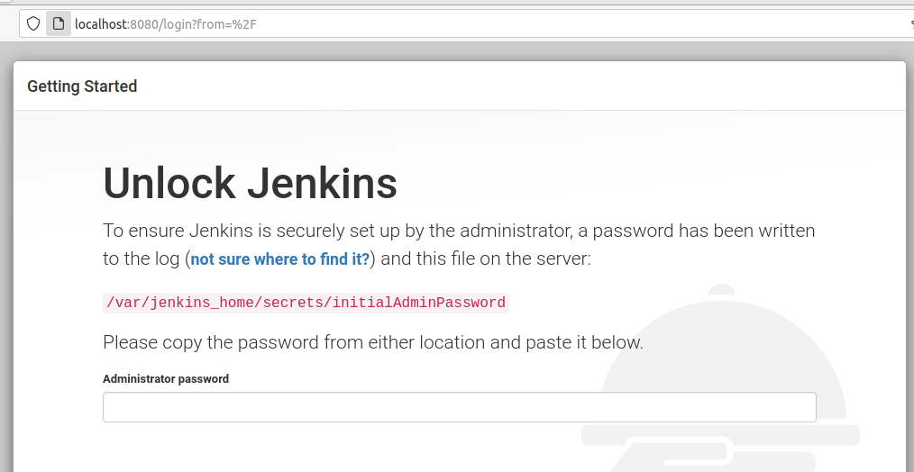

* 4. Następnie instalacja, założenie konta i zalogowanie się.

  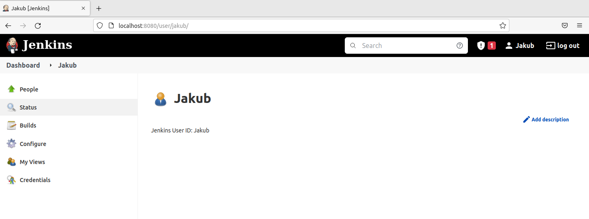

