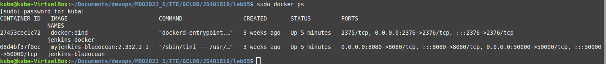
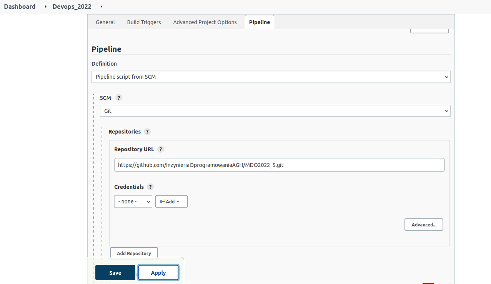
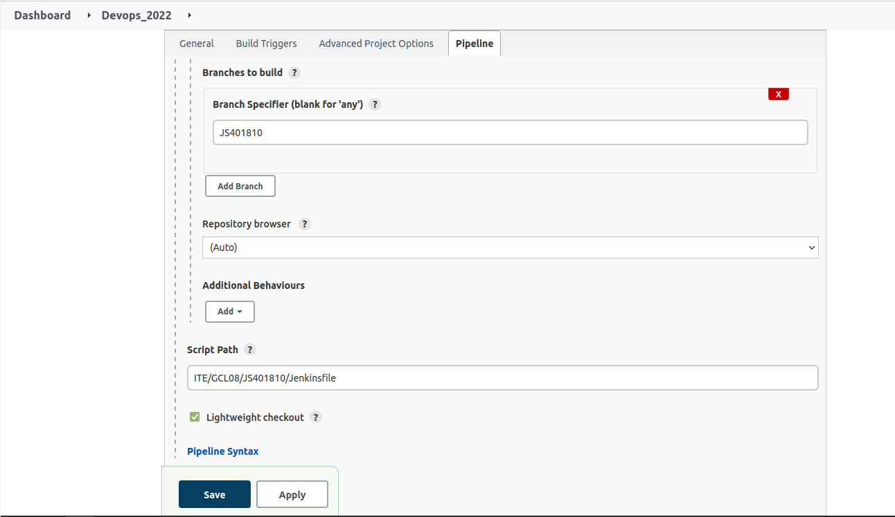
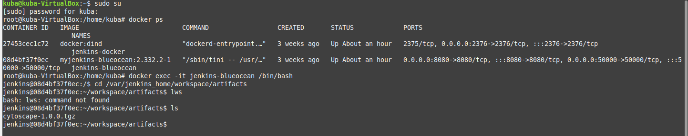
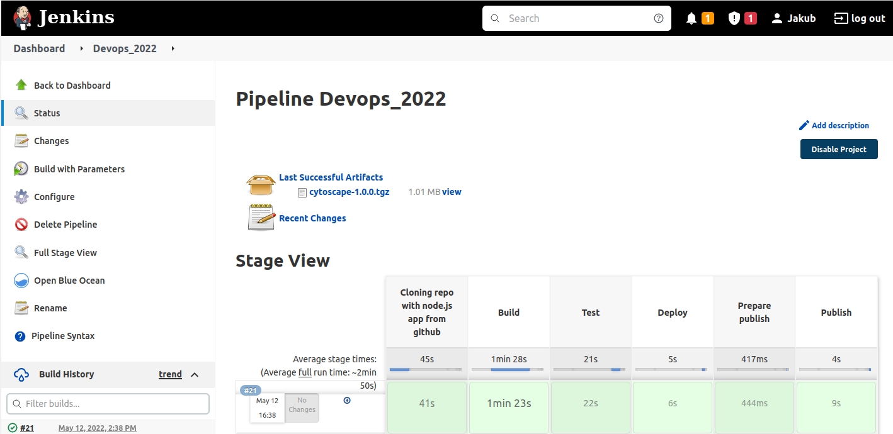
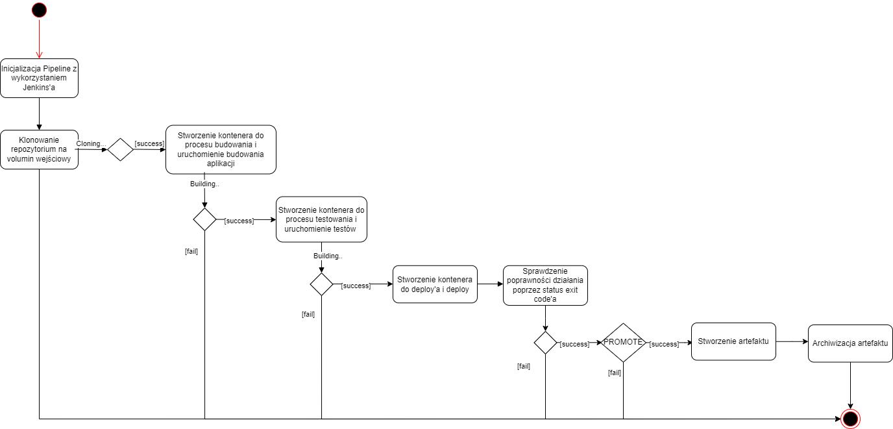
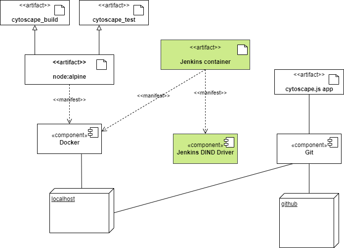

# Metodyki devops - projekt "Przygotowujemy pipeline!"

## Cel projektu:
Głównym założeniem projektu było wykonanie "tego co wcześniej, ale przez Jenkinsa". Tego co wcześniej to znaczy uporządkowanie procesów "Build" oraz "Test" wykorzystująć utworzne wcześniej Dockerfile. Dodatkowo należało wykonać "Deploy" oraz "Publish" aplikacji, wykorzystywanej podczas poprzednich laboratoriów.

Repozytorium programu: https://github.com/cytoscape/cytoscape.js/

**Cytoscape.js** to stworzona w node.js biblioteka teorii grafów (sieci) do wizualizacji i różnych analiz.

**Użyte technologie:** git, npm, Docker oraz Jenkins.

**Przygotowanie środowiska kontenerowego Jenkins with Docker:**
W trakcie poprzednich laboratorium należało przygotować kontenery Jenkins oraz DIND, bez których funkcjonowanie Pipelina nie jest możliwe. 

Działające kontenery:


Oprócz kontenerów do wykonania kroków build oraz test należy wykorzystać utworzone wcześniej pliki ```Dockerfile```, które muszą się znajdować w repozytorium przedmiotowym pod ścieżką i na własnej gałęzi.

**Dockerfile-build**
```
FROM node:alpine

WORKDIR app
WORKDIR app_build
#clone repo and build
RUN apk update && apk add git && apk add bash
```

**Dockerfile-test**
```
FROM node:alpine

WORKDIR app_test

RUN apk update && apk add bash
```


**Część 1: Konfiguracja Jenkinsa do budowy Pipeline**

Do utworzenia nowego projektu należy wybrać ```New Item``` a następnie z listy wybrać  ```Pipeline``` i nadać mu nazwę. Kolejno przechodzimy do zakładki ```Advanced Project Options```, gdzie wybieramy `Pipeline script from SCM`.

* W `Repository URL` wklejamy link https do repozytorium,
* W `Branch Specifier` wpisujemy nazwę swojego brancha,
* W `Script Path` należy podać ścieżkę bezwzględną do Jenkinsfile.

**Poprawna konfiguracja wygląda następująco:**



**Część 2: Klonowanie repozytorium**

Efektem końcowym tego kroku powinno być sklonowanie repozytorium z naszą aplikacją i umieszczenie go na voluminie wejściowym.

Etap ten rozpoczynam od utworzenia voluminów ```input i output```. Na początek sprawdzam, czy kontener już istnieje, jeśli nie to tworzę go i montuję do niego volumin `input`. Następnie klonuje repozytorium i kopiuje je do foleru `/app` na woluminie. Dzięki tej czynności po usunięciu kontenera, dane pozostają w voluminie. 

**Część 3: Budowanie aplikacji**

W tym etapie efektem końcowym jest umieszczenie zbudowanej aplikacji na voluminie `output`.

Aby poprawnie zbudować obraz z Dockerfile należy na początek przy pomocy polecenia `dir` przemieścić sie do odpiwiedniego katalogu, w którym znajduje się nasz plik. Następnie uruchamiam kontener z zamontowymi voluminami `input i output`, bazując na utworzonym wcześniej za pomocą Dockerfile obrazie. Korzystam tutaj z **node:alpine** ponieważ w przeciwieństwie do zwykłego node jest znacznie lżejszy. Należy jednak pamiętać, że nie ma w sobie chociażby basha, którego należy doinstalować w Dockerfile, aby móc zbudować program. 

Program buduje na voluminie `input` korzystając z narzędzia `npm` i po zbudowaniu, pliki repozytorium kopiowane na volumin `output`. Jeśli build się powiedzie otrzymamy komunikat o sukcesie, jeśli nie to o porażce (`sekcja post`). 

**Część 4: Testowanie aplikacji**

Finalnym efektem jest zakończenie powodzeniem wszystkich testów wbudowanych w repozytorium aplikacji. 

Podobnie jak w etapie build kluczem do sukcesu jest znajdowanie się w odpowiedniej lokalizacji z Dockerfile do testowania. Tak samo tworzę kontener na podstawie wcześnij stworzonego obrazu i montuję do niego volumin `output`. Następnie przy pomocy `npm test` uruchamiam testy. 

Jeśli testy się powiodą, zwracany jest komunikat o sukcesie. 

**Część 5: Deploy**

Celem tego etapu jest sprawdzenie poprawności działania zbudowanego wcześniej kodu przed etapem jego publikacji.

Na początek sprawdzam istnienie kontenera o zadanej nazwie, jeśli nie istnieje to go tworzę i uruchamiam montując volumin `output`. Dodatkowo dodaję flagę `-d`, która sprawia, że kontener działa w trybie odłączonym (chodzi cały czas w tle do momentu jego killa/usunięcia). Następnie poleceniem `npm run <target>` odpalam jeden z targetów aplikacji, wskazany w repozytorium (wybrałem target test). Czekam 30s i sprawdzam poprawność działania poprzez zwrócony przez kontnener status exit code. Jeśli wszystko zakończyło się powodzeniem (exit code jest 0), to kontener zostaje usunięty. 

**Część 6: Prepare publish**

Efektem końowym jest utworzenie katalgu `artifacts` w odpowiedniej ścieżce w kontenerze Jenkinsa. 

Tutaj pojawia się parametr `PROMOTE`, który umożliwia uruchomienie danego etapu, jeśli jego wartość jest `true`. Sprawdzana jest ścieżka i tworzony folder we wskazanej lokalizacji, jeżeli takowy jeszcze nie istnieje.

**Uwagi**: W tym etapie napotkałem na problem dotyczęcy uprawnień. Jenkins nie znajduję się w pliku sudoers, przez co nie posiada uprawnień root'a. Blokuje to wiele czynności, jak chociażby usuwanie folderów za pomocą `rm`, dlatego wykorzystuje polecenie `find` do sprawdzenia.

**Część 7: Publish**

Zadaniem tego etapu, finalnym już, jest wypromowanie pliku do artefaktu i jego publikacja.

Etap ten rozpoczynam od rozwiązania problemu dotyczącego uprawnień. Dokonuje podpięcia nowego agenta z obrazem node:apline, dzięki czemu posiadam uprawnienia root'a i mogę wyczyścić katalog `artifacts`. Wykorzystuję parametry `VERSION` do nazwania wersji oraz `PROMOTE`, aby sprawdzić czy ten etap wykona. Do spakowania mojego programu używam polecenia `npm pack`, co powoduje powstanie paczki z roszerzeniem .tgz. Dodatkowo ustawiam wersję mojej publikacji. Po spakowaniu przenoszę archiwum do przygotowanej wcześniej lokalizacji (katalog artifacts) i archiwizuję artefakt.

**Uwagi:** Z napotkanych przeze mnie problemów warto wspomnieć o zamieszaniu ze ścieżkami przy archiwizacji oraz rozwiązaniu tego problemu przez wykorzystanie polecenia `dir` i przejście do wskazanego folderu. Podsumowując pilnowanie ścieżek i lokalizacji folderów to klucz do sukcesu :). 

**Utworzony artefakt**



**Clean-up**
Po zakończeniu pracy i archiwizacji artefaktu sprzątam mój obszar roboczy wykorzystując `cleanWs()`.

# Etapy działania Pipeline'a



# Logi w pliku .txt
<a href="./Pipeline_logs.txt">Logi działania Pipeline'a</a>


# Diagram aktywności


# Diagram wdrożenia

