# Metodyki devops - Przygotowanie wdrożeń nienadzorowanych dla platform z pełnym OS.

## Wykonanie laboratorium:

# **Część 1: Przygotowanie systemu pod uruchomienie**
Należało dokonać instalacji systemu Fedora na VM. Przydzieliłem jej 2GB RAM i 10GB miejsca na dysku. Dokonałem wyboru języka instalacji, skonfigurowałem sieć oraz konto roota oraz wybrałem  w sekcji software selection wybrano "minimal install".

Wykonane czynności przedstawiają poniższe screeny:
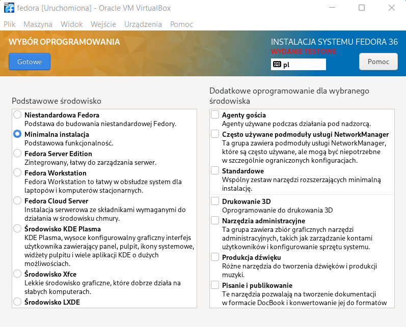
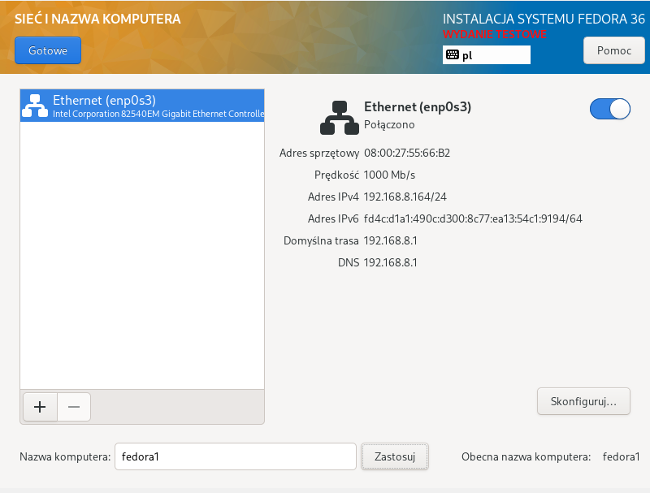
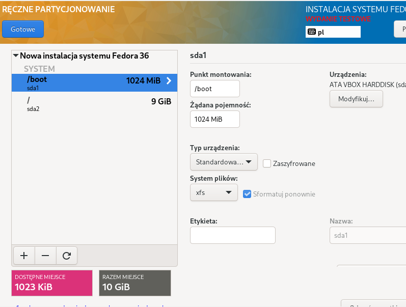
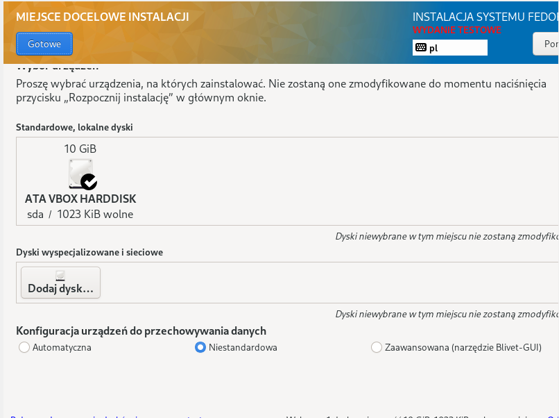
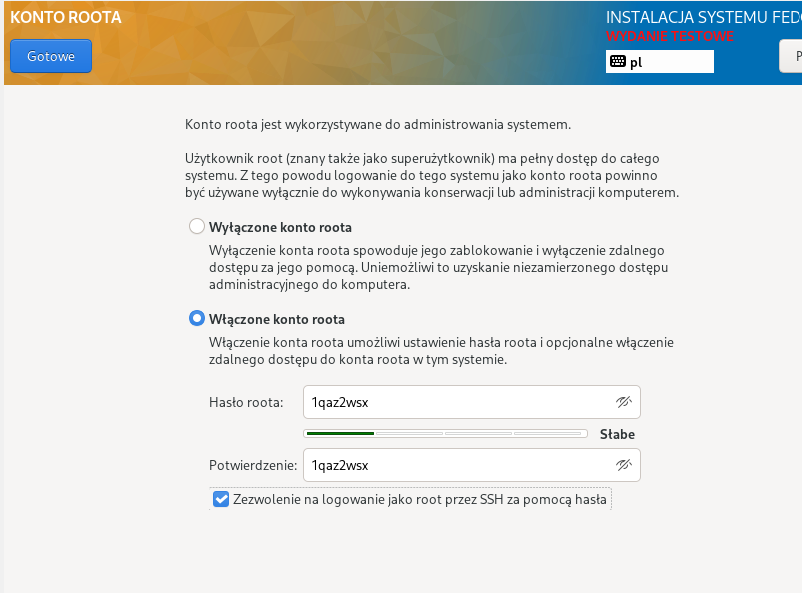

- Po poprawnie zakończonej instalacji utworzony został plik `anaconda-ks.cfg` w katalogu /root. Jest to plik zawierający informacje dla automatycnego instalatora, umożliwiający przeprowadzenie kolejnej instalacji. 

- Następnie zalogowałem się na konto roota i sprawdziłem adres ip maszyny (komenda ip a), aby za pomocą programu `WinSCP` wyciągnąć plik z maszyny.

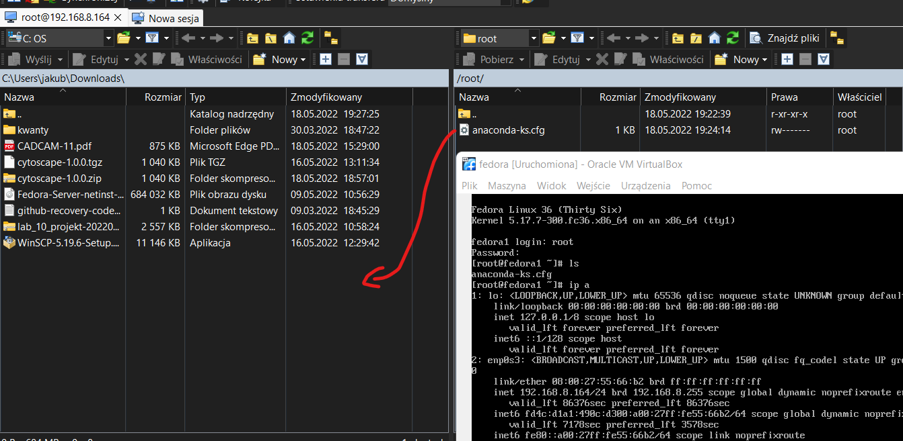

- Później ponownie postawiłem VM z Fedorą w takiej samej konfiguracji jak poprzednia. Zadaniem tej maszyny będzie funkcjonowanie jako serwer plików httpd, aby umieścić na nim artefakt `cytoscape-1.0.0.tgz`, utworzony w Pipeline i następnie umożliwić pobranie go z maszyny hosta.

**Instalacja httpd - maszyna serwer**

Aktualizacja pakietów:

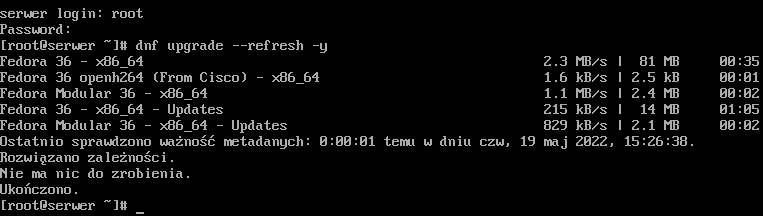

Instalacja httpd:
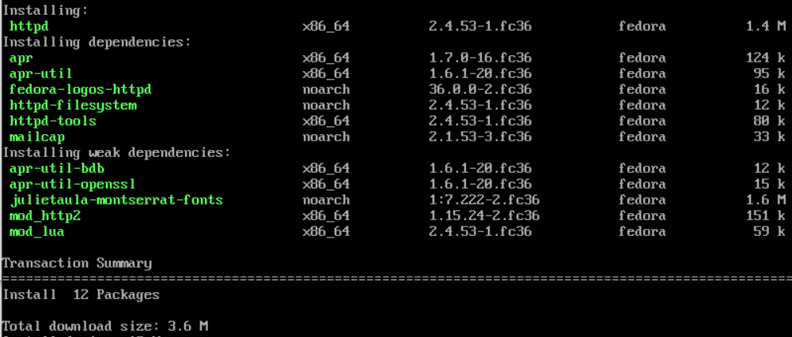

Uruchomienie i sprawdzenie statusu:
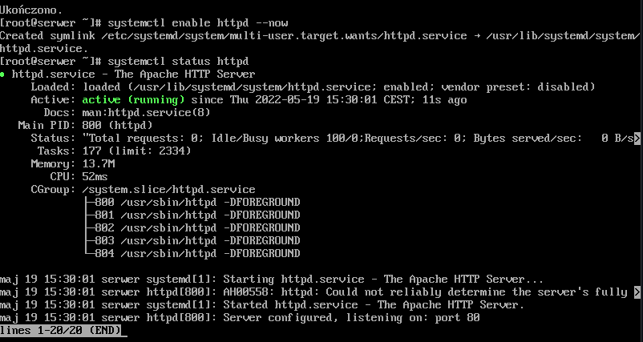

Dodanie wyjątków do firewall'a:

- Po wykonaniu powyższych poleceń w folderze `/var/www/html/` utworzyłem katalog `/artifacts`, który posłuży za miejsce docelowe, gdzie zostanie wrzucony artefakt. Wybrałem ten katalog, ponieważ w pliku httpd.conf był już udostępniany.

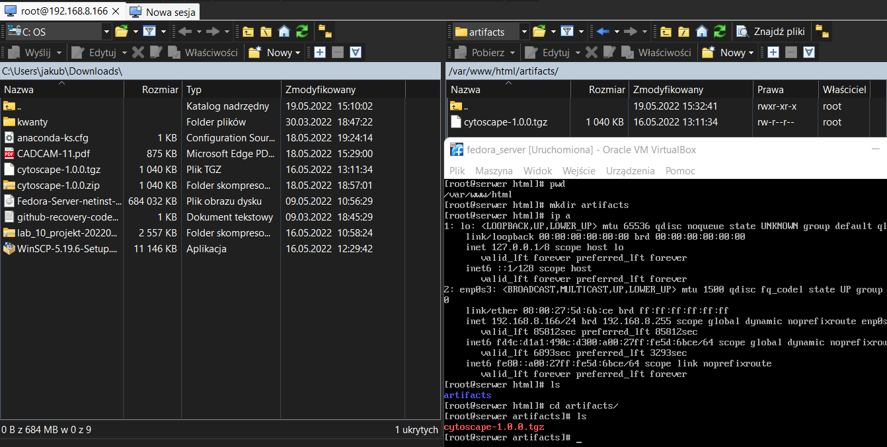

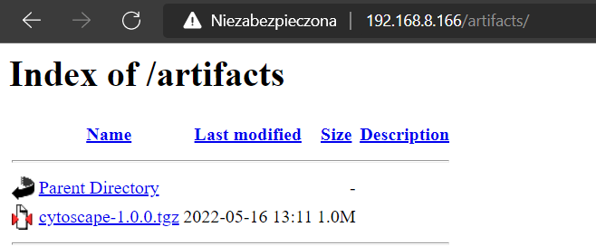

**Instalacja wget i pobranie artefaktu - maszyna host**

Aby poprawnie pobrać artefakt należy na maszynie hosta zainstalować wget poleceniem `dnf install wget`. Następnie `ip a` na maszynie serwerowej sprawdzam jej adres ip. Znając ten adres w maszynie hosta wpisuję polecenie `wget adres_ip_serwera/artifacts/cytoscape-1.0.0.tgz` i pobieram artefakt. Po pobraniu zmieniam uprawnienia artefaktu, co pozawla użytkownikowi na uruchomienie pliku.

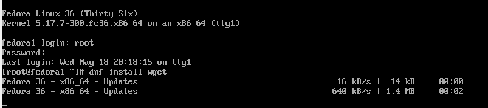

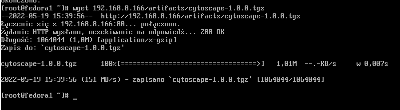

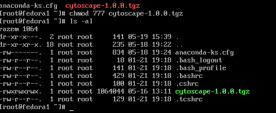

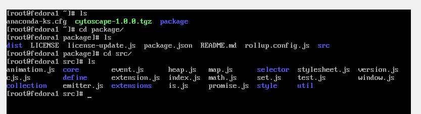

# **Część 2: Instalacja nienadzorowana**
Celem tej częście jest wykonanie instalacji systemu z pliku odpowiedzi. Plik `anaconda-ks.cfg` wrzuciłem na github i dokonałem w nim kilku modyfilacji:
- zmieniłem typ instalacji na tekstowy
- dodano informacje o repozytorium
- dodano wymagane zależności: wget i npm
- dodano sekcje post, odpowiedzialną za pobranie artefaktu
<a href="./anaconda-ks.cfg">anaconda-ks.cfg</a>

Utworzyłem nową maszynę i zamiast przeprowadzać standardową instalacje, wykorzystałem utworzoną "płytkę" i uruchomiłem instalacje nienadzorowaną. 

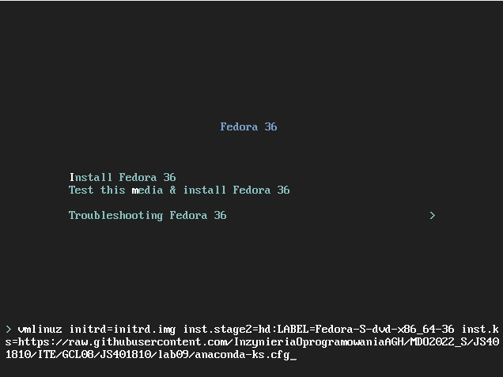

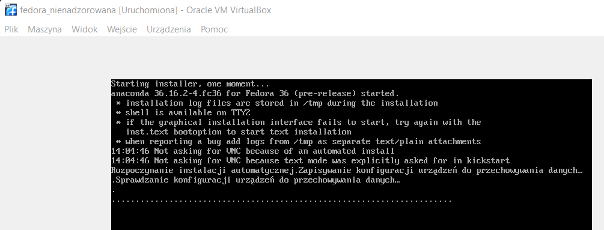

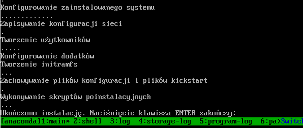

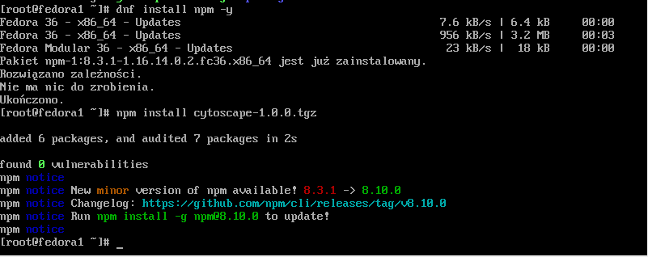

Pakiet npm miałem już wcześniej zainstalowany z pliku .cfg. Jak widać instalacja systemu, pobranie paczki i instalacja apki zakończyły się sukcesem.

# **Część 3: Infrastructure as a code**

- na początek należy wsunąć do napędu płytkę iso z naszą fedorą, następnie tworzę folder, do którego montuję to iso.

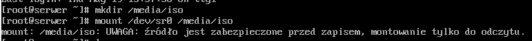

- później kopiuje pliki do folderu roboczego, aby uzyskać uprawnienia pozwalające na modyfikację.

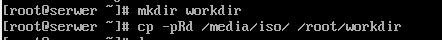

- kolejno kopiuje mój plik anaconda-ks.cfg do folderu z iso do pliku ks.cfg

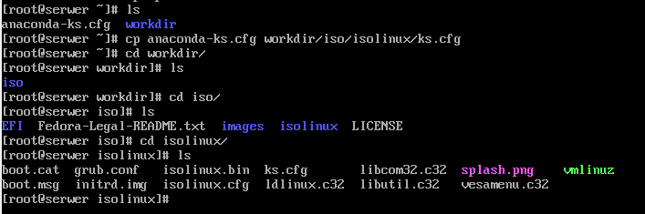

- modyfikuję plik isolinux.cfg o ścieżkę do pliku ks.cfg

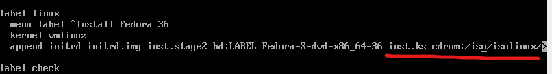

- następnie tworzę iso poniższą komendą. Jednak za pierwszym razem nie wykonuje się, trzeba doinstalować `genisoimage`.
 
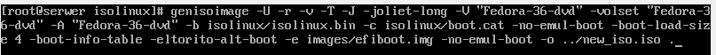

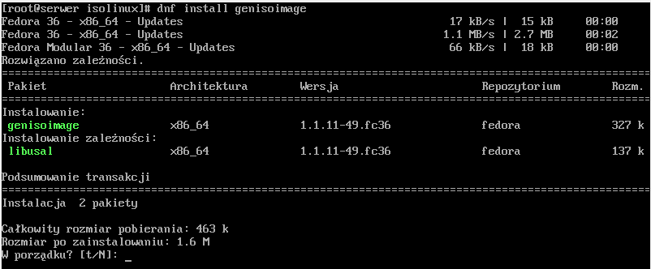

- polecenie wykonało się poprawnie, w efekcie utworzono plik iso.

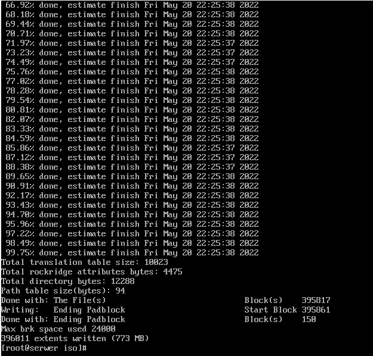

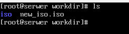

# **Uwagi i napotkanie problemy**
Podczas próby pobrania pliku z serwera napotkałem błąd "brak trasy do hosta". Sytuacja była taka, że obie maszyny się widziały (pingowały sie nawzajem) oraz z serwera na serwer dało się pobrać. W tym przypadku problem leżał po stronie serera, a konkretnie usługi httpd. Próbowałem kilkukrotnie instalować oraz restartować usługę, lecz bezskutecznie. W końcu najpierw wykonałem upgrade pakietów przed instalacją usługi i problem zniknął.
