# Sprawozdanie z laboratorium 1 Jan Święs 402998

    1. Zainstalowałem klienta Git

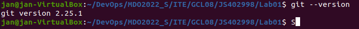

    2. Sklonowałem repozytorium przedmiotu przy pomocy HTTPS

    3. Utworzyłem własny klucz SSH i skonfigurowałem go jako metodę dostępu do GitHuba

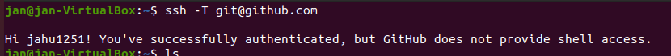
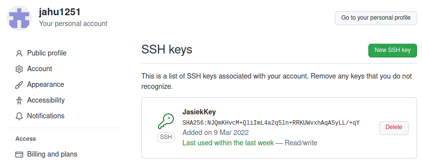
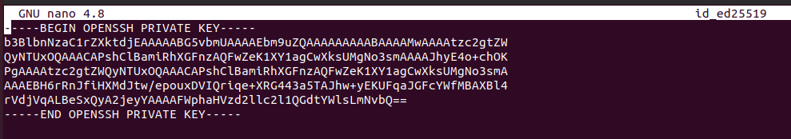

    4. Sklonowalem repozytorium z wykorzystaniem protokołu SSH

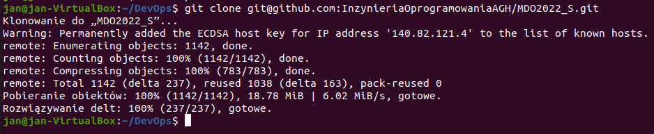

    5.Przełączylem się na gałąź main, a potem na gałąź mojej grupy

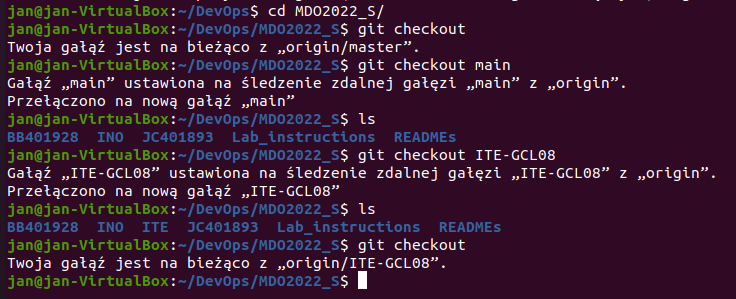

    6. Utworzyłem własnego branch'a o nazwie JS402998 i "odgałęziłem" się od grupy

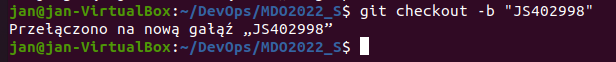

    7. W katalogu swojej grupy utworzyłem katalog, o nazwie JS402988, a w nim katalog o nazwie Lab01

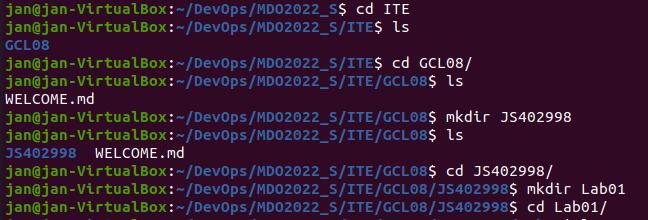

    8. W nowym katalogu utwrzyłem sprawozdanie i wrzuciłem zrzuty ekranu
    9. Utworzyłem sprawozdanie w powyższym katalogu

    10. Wyślij zmiany do zdalnego źródła

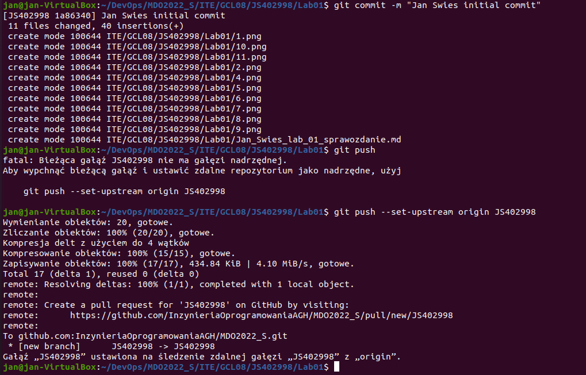

    11. Spróbuj wciągnąć swoją gałąź do gałęzi grupowej

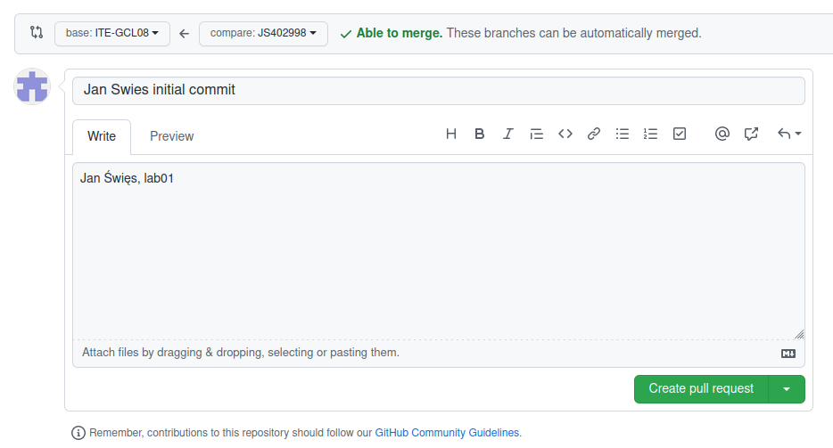
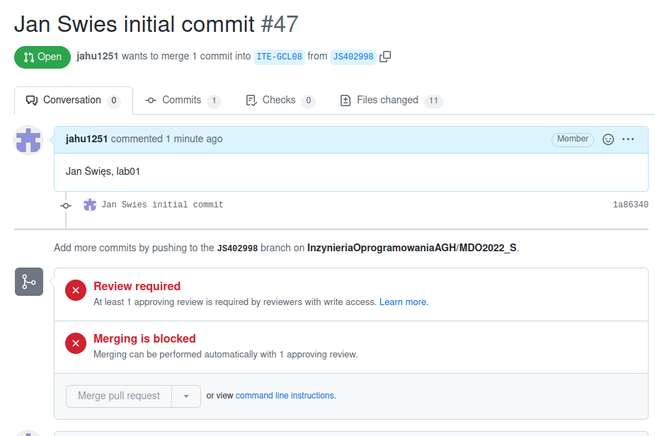
