# Sprawozdanie z laboratorium 3 Jan Święs 402998

Wybór oprogramowania na zajęcia

    1.Znalazłem repozytorium z programem, który dysponował otwartą licencją
    i był umieszczony wraz ze swoimi narzędziami makefile. Repozytorium to zawierało również testy, które mogłem uruchomić i formułowały raport końcowy

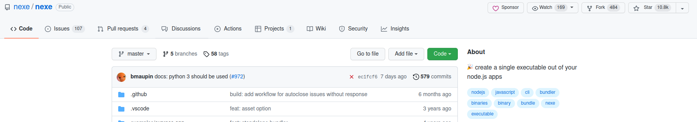

Przeprowadzenie buildu w kontenerze

    2.Pobrałem obraz node'a
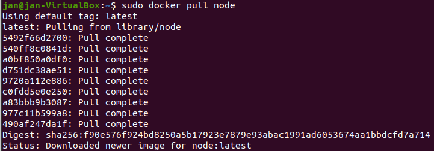

    3.Uruchomiłem kontener i podłączyłem do niego TTY
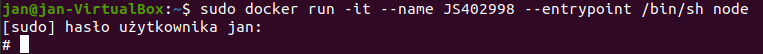

    4.Sklonowałem repozytorium wybranego przeze mnie wczesniej programu
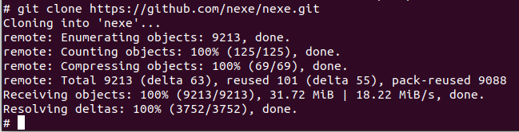

    5. Uruchom build poleceniem npm i (install)
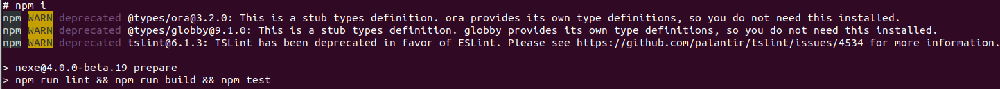

    6.Uruchomiłem testy
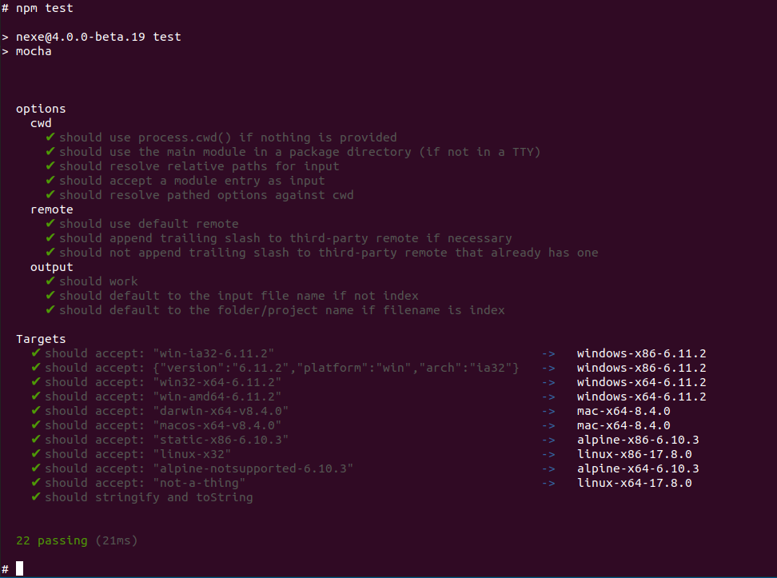

    7.Stworzyłem dwa pliki Dockerfile automatyzujące kroki powyżej:

    a)Kontener pierwszy przeprowadzający wszystkie kroki do momentu builda
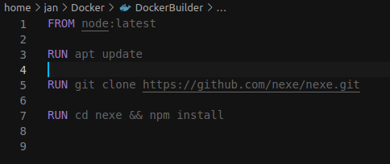
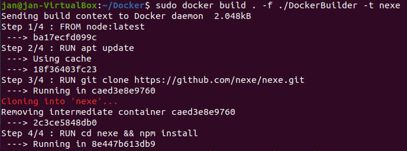
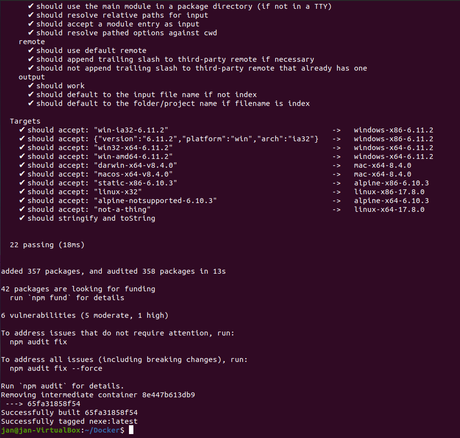

    b)Kontener drugi bazujący na pierwszym i wykonujący testy

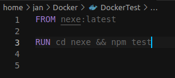
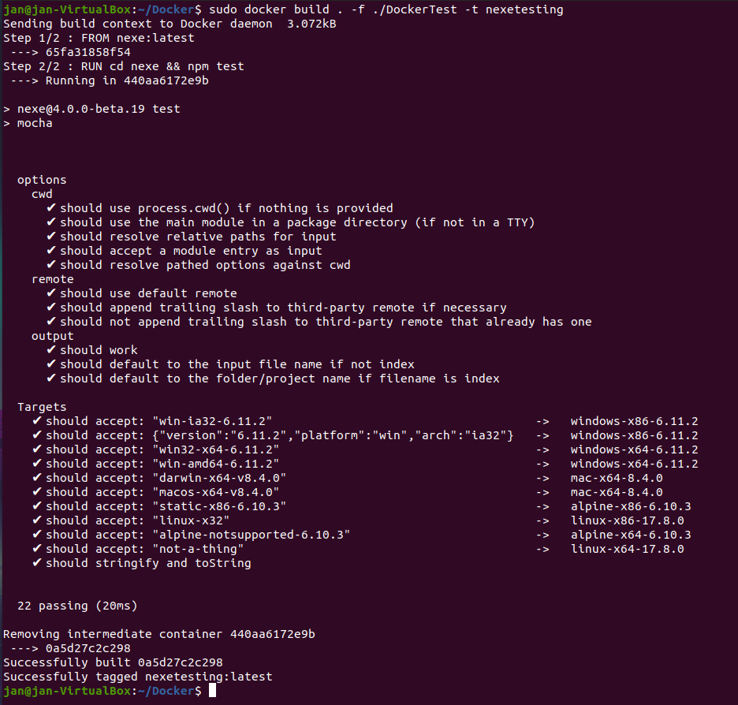

    8. Sprawdzenie poprawności

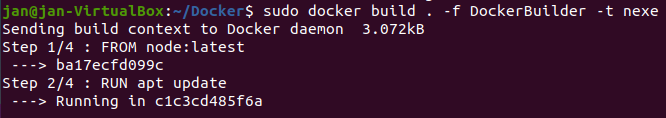

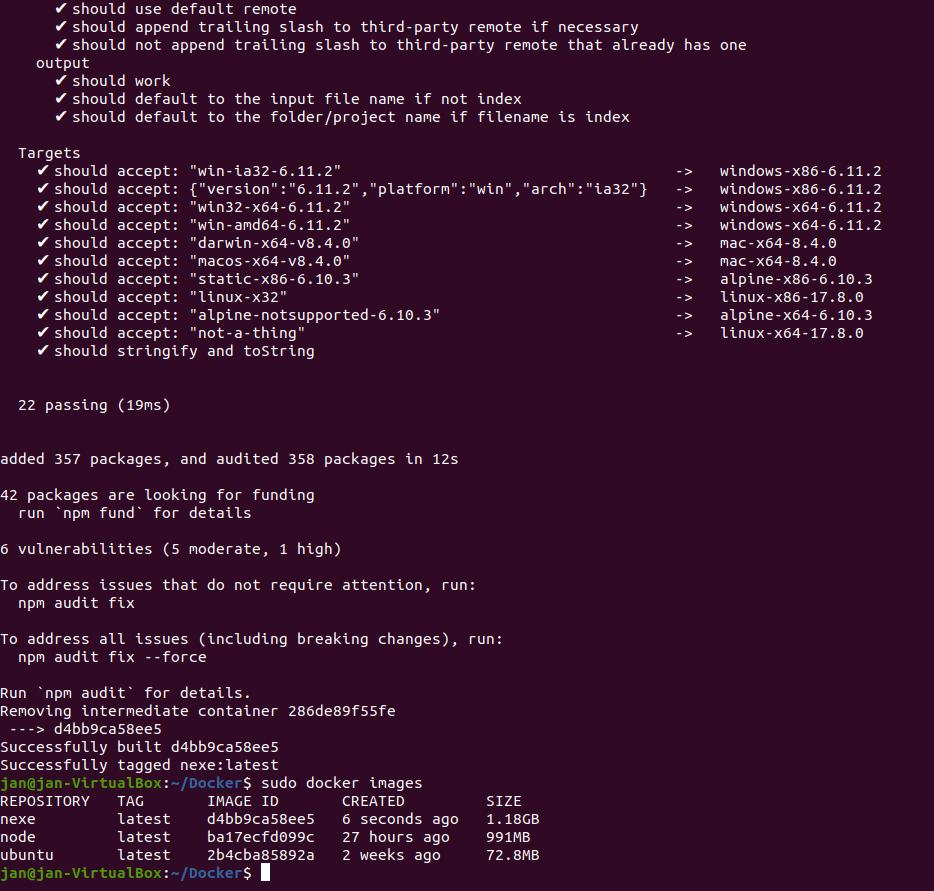

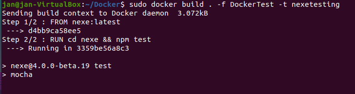

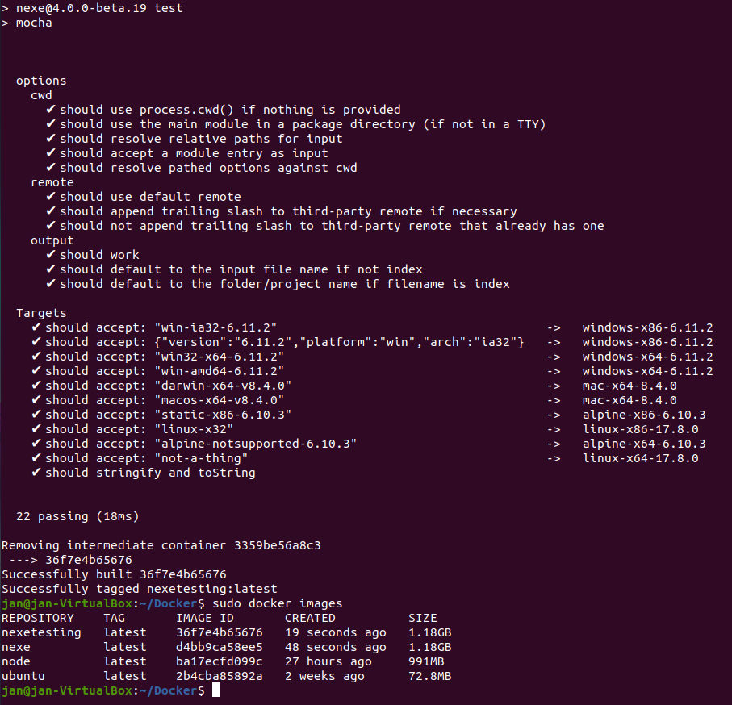

# Pytania i odpowiedzi

    1. Co pracuje w kontenerze ?
    
    W kontenerze pracuje program w odpowienio przygotowanym środowisku, który jest odizolowany od zewnętrznego świata (systemu)

    2.