# Sprawozdanie Lab04 Jan Święs ITE-GCL08

# Przebieg laboratorium

1. Utworzenie 2 woluminów o nazwach input i output.

    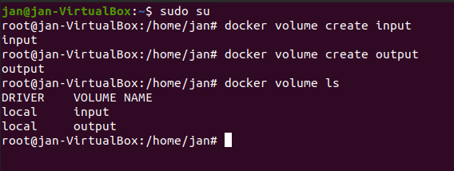

2. Utworzenie kontenera na podstawie obrazu node i podpięcie do niego utworzonych wcześniej woluminów.

    

3. Sklonowanie do woluminu wejściowego repozytorium gita.

    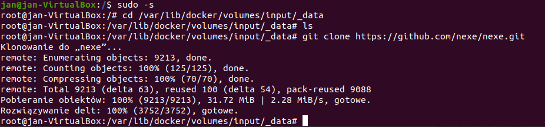

4. Pokazanie repozytorium w kontenerze.

    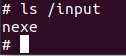

5. Skopiowanie repozytorium z woluminu wejściowego do wyjściowego i wykoanie builda za pomocą npm.

    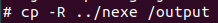

    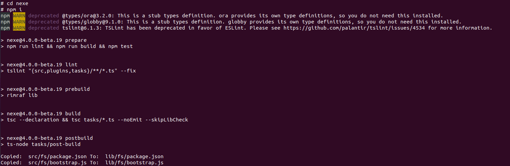

6. Sprawdzenie istnienia programu.

    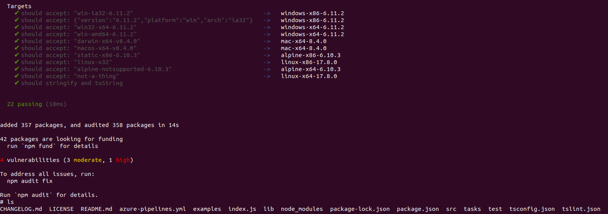
    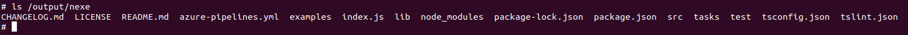

# Eksponowanie portu

1. Pobranie iperf3 na kontener oraz uruchomienie nasłuchiwania na porcie 5201

    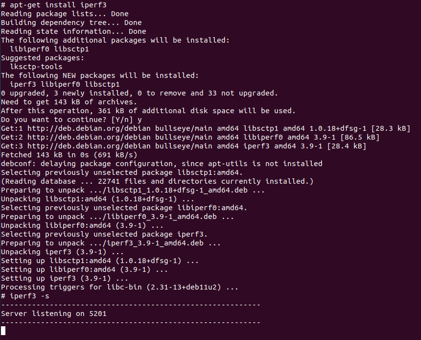

2. Utworzenie drugiego kontenera, zainstalowanie serwera iperf3 i sprawdzenie ruchu pomiędzy kontenerami. (zapomniałem na tym etapie zrobić ss utworzenia drugiego kontenera i instalacji iperf3 na nim)

    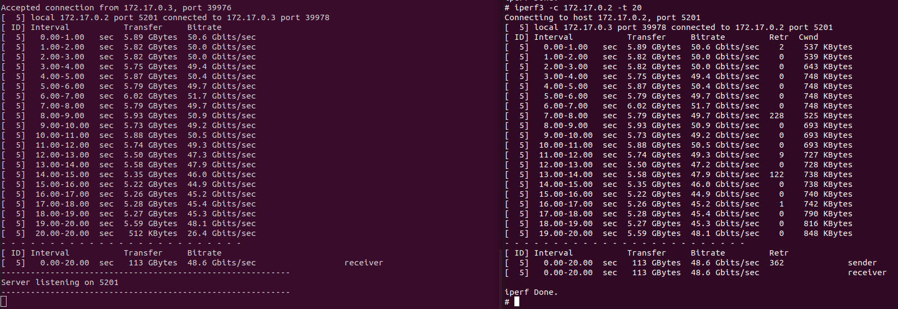

3. Zainstalowanie serwera ```iperf3``` na hoście i sprawdzenie ruchu pomiędzy hostem, a kontenerem.

    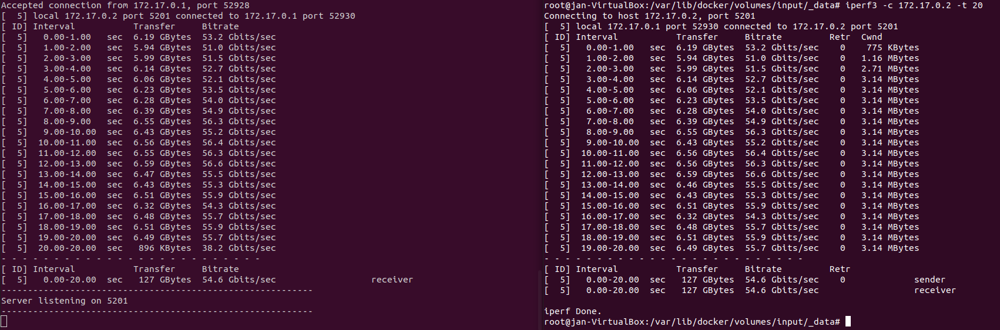

4. Sprawdzenie adresu IP hosta.

    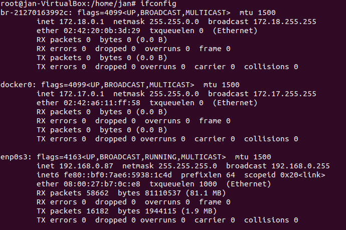

5. Pobranie serwera iperf3 na system zewnętrzny - Windows.

    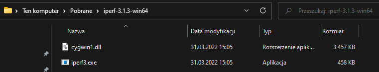

6. Test połączenia skończony błędem - wynika to z faktu, iż kontener nie publikuje portu 5201 do hosta, czyli host nie nasłchuje a tym porcie. Rozwiązaniem tego problemu jest uruchomienie kontenera z opcją --publish.

    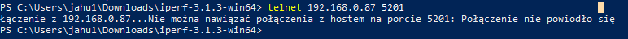
    
7. Uruchomienie kontenera z opcją publish dla portów w zakresie od 5201 do 5201 i sprawdzenie nasłuchiwanych portów przez hosta.

    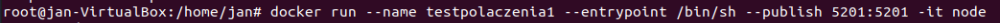

8. Sprawdzenie ruchu pomiędzy maszyną spoza hosta a kontenerem.

    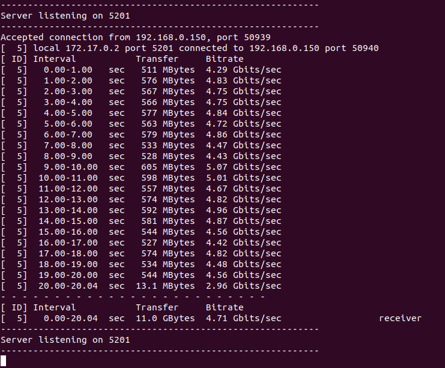

    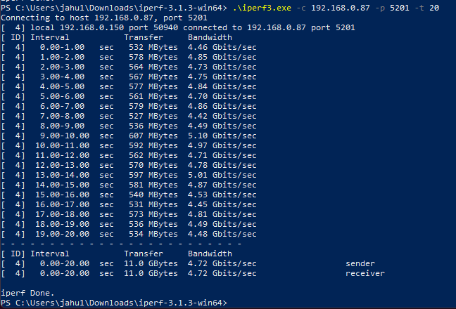

# Analiza wyników

    Najszybszym połączeniem jest połączenie hosta z kontenerem o prędkości transmisji oscylującej pomiędzy 51 a 56 Gbit/sec. Wynika to z bezpośredniego połączenia pomiędzy hostem, a kontenerem - brak pośredników.

    Nieco wolniejszym połączeniem jest połączenie pomiędzy dwoma kontenerami o  prędkości transmisji oscylującej pomiędzy 45 a 50  Gbit/sec. Występuje tutaj pośrednik w postaci hosta - maszyny wirtualenj
    
    Najwolniejszym połączeniem jest połączenie hosta z zewnątrz sieci do kontenera,  średniej transmisji od 4,5 do 5,1 Gbit/sec**, co wynika z długiej trasy jaką musi przebyć pakiet (występuje tutaj pośrednik między kontenerem a systemem Windows - Ubuntu na wirtualnej maszynie)


# Instalacja Jenkinsa

1. Stworzenie sieci mostkowanej w Dockerze (miałem ją już utworzoną wcześniej)

    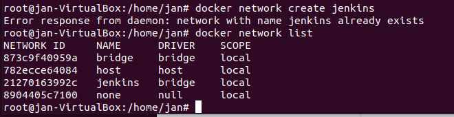

2. Utworzenie volumin'ów jenkins-data oraz jnkins-docker-certs

    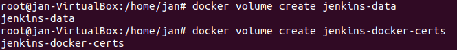

2. Pobranie i uruchomienie obrazu docker:dind.

    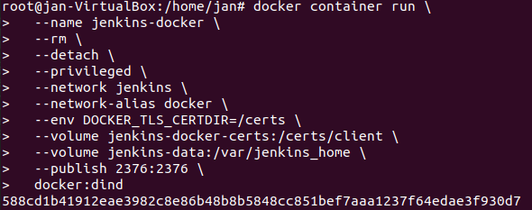

3. Uruchomienie kontenera

    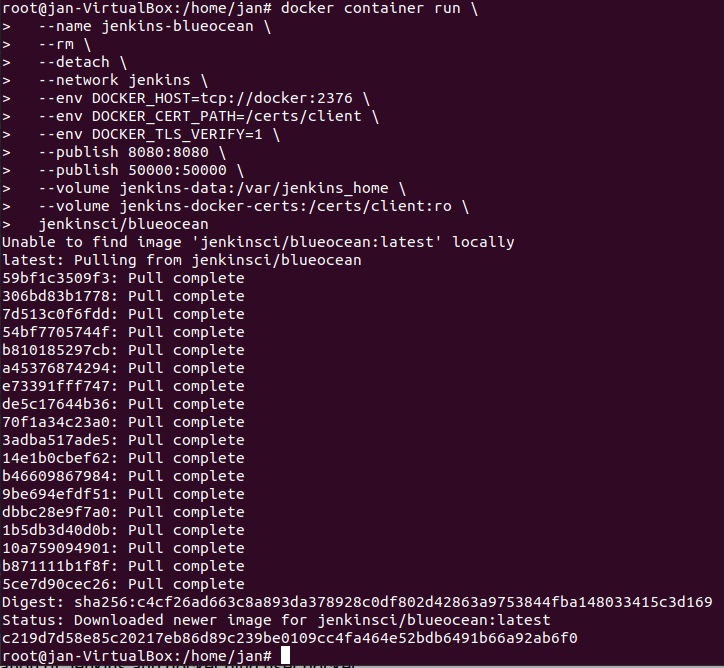

4. Sprawdzenie uruchomionych kontenerów i wyświetlenie logów kontenera jenkins, w celu pobrania hasła do inicjalizacji admina.

    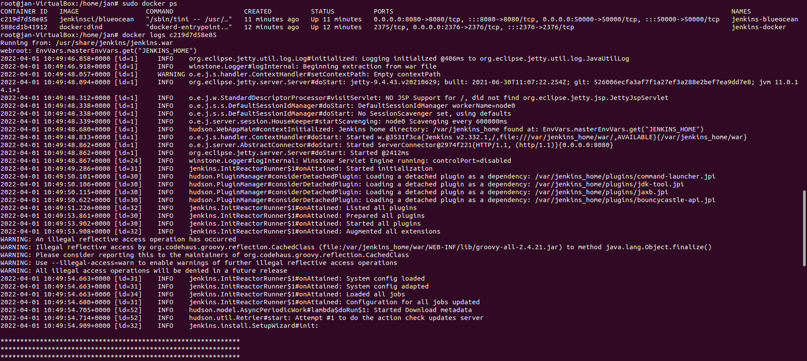

5. Odblokowanie Jenkinsa

    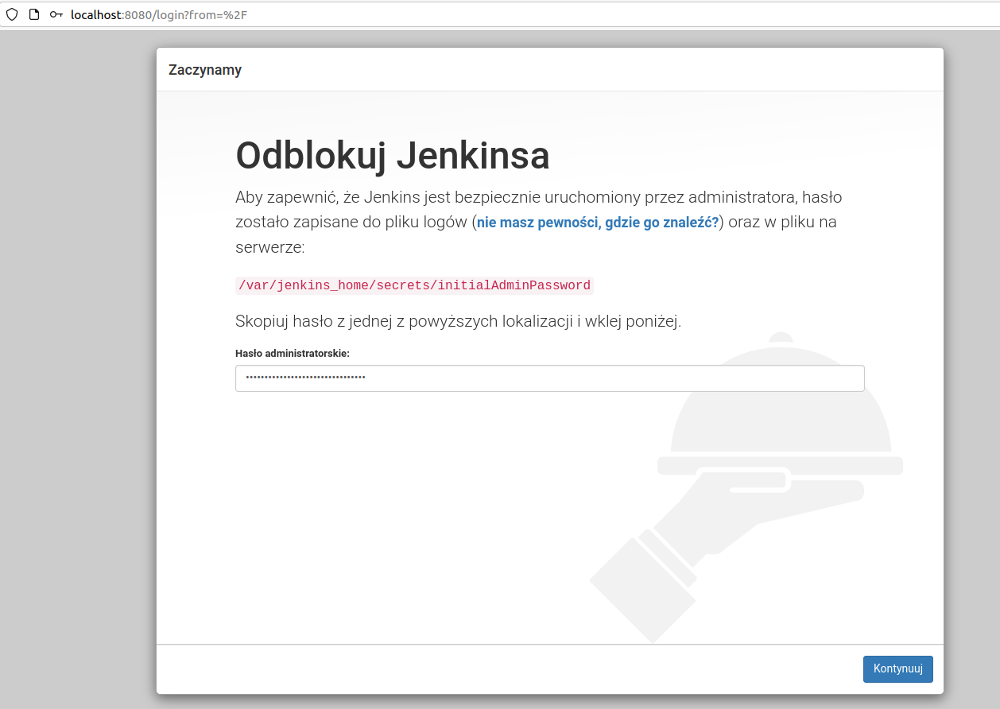

6. Instalacfja sugerowanych wtyczek

    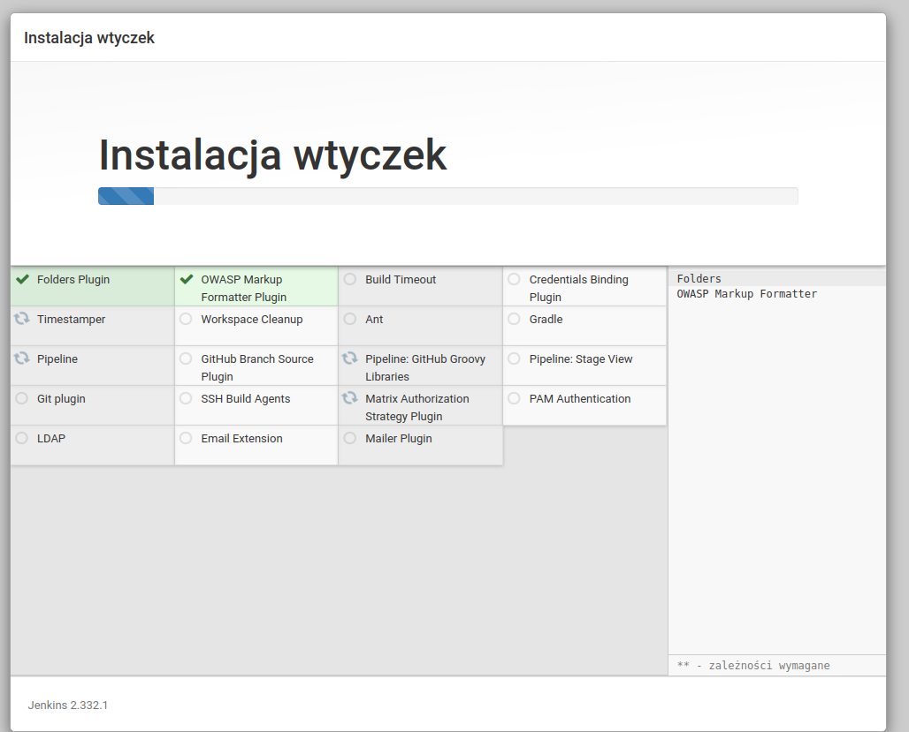

    Tutaj warto zaznaczyć, że instalacja kilku wtyczek zakończyła się u mnie erorrem - wielokrtone ponawianie ich instalacji stopniowo naprawia ten problem .

7. Utworzenie pierwszego użytkownika

    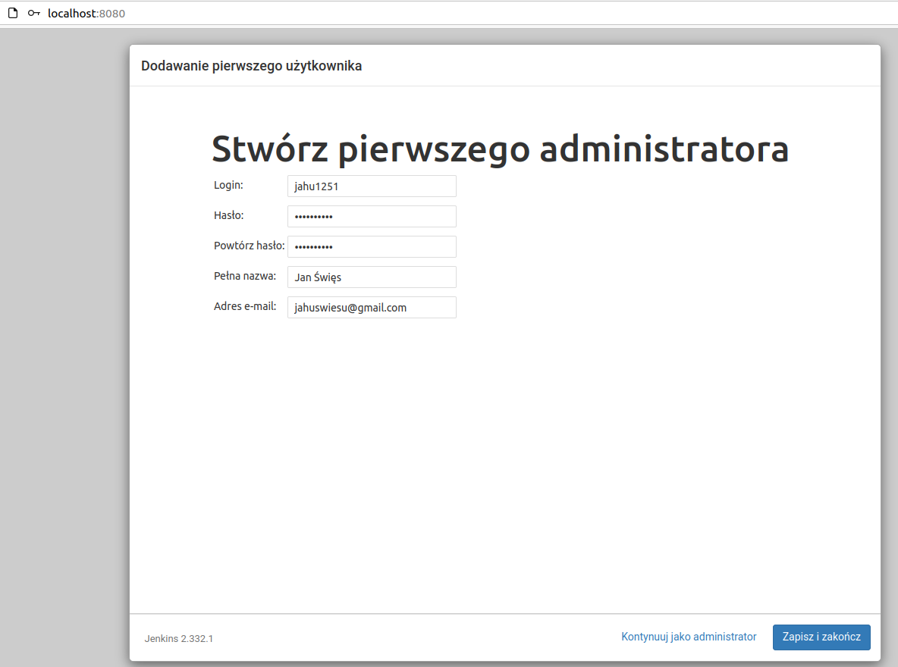

8. Stronba główna Jenkinsa po zalogowaniu

    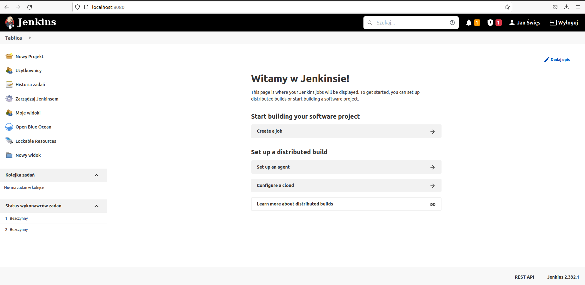