# Sprawozdanie z laboratorium 1 Jan Święs 402998

    1. Przygotowałem git hook'a, który sprawdza, czy tytuł commita nazywa się \<inicjały>\<numer indeksu> oraz, czy w treści commita pada numer labu, właściwy dla zadania

    a)Odnalazłem folder z hook'ami, po czym rozpocząłem edycje  pre-commit.sample w Visual Studio Code

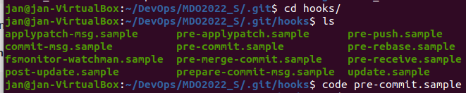

    b)Napisałem go w języku Python, aby wykonywał powyższe zadania

```
#!/bin/python3

import sys

print("Starting commit title testing... ")

messageFile = sys.argv[1]
file = open(messageFile, 'r')
message = file.read()

title = message.split("\n")[0]
content = message.split("\n")[2]

if title != "JS402998":
	print("Your commit title must contain your initials and index number !") 
	exit(1)
if not (content.find("02") != -1 or content.find("2") != -1):
	print("Your commit message does not contain exercise number !") 
	exit(2)
else:
	print("Your commit meets all requirements !")
	exit(0)
```


    c)Nadałem plikowi odpowiednie prawa dostępu poleceniem chmod

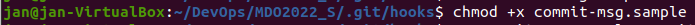

    d)Usunąłem jego rozszerzenie, aby go aktywować

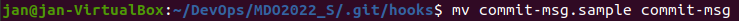

    e)Prezentacja działania

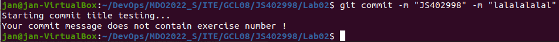

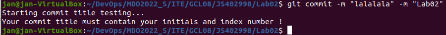

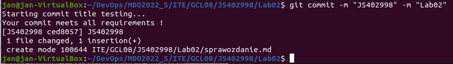

    2.Przygotowałem środowisko Docker'owe
    
    a)Zapewniłem dostęp do maszyny wirtualnej przez zdalny terminal

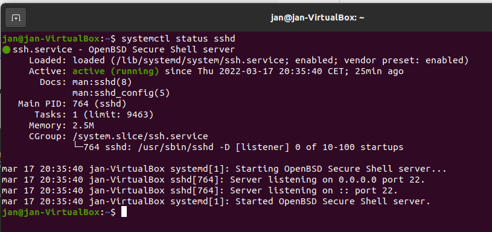

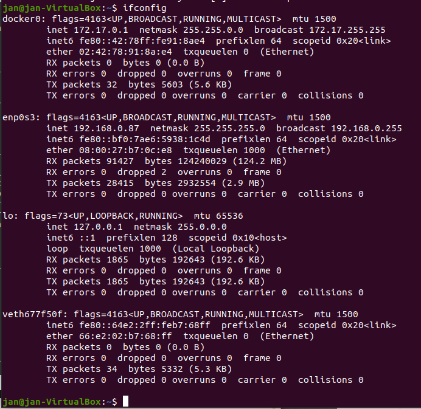

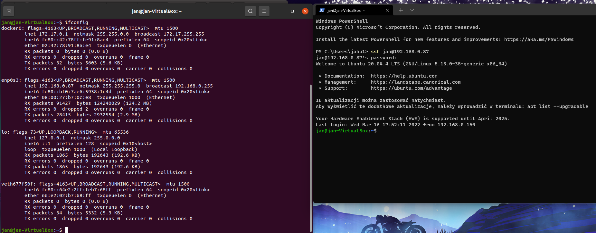

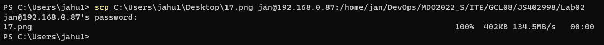

    b)Zainstalowałem środowisko docker'owe w systemie ubuntu

    wersja zainstalowanego dockera

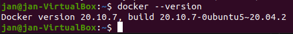

    c)pokazanie, że usługa docker'a jest uruchomiona
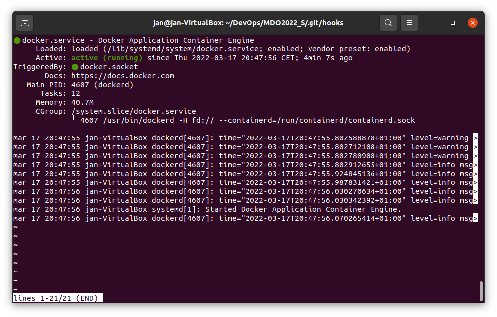

    d)Pobrałem obrazu ubuntu
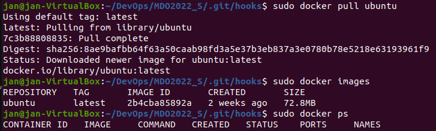

    e)Utworzyłem i uruchomiłen kontener o nazwie jasiek z systemem ubuntu i wyświetliłem  nim informacje
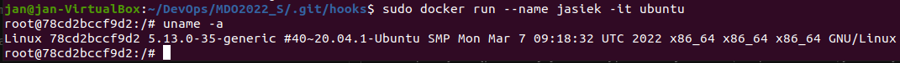

    f)Prezentacja działania środowiska dokerowego
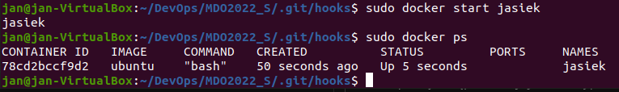

    c)Założyłem konto na Docker Hub

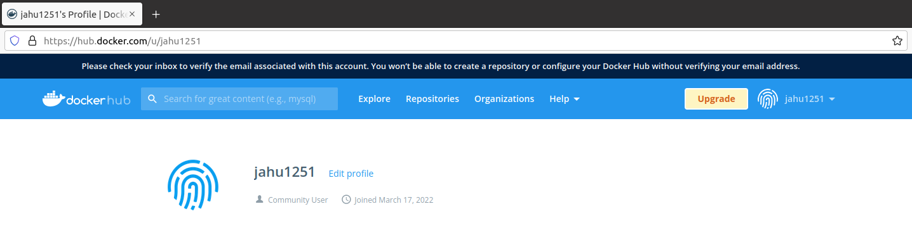

